# Software Organization Domain Model

## 1. How to read this model

This document defines the domain model of a software-producing organization: the terms it uses, how those terms relate to each other (and in what numbers), how they change over time, and the rules that always hold.

**The model has three dimensions.** They describe different kinds of things, and the whole point of the model is to keep them separate rather than flatten them into one hierarchy:

- **The Domain Layer — what exists (§3).** The ten stable areas of a software organization: Organizational Structure & People, Strategy, Market, Product, Commercial, Software Estate, Delivery, Operations, Governance, and External Dependencies.
- **The Work Management Layer — how change is coordinated (§4).** The constructs that move work across those areas: Project, Workstream, Work Item, Assignment, Milestone, Handoff. This layer coordinates change in every domain.
- **The Function Overlay — who participates (§5).** The organizational functions that do the work: Product Management, Engineering, QA, Sales, Security, and so on. Functions staff and take part in work management.

Put simply: the domains say **what exists**, work management says **how it changes**, and functions say **who is involved**. The same initiative touches all three, but they stay distinct kinds of things.

**Three levels of naming.** Inside the model, terms nest three levels deep:

- a **domain** — one of the ten areas above; these are the section headings;
- a **block** — a named subarea inside a domain, and the unit that carries the Studio tier;
- a **term** — a concrete entity or record type inside a block.

Tables use short codes: `L2` = block, `L3` = term. Domains need no code because they are the sections. A term gets its own row only when a relationship, a lifecycle, or an invariant connects to it; plain vocabulary with no connections stays folded into its block.

**Where to find what:**

- every **term** and its meaning → §3 (domains), §4 (work management), §5 (functions);
- every **relationship**, with multiplicity (`1:1` / `1:N` / `N:M`) → the **Relationships** table inside each domain section (legend and conventions at the top of §3);
- **lifecycles** (state vocabularies) and **invariants** (rules that always hold) → §6;
- the **Studio** column on each block → **our proposal of what Studio should cover**, validated against [[studio-representation-model]] §9 (Organization-to-Studio Mapping): `core` = essential to represent · `extended` = worth covering (often mirrored or linked; commercial and financial views role-restricted) · `background` = not proposed for coverage yet ("mapped on demand"). It is an organization-side proposal — the representation model stays authoritative for what Studio actually covers.

## 2. Purpose

This document is the **organization-side canon** of the foundation set: the shared vocabulary of a software-producing organization — terms, relationships with multiplicity, lifecycles and invariants — described independently of any modeling platform. Its companion [[studio-representation-model]] defines how Studio represents and acts on this domain; here this model is authoritative for what the organization *is*. The domain set is initial, extended in later passes.

## 3. Domain Layer

Each domain section has three synchronized views: a **diagram** of the core entities, a **Terms** table, and a **Relationships** table — the diagram is a readable subset, the Relationships table is authoritative. In the Terms tables `L2` rows are blocks and `L3` rows (`↳`) are the terms inside them; a term earns its own row only when a relationship, lifecycle or invariant connects to it, otherwise it stays folded into its block.

*Multiplicity (`How many` column).* A modeling guide, not a schema constraint:

| Value           | Meaning                                            |
| --------------- | -------------------------------------------------- |
| `1:1`           | One subject relates to one object.                 |
| `1:N`           | One subject can relate to many objects.            |
| `N:1`           | Many subjects can relate to one object.            |
| `N:M`           | Many subjects can relate to many objects.          |
| `0..1` · `0..N` | Object side optional — at most one · zero or more. |

*In diagrams* the crow's foot carries the same values: `||--o{` = `1:N` · `}o--||` = `N:1` · `}o--o{` = `N:M` · `||--||` = `1:1` · a small `o` next to an entity = optional (`0..1`/`0..N`). Diagram identifiers drop spaces (`ProductLine`, `JobRole`); the tables spell them in full.

*Studio coverage (the `Studio` column).* Each L2 block (and §4 term) carries a **Studio** tier — the organization side's proposal of what Studio should cover, validated against [[studio-representation-model]] §9: **core** = represent first · **extended** = cover on demand · **background** = not proposed yet. L3 inherits its block's tier. It is a proposal, not organization-model semantics — the representation model is authoritative.

### 3.1 Organizational Structure & People

> Who exists in the organization, how is it structured, who can do what, and who is accountable for what?

**The boundary — who exists and belongs where:**

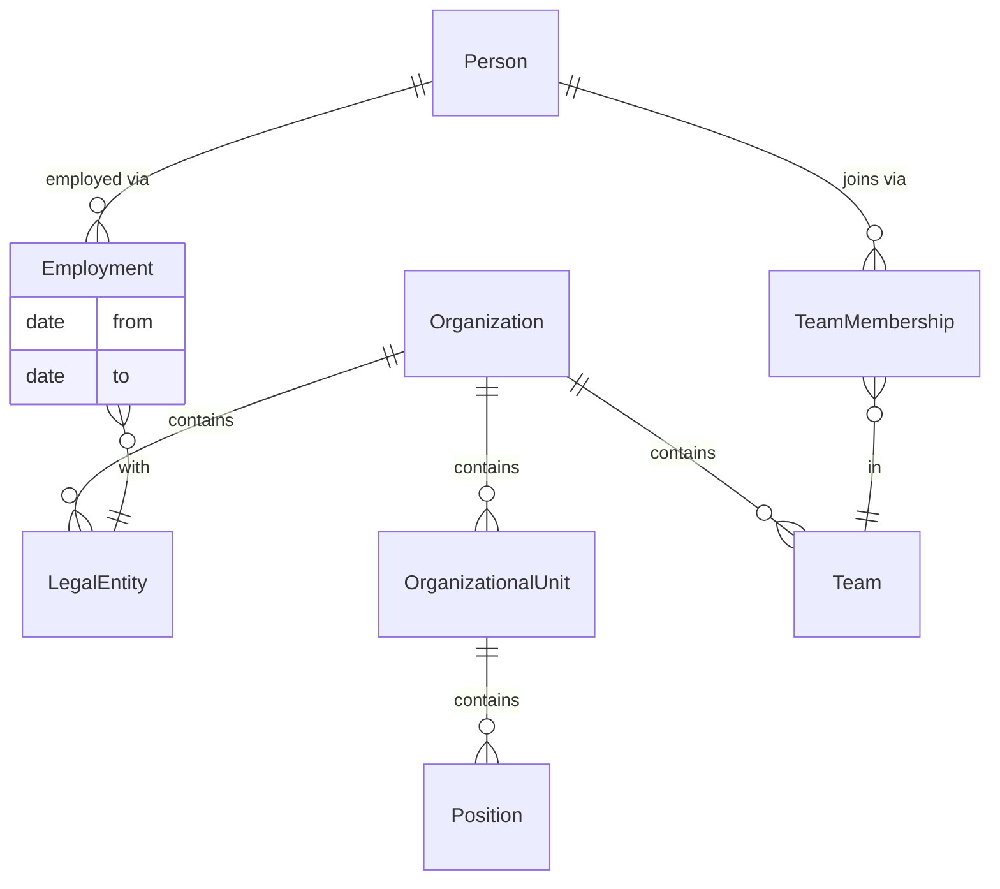

**People at work — roles, skills, projects:**

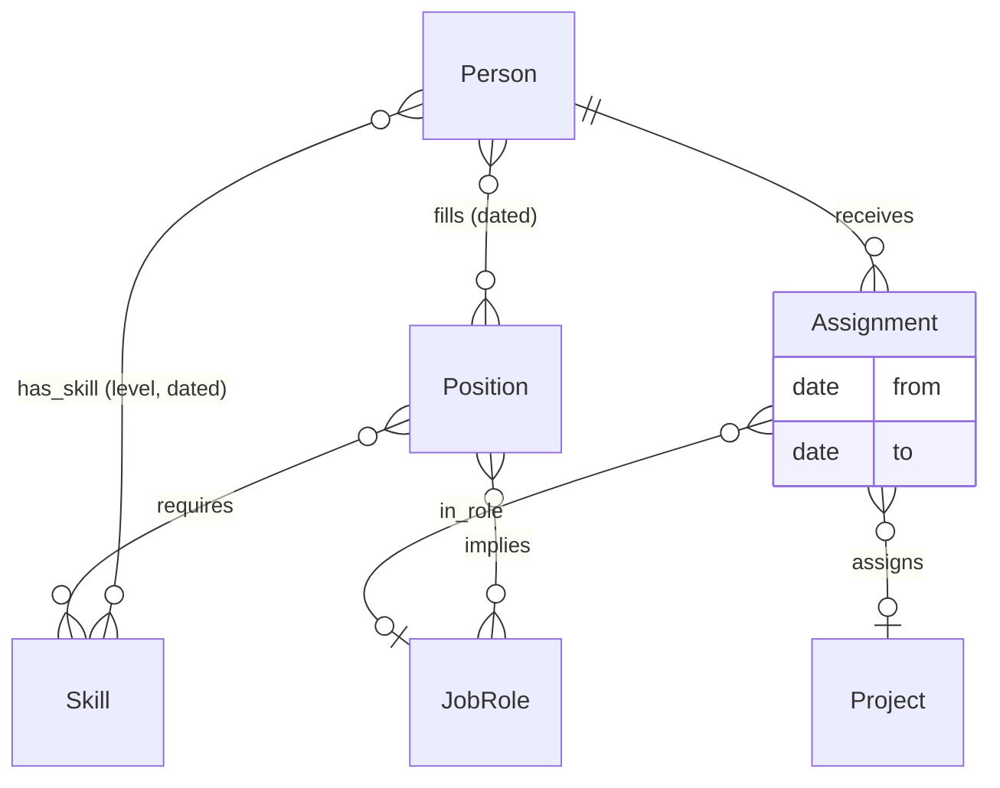

**Worked example.** Anna is employed by a Legal Entity (*Employment*, dated). She fills the *Position* "Senior Engineer", which implies the *Job Roles* Developer and Security Lead — one person, several roles (`fills` `N:M` → `implies` `N:M`). She is a member of Team Atlas and of the Platform Guild (`member_of` `N:M`). She holds an *Assignment* on Project Phoenix `in_role` Tech Lead and another on Project Beacon `in_role` Reviewer — same person, two projects, two different roles. Her *profile* — strengths, expertise, history — is the derived view over these records plus her *Skills* (e.g., Kubernetes, level: expert, dated).

**Terms**

| Level  | Term                             | Meaning                                                                                                                                                                                                                                                                                                                                                                                                     | Studio       |
| ------ | -------------------------------- | ----------------------------------------------------------------------------------------------------------------------------------------------------------------------------------------------------------------------------------------------------------------------------------------------------------------------------------------------------------------------------------------------------------- | ------------ |
| **L2** | **Organization Boundary**        | Company, legal and structural boundary of the organization being modeled.                                                                                                                                                                                                                                                                                                                                   | **extended** |
| L3     | ↳ **Organization**               | A software-producing company or group of companies being modeled.                                                                                                                                                                                                                                                                                                                                           | **extended** |
| L3     | ↳ **Legal Entity**               | A legally recognized entity associated with the Organization.                                                                                                                                                                                                                                                                                                                                               | **extended** |
| L3     | ↳ **Organizational Unit**        | Business unit, department, division or practice inside the Organization.                                                                                                                                                                                                                                                                                                                                    | **core**     |
| **L2** | **People, Employment & Skills**  | People known to the organization, their employment relationship and what they can do — capabilities, strengths, expertise.                                                                                                                                                                                                                                                                                  | **core**     |
| L3     | ↳ **Person**                     | A real human being known to the Organization.                                                                                                                                                                                                                                                                                                                                                               | **core**     |
| L3     | ↳ **Employment**                 | Dated relationship between a Person and a Legal Entity.                                                                                                                                                                                                                                                                                                                                                     | **extended** |
| L3     | ↳ **Skill**                      | Named capability, expertise area or strength a Person can hold and a Position or Assignment can require — e.g., Kubernetes, payments domain expertise, incident command. Proficiency level and source (declared / assessed / derived) live on the possession record.                                                                                                                                        | **core**     |
| **L2** | **Positions & Reporting**        | Formal role slots and reporting structure.                                                                                                                                                                                                                                                                                                                                                                  | **core**     |
| L3     | ↳ **Position**                   | Official role slot, title or function in the Organization.                                                                                                                                                                                                                                                                                                                                                  | **core**     |
| L3     | ↳ **Reporting Line**             | Dated manager/report relationship from one Position to another.                                                                                                                                                                                                                                                                                                                                             | **core**     |
| L3     | ↳ **Job Role**                   | Work/organizational role such as Product Manager, Developer, SRE or Security Lead. Held two ways: **org-wide** through a Position (`Position implies Job Role`), and **per project** through an Assignment (`Assignment in_role Job Role`, Work Management layer). So one person can hold several roles at once and act in a *different* role on each project — e.g. Tech Lead on one, Reviewer on another. | **core**     |
| **L2** | **Teams & Membership**           | Stable teams and the way people or positions are allocated to them.                                                                                                                                                                                                                                                                                                                                         | **core**     |
| L3     | ↳ **Team**                       | A stable group of people that builds, owns, operates, supports or governs work/assets.                                                                                                                                                                                                                                                                                                                      | **core**     |
| L3     | ↳ **Team Membership**            | Dated membership of a Person in a Team.                                                                                                                                                                                                                                                                                                                                                                     | **core**     |
| L3     | ↳ **Position Allocation**        | Dated allocation of a Position to a Team.                                                                                                                                                                                                                                                                                                                                                                   | **core**     |
| **L2** | **Responsibility & Measurement** | Accountability assignments and organizational measurements.                                                                                                                                                                                                                                                                                                                                                 | **extended** |
| L3     | ↳ **Responsibility Assignment**  | Dated record that a Person or Team is accountable for a domain object.                                                                                                                                                                                                                                                                                                                                      | **extended** |
| L3     | ↳ **Organizational Metric**      | Measures teams, positions, employment, staffing, responsibility coverage or team health.                                                                                                                                                                                                                                                                                                                    | **extended** |

A person's **profile** (strengths, expertise, work history) is a derived view over Employment, Positions, Job Roles, Team Memberships, Assignments, Skills and authored work — not a stored entity, following the model's rule that views are not entities.

**Relationships**

| Subject               | Predicate       | Object                                             | How many | Notes                                                                                                                                                                                                                                |
| --------------------- | --------------- | -------------------------------------------------- | -------- | ------------------------------------------------------------------------------------------------------------------------------------------------------------------------------------------------------------------------------------ |
| Organization          | contains        | Legal Entity / Organizational Unit / Person / Team | `1:N`    |                                                                                                                                                                                                                                      |
| Organizational Unit   | contains        | Position / Team                                    | `1:N`    |                                                                                                                                                                                                                                      |
| Legal Entity          | employs         | Person                                             | `N:M`    | Through Employment; has effective dates.                                                                                                                                                                                             |
| Legal Entity          | party_to        | Customer Agreement / Supplier Agreement            | `1:N`    | The organization's signing side of agreements.                                                                                                                                                                                       |
| Person                | fills           | Position                                           | `N:M`    | Position filling has effective dates.                                                                                                                                                                                                |
| Person                | member_of       | Team                                               | `N:M`    | Through Team Membership; has effective dates.                                                                                                                                                                                        |
| Person / Team         | participates_in | Project / Workstream                               | `N:M`    | Derived from Assignment records (§4); a person works on many projects, a project has many participants.                                                                                                                              |
| Person                | has_skill       | Skill                                              | `N:M`    | Proficiency level, source and effective dates on the possession record.                                                                                                                                                              |
| Position / Assignment | requires        | Skill                                              | `N:M`    | |
| Position              | allocated_to    | Team                                               | `N:M`    | Through Position Allocation; has effective dates.                                                                                                                                                                                    |
| Position              | reports_to      | Position                                           | `N:1`    | Reporting Line has effective dates.                                                                                                                                                                                                  |
| Position              | implies         | Job Role                                           | `N:M`    | Org-wide roles a title carries.                                                                                                                                                                                                      |
| Person                | plays_role_in   | Job Role (per Project / Workstream)                | `N:M`    | Derived from `Assignment in_role` (Work Management layer): the same person may act in a different role on each project — Tech Lead on one, Reviewer on another. Project-scoped, distinct from the org-wide roles a Position implies. |
| Person / Team         | responsible_for | Domain Object                                      | `N:M`    | Through Responsibility Assignment; has effective dates.                                                                                                                                                                              |

### 3.2 Strategy

> Why is the organization investing, prioritizing and changing?

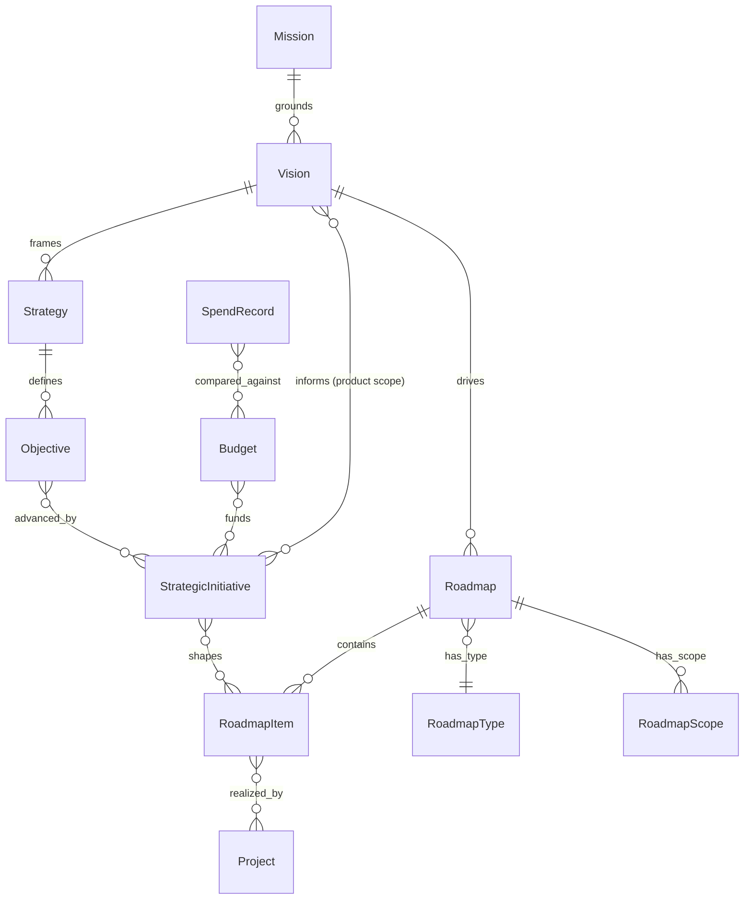

**Terms**

| Level  | Term                          | Meaning                                                                                                                                                                                                        | Studio       |
| ------ | ----------------------------- | -------------------------------------------------------------------------------------------------------------------------------------------------------------------------------------------------------------- | ------------ |
| **L2** | **Strategic Direction**       | Long-term intent and choices about where the organization is going.                                                                                                                                            | **core**     |
| L3     | ↳ **Mission**                 | Timeless purpose: why the Organization exists. Grounds Vision and Strategy; not itself a future state (that is Vision) nor a way to win (that is Strategy).                                                    | **core**     |
| L3     | ↳ **Vision**                  | Desired future state and product/business ambition. A Vision states its scope: the Organization as a whole, a Product Line or a single Product — one active Vision per scope target (one Product, one Vision). | **core**     |
| L3     | ↳ **Product Vision**          | A Vision scoped to a single Product (or Product Line) — **one Product, one Vision**. Not a separate entity: the Vision term with scope = Product; see the naming block below.                                  | **core**     |
| L3     | ↳ **Strategy**                | Durable direction: where the organization chooses to compete and how it intends to win.                                                                                                                        | **core**     |
| **L2** | **Objectives & Investment**   | Outcomes, initiatives and investment choices that translate strategy into focus.                                                                                                                               | **extended** |
| L3     | ↳ **Objective**               | Measurable outcome leadership wants to achieve.                                                                                                                                                                | **extended** |
| L3     | ↳ **Objective Metric**        | Measures progress toward objectives, initiatives or roadmap outcomes.                                                                                                                                          | **extended** |
| L3     | ↳ **Strategic Initiative**    | Strategic investment theme or intent connecting Objectives to planned changes.                                                                                                                                 | **extended** |
| L3     | ↳ **Investment Direction**    | Chosen direction for allocating funding, capacity or attention.                                                                                                                                                | **extended** |
| L3     | ↳ **Investment Metric**       | Measures funding, capacity, spend, cost allocation or investment performance.                                                                                                                                  | **extended** |
| **L2** | **Investment Budget & Spend** | Funding envelopes and actual spend — the financial contour of strategy, not a full finance model.                                                                                                              | **extended** |
| L3     | ↳ **Budget**                  | Approved funding envelope for a period and scope: organizational unit, strategic initiative, project or team.                                                                                                  | **extended** |
| L3     | ↳ **Spend Record**            | Recorded actual cost: people, vendors, infrastructure, tooling or AI model usage.                                                                                                                              | **extended** |
| **L2** | **Roadmaps**                  | Planning views that connect strategic intent to planned product, platform or organizational change.                                                                                                            | **core**     |
| L3     | ↳ **Roadmap**                 | Planning view over intended changes for a defined scope and horizon.                                                                                                                                           | **core**     |
| L3     | ↳ **Product Roadmap**         | A Roadmap with type = product, scoped to a Product Line / Product. Not a separate entity: the Roadmap term with a type + scope; see the naming block below.                                                    | **core**     |
| L3     | ↳ **Roadmap Item**            | Planned outcome/change: feature, capability increment, experiment, compliance item, technical investment or market response.                                                                                   | **core**     |
| L3     | ↳ **Roadmap Type**            | Classification: company, product, platform, engineering, technology or governance.                                                                                                                             | **core**     |
| L3     | ↳ **Roadmap Scope**           | Domain object or area a Roadmap is about.                                                                                                                                                                      | **core**     |
| L3     | ↳ **Roadmap Horizon**         | Planning time window: quarter, half-year, year or custom period.                                                                                                                                               | **core**     |
| **L2** | **Strategic Decisions**       | Recorded business choices about investment, market, budget, pricing, partnership or priority.                                                                                                                  | **extended** |
| L3     | ↳ **Business Decision**       | Specialized Decision about investment, market, budget, pricing, partnership or priority.                                                                                                                       | **extended** |

There is one canonical `Vision`; named visions are scopes of it, not separate entities:

```text
Company Vision   = Vision with scope = Organization.
Product Vision   = Vision with scope = Product Line / Product.
```

A product-scoped Vision is expected to name the target customer (Persona), the problem (Opportunity) and the differentiation — the content template varies by scope, the entity does not. Values enter the model only where operationalized — as a Policy or Guideline (§3.9). Relationships apply by scope, not by splitting the entity: the org-scoped Vision `frames` Strategy (canon — vision above strategy), while a product-/line-scoped Vision is `informed by` Strategic Initiatives and `drives` its same-scope Roadmap — both are the one `Vision` entity, exactly as one `Roadmap` carries scope-varying inputs.


There is one canonical `Roadmap` (a planning construct); named roadmaps are types and scopes of it, not separate entities:

```text
Company Roadmap = Roadmap with type = company and scope = Organization.
Product Roadmap = Roadmap with type = product and scope = Product Line / Product / Product Capability.
Platform Roadmap = Roadmap with type = platform and scope = internal Product / Software System.
Engineering Roadmap = Roadmap with type = engineering and scope = Software Estate / Technology Stack / Software System / Infrastructure Resource.
```

**Relationships**

| Subject              | Predicate        | Object                                                                                                                                               | How many | Notes                                                                |
| -------------------- | ---------------- | ---------------------------------------------------------------------------------------------------------------------------------------------------- | -------- | -------------------------------------------------------------------- |
| Mission | grounds | Vision / Strategy | `1:N` | At most one, organization-scoped; timeless — no lifecycle. |
| Vision               | frames           | Strategy / Objective                                                                                                                                 | `1:N`    |                                                                      |
| Vision | has_scope | Organization / Product Line / Product | `1:1` | A Vision is written for exactly one scope target; each target has **at most one** active Vision — **one Product, one Vision** (a product may have none yet; likewise one per Line, one for the Organization). Superseded visions are versions of the same record. |
| Vision | drives | Roadmap | `1:N` | The strategic spine — a Vision drives the Roadmap at its own scope or narrower (Product Vision → Product Roadmap; Company Vision → Company Roadmap); scope pairs them (Roadmap scope ⊆ Vision scope). Deliberately kept out of the flat `informed_by` list — the spine is not one signal among many. |
| Strategy             | defines          | Objective                                                                                                                                            | `1:N`    |                                                                      |
| Objective            | advanced_by      | Strategic Initiative                                                                                                                                 | `N:M`    |                                                                      |
| Strategic Initiative | shapes           | Roadmap Item / Project / Workstream                                                                                                                  | `N:M`    |                                                                      |
| Strategic Initiative | informs | Vision | `N:M` | Product-/Line-scoped visions only — a company initiative shapes the product ambition it lands on. The org-scoped Vision `frames` Strategy (above) and is not informed by initiatives. |
| Investment Direction | prioritizes      | Strategic Initiative / Product / Product Line / Roadmap Item / Project                                                                               | `N:M`    |                                                                      |
| Roadmap              | informed_by      | Strategy / Objective / Strategic Initiative / Market Signal / Product Decision / Customer Feedback / Usage / Commercial Metric                       | `N:M`    |                                                                      |
| Roadmap              | has_type         | Roadmap Type                                                                                                                                         | `N:1`    |                                                                      |
| Roadmap              | has_scope        | Roadmap Scope                                                                                                                                        | `1:N`    |                                                                      |
| Roadmap              | has_horizon      | Roadmap Horizon                                                                                                                                      | `N:1`    |                                                                      |
| Roadmap              | has_owner        | Person / Team                                                                                                                                        | `N:M`    | Through Responsibility Assignment.                                   |
| Roadmap Scope        | references       | Organization / Product Line / Product / Product Capability / Software System / Technology Stack / Infrastructure Resource / Team | `N:M`    | Named roadmaps are represented through scope, not separate entities. |
| Roadmap              | contains         | Roadmap Item                                                                                                                                         | `1:N`    |                                                                      |
| Roadmap Item         | supports         | Objective / Strategic Initiative                                                                                                                     | `N:M`    | Items should trace back to intent where possible.                    |
| Roadmap Item         | targets          | Product / Product Capability / Feature / Software System / Control                                                                                   | `N:M`    |                                                                      |
| Roadmap Item         | changes          | Product Capability / Feature / Software System / Control                                                                                             | `N:M`    | Typed change: add, modify, retire or replace.                        |
| Roadmap Item         | realized_by      | Project / Workstream                                                                                                                                 | `N:M`    |                                                                      |
| Business Decision    | changes          | Objective / Strategic Initiative / Roadmap Item / Investment Direction                                                                               | `N:M`    |                                                                      |
| Budget               | funds            | Strategic Initiative / Project / Team / Organizational Unit                                                                                          | `N:M`    |                                                                      |
| Spend Record         | attributed_to    | Team / Product / Software System / Vendor / Tooling System / AI Model                                                                                | `N:M`    |                                                                      |
| Spend Record         | compared_against | Budget                                                                                                                                               | `N:M`    | Actuals versus the envelope for the same period and scope.           |

### 3.3 Market

> What external signals, segments, competitors and customer needs should influence decisions?

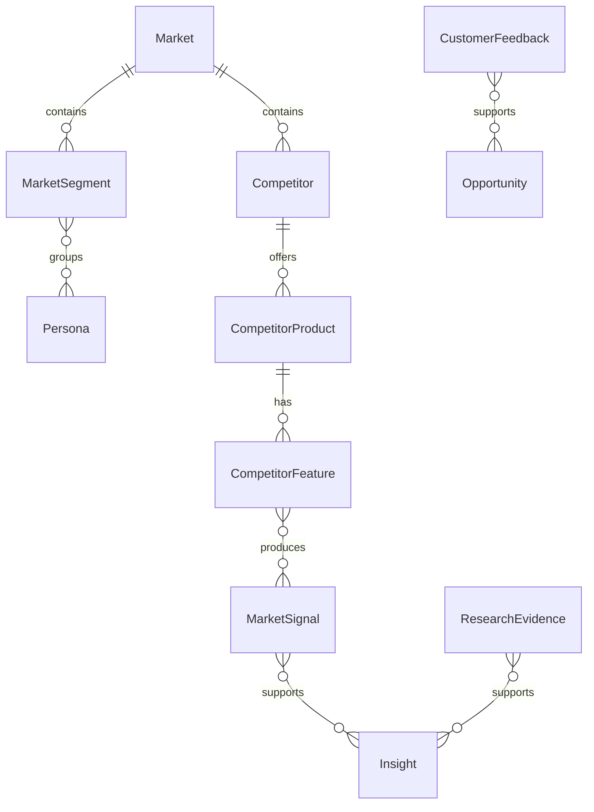

**Terms**

| Level  | Term                     | Meaning                                                                                                                                             | Studio         |
| ------ | ------------------------ | --------------------------------------------------------------------------------------------------------------------------------------------------- | -------------- |
| **L2** | **Market Context**       | External arena, target segments and personas used to reason about demand.                                                                           | **extended**   |
| L3     | ↳ **Market**             | External arena in which the organization competes, sells, learns or seeks adoption.                                                                 | **extended**   |
| L3     | ↳ **Market Segment**     | Target market, customer group or context in which Products compete.                                                                                 | **extended**   |
| L3     | ↳ **Persona**            | Representative user, buyer, customer or stakeholder type used to reason about needs and behavior; informs product, market and commercial decisions. | **extended**   |
| **L2** | **Competition**          | Competitors, their products and observed competitive capabilities.                                                                                  | **core**       |
| L3     | ↳ **Competitor**         | Organization competing for the same customer need.                                                                                                  | **core**       |
| L3     | ↳ **Competitor Product** | Product offered by a Competitor.                                                                                                                    | **core**       |
| L3     | ↳ **Competitor Feature** | Observed competitor capability, behavior, offer or change.                                                                                          | **core**       |
| **L2** | **Signals & Evidence**   | External and customer evidence interpreted into product, market or strategy learning.                                                               | **core**       |
| L3     | ↳ **Market Signal**      | Evidence from market, competitors, sales or customers that may influence product decisions.                                                         | **core**       |
| L3     | ↳ **Customer Feedback**  | Input from customers/users: support tickets, interviews, surveys, usage signals or sales feedback.                                                  | **core**       |
| L3     | ↳ **Research Evidence**  | Observed or collected evidence from research, analysis, interviews, experiments or market monitoring.                                               | **core**       |
| L3     | ↳ **Insight**            | Interpreted learning from evidence that may influence strategy, product or commercial decisions.                                                    | **core**       |
| **L2** | **Market Measurement**   | Measurement of demand, market behavior, competition and segments.                                                                                   | **background** |
| L3     | ↳ **Market Metric**      | Measures market size, growth, share, demand, win/loss, competitor traction or segment behavior.                                                     | **background** |

**Relationships**

| Subject | Predicate | Object | How many | Notes |
| --- | --- | --- | --- | --- |
| Market | contains | Market Segment / Competitor / Market Signal / Research Evidence | `1:N` | |
| Market Segment | groups | Customer / Customer Account / Persona | `N:M` | |
| Competitor | offers | Competitor Product | `1:N` | |
| Competitor Product | has | Competitor Feature | `1:N` | |
| Competitor Feature | produces | Market Signal | `N:M` | |
| Market Signal | supports | Insight / Opportunity / Product Decision | `N:M` | |
| Customer Feedback | supports | Opportunity / Requirement / Finding / Product Decision | `N:M` | |
| Research Evidence | supports | Insight / Hypothesis / Opportunity | `N:M` | |
| Insight | informs | Strategy / Product / Commercial | `N:M` | |

### 3.4 Product

> What value does the organization offer, and what product capabilities should change?

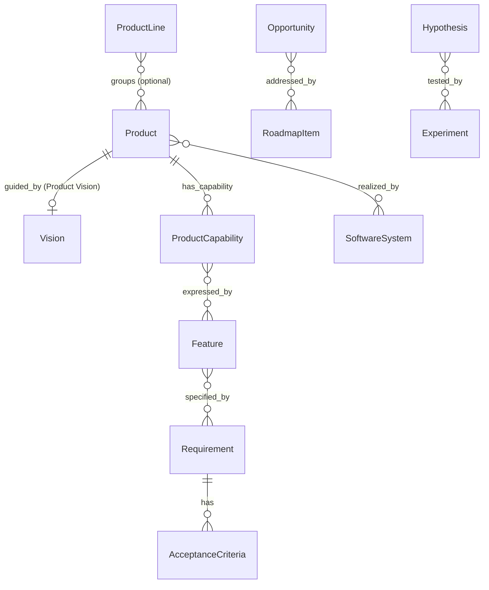

**Product is the only mandatory term in the offering structure.** Product Line is an optional grouping view over products — for strategy, investment, reporting or management. A product can sit in zero, one or several lines (`N:M`, drawn above); smaller organizations typically use none. Some organizations use the word *portfolio* for a cross-line investment or reporting view; that view is not a modeled entity — represent it as an Organization-scoped Vision or Roadmap, or as a rollup over Product Lines and Products.

**Terms**

| Level  | Term                       | Meaning                                                                                            | Studio   |
| ------ | -------------------------- | -------------------------------------------------------------------------------------------------- | -------- |
| **L2** | **Product Line**           | Optional grouping of related Products; may be absent in smaller or simpler product organizations.  | **core** |
| **L2** | **Product**                | Managed offering that delivers value to internal or external customers.                            | **core** |
| **L2** | ↳ **Product Capability**   | Stable ability of a Product to solve a coherent user or business scenario.                         | **core** |
| **L2** | ↳ **Feature**              | Product function or behavior available to a user or customer.                                      | **core** |
| **L2** | **Product Discovery**      | Learning about opportunities, assumptions and experiments before or during product change.         | **core** |
| L3     | ↳ **Opportunity**          | Product/market opportunity worth evaluating or pursuing.                                           | **core** |
| L3     | ↳ **Hypothesis**           | Testable belief about customer value, market response, usability, feasibility or business impact.  | **core** |
| L3     | ↳ **Experiment**           | Bounded activity to test a Hypothesis.                                                             | **core** |
| **L2** | **Product Specification**  | Requirements and bounded product changes that can be planned, implemented and verified.            | **core** |
| L3     | ↳ **Requirement**          | Atomic statement of what a Product or System must do or satisfy.                                   | **core** |
| L3     | ↳ **Acceptance Criteria**  | Conditions that must be satisfied for a Requirement or Work Item to be accepted.                   | **core** |
| L3     | ↳ **Capability Increment** | Bounded change to a Feature or Product Capability.                                                 | **core** |
| L3     | ↳ **Design Artifact**      | Design output specifying user experience or interface: wireframe, prototype, design specification. | **core** |
| **L2** | **Product Outcomes**       | Expected and measured product results.                                                             | **core** |
| L3     | ↳ **Success Criteria**     | Expected outcome condition for a change, expressed through metrics or qualitative evidence.        | **core** |
| L3     | ↳ **Product Metric**       | Measures product value, adoption, engagement, retention, usage, quality or outcome.                | **core** |
| **L2** | **Product Actors**         | People, customers and actors who receive value from or interact with a Product.                    | **core** |
| L3     | ↳ **Customer**             | Individual, group or organization receiving value from a Product; may be internal or external.     | **core** |
| L3     | ↳ **User**                 | Person or actor interacting with a Product or affected by its behavior.                            | **core** |
| **L2** | **Product Decisions**      | Recorded choices about product direction, scope, trade-offs and prioritization.                    | **core** |
| L3     | ↳ **Product Decision**     | Specialized Decision about product direction, scope, trade-off, roadmap or capability.             | **core** |

**Relationships**

| Subject | Predicate | Object | How many | Notes |
| --- | --- | --- | --- | --- |
| Product Line | groups | Product | `N:M` | Product lines may be absent in simpler organizations. |
| Product Line / Product | has_planning_view | Roadmap | `N:M` | Derived from Roadmap Scope; a product roadmap is not a separate entity. |
| Product Line / Product | guided_by | Vision | `0..1` | At most one active Vision per Product (or Line) — one Product, one Vision (a product may have none yet); derived from Vision scope (§3.2); a product vision is not a separate entity. |
| Product | has_capability | Product Capability | `1:N` | |
| Product Capability | expressed_by | Feature | `N:M` | |
| Feature | specified_by | Requirement | `N:M` | |
| Capability Increment | changes | Feature / Product Capability | `N:M` | |
| Design Artifact | specifies | Feature / Product Capability | `N:M` | |
| Design Artifact | informed_by | Research Evidence / Customer Feedback | `N:M` | |
| Opportunity | supported_by | Market Signal / Customer Feedback / Research Evidence | `N:M` | |
| Opportunity | addressed_by | Roadmap Item / Requirement | `N:M` | |
| Hypothesis | tested_by | Experiment | `N:M` | |
| Experiment | produces | Research Evidence / Insight / Product Metric | `N:M` | |
| Requirement | has | Acceptance Criteria | `1:N` | |
| Product Decision | accepts_rejects_or_prioritizes | Opportunity / Feature / Requirement / Roadmap Item | `N:M` | |
| Customer / User | uses | Product | `N:M` | |
| User | provides | Customer Feedback / Usage | `1:N` | |

### 3.5 Commercial

> How does the organization package, sell, agree, monetize and renew product value?

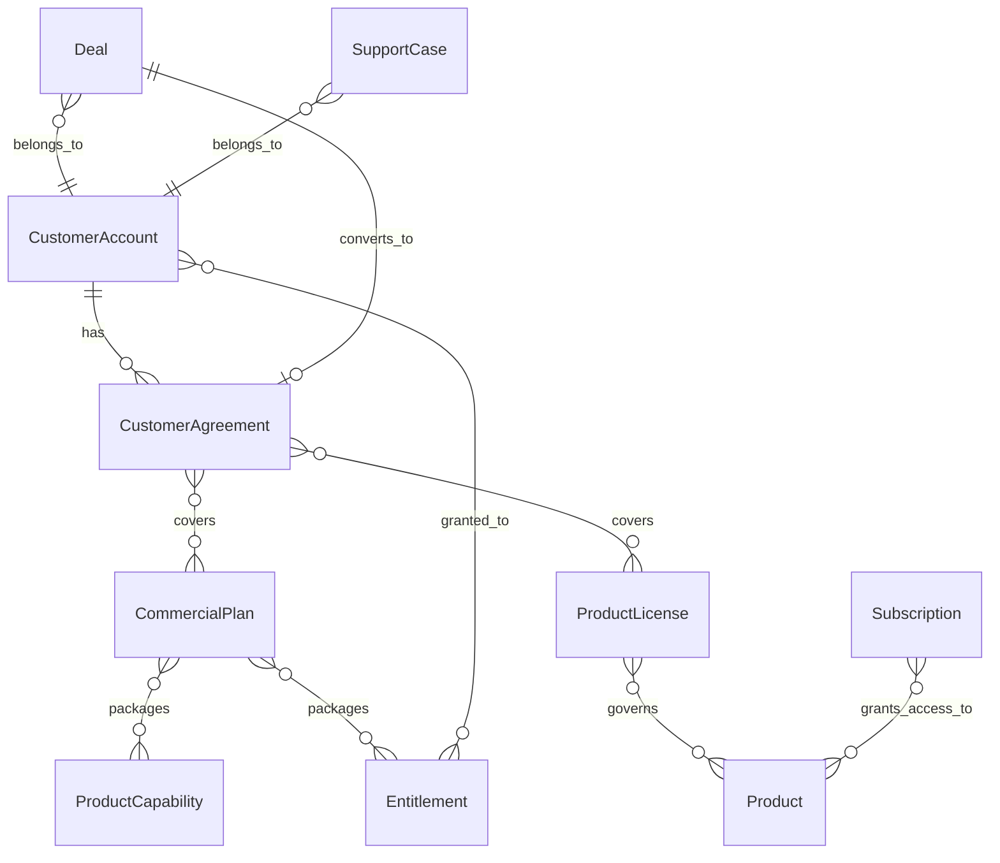

**Terms**

| Level  | Term                                       | Meaning                                                                                                                                                                                                                                   | Studio         |
| ------ | ------------------------------------------ | ----------------------------------------------------------------------------------------------------------------------------------------------------------------------------------------------------------------------------------------- | -------------- |
| **L2** | **Customer Agreements**                    | Commercial customer context and agreements.                                                                                                                                                                                               | **extended**   |
| L3     | ↳ **Customer Account**                     | Commercial or organizational customer that buys, uses or evaluates a Product.                                                                                                                                                             | **extended**   |
| L3     | ↳ **Customer Agreement**                   | Agreement governing a commercial, legal or service relationship with a customer.                                                                                                                                                          | **extended** |
| L3     | ↳ **Commercial Customer Relationship**     | Ongoing relationship between the organization and a customer account across buying, usage, support and renewal.                                                                                                                           | **extended**   |
| **L2** | **Sales Pipeline**                         | Sales opportunities moving toward customer agreements.                                                                                                                                                                                    | **extended** |
| L3     | ↳ **Deal**                                 | Sales opportunity with a customer account, moving through pipeline stages toward an agreement.                                                                                                                                            | **extended** |
| L3     | ↳ **Win/Loss Record**                      | Recorded outcome and reasons of a closed deal.                                                                                                                                                                                            | **background** |
| **L2** | **Packaging & Entitlements**               | How product value is packaged, priced, licensed and granted.                                                                                                                                                                              | **core**       |
| L3     | ↳ **Commercial Plan**                      | Packaged commercial offer — often called a plan or tier — defining available capabilities, limits, pricing or service level.                                                                                                              | **core**       |
| L3     | ↳ **Pricing**                              | Rules or model for how product value is monetized.                                                                                                                                                                                        | **core**       |
| L3     | ↳ **Entitlement**                          | Right granted to a customer, account or user to access a product capability, plan, limit or service.                                                                                                                                      | **core**       |
| L3     | ↳ **Product License**                      | Legal grant under which the organization's **own** Product is provided to a customer or the public: commercial license, EULA, or the product's own open-source license. Outbound counterpart of the inbound third-party License in §3.10. | **core**       |
| **L2** | **Subscription & Renewal**                 | Ongoing commercial access and lifecycle of the paid relationship.                                                                                                                                                                         | **extended**   |
| L3     | ↳ **Subscription**                         | Ongoing commercial relationship granting access to a product, plan or service for a period.                                                                                                                                               | **core**       |
| L3     | ↳ **Renewal**                              | Commercial event or process of extending, changing or ending an existing customer relationship.                                                                                                                                           | **core**       |
| **L2** | **Commercial Commitments**                 | Commitments made to customers as part of agreements.                                                                                                                                                                                      | **background** |
| L3     | ↳ **SLA**                                  | Agreement-backed service-level commitment to a customer.                                                                                                                                                                                  | **background** |
| **L2** | **Customer Support & Relationship Health** | Customer support operations and relationship health.                                                                                                                                                                                      | **core**       |
| L3     | ↳ **Support Case**                         | Tracked customer support request or issue with its own lifecycle and response commitments.                                                                                                                                                | **core**       |
| L3     | ↳ **Customer Health**                      | Assessed state of a customer relationship.                                                                                                                                                                                                | **core**       |
| **L2** | **Usage & Commercial Measurement**         | Measured usage and commercial performance.                                                                                                                                                                                                | **extended**   |
| L3     | ↳ **Usage**                                | Measured product consumption, adoption or activity by customers or accounts.                                                                                                                                                              | **extended**   |
| L3     | ↳ **Commercial Metric**                    | Measures ARR, MRR, expansion, churn, usage revenue or agreement value.                                                                                                                                                                    | **extended**   |

**Relationships**

| Subject | Predicate | Object | How many | Notes |
| --- | --- | --- | --- | --- |
| Customer Account | has | Customer Agreement | `1:N` | |
| Customer Agreement | covers | Product / Commercial Plan / Entitlement / Product License / SLA | `N:M` | |
| Product License | governs | Product | `N:M` | Outbound licensing of the organization's own product. |
| Commercial Plan | packages | Product Capability / Entitlement | `N:M` | |
| Pricing | applies_to | Commercial Plan / Customer Agreement / Subscription / Usage | `N:M` | |
| Subscription | grants_access_to | Product / Commercial Plan | `N:M` | |
| Entitlement | granted_to | Customer Account / User | `N:M` | |
| Entitlement | enables | Product Capability | `N:M` | |
| SLA | references | SLO | `N:M` | |
| Renewal | updates | Customer Agreement / Subscription / Commercial Plan | `N:M` | |
| Usage | feeds | Product Metric / Commercial Metric / Renewal | `N:M` | |
| Customer Account | generates | Usage | `1:N` | |
| Software System / Telemetry Signal | produces | Usage | `N:M` | |
| Deal | belongs_to | Customer Account | `N:1` | |
| Deal | blocked_by | Feature / Roadmap Item | `N:M` | Deal-blocking gaps are a first-class roadmap input. |
| Deal | converts_to | Customer Agreement | `0..1` | |
| Win/Loss Record | produces | Market Signal / Insight | `N:M` | |
| Support Case | belongs_to | Customer Account | `N:1` | |
| Support Case | may_create | Customer Feedback / Work Item | `N:M` | Inbound customer-reported lifecycle — distinct from Customer Impact, the assessed effect of an operational event. |
| Support Case | references | Incident / Product / Feature | `N:M` | |
| Support Case | reveals | Customer Impact | `N:M` | The impact record itself is created from incidents and service health. |
| Customer Health | derived_from | Usage / Support Case / Incident / Renewal | `N:M` | |
| Commercial Customer Relationship | connects | Customer Account / Customer Agreement / Usage / Renewal | `N:M` | Customer Success participates through the Function Overlay. |

### 3.6 Software Estate

> What technical systems, components, code, data and infrastructure realize products and run the organization?

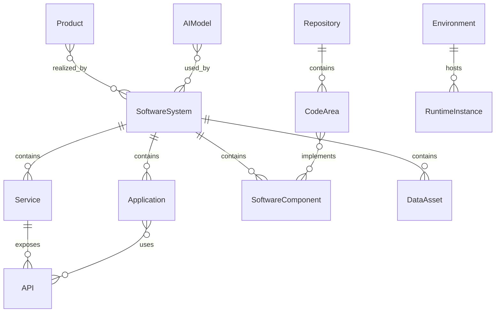

**Terms**

| Level  | Term                              | Meaning                                                                                                                                                        | Studio   |
| ------ | --------------------------------- | -------------------------------------------------------------------------------------------------------------------------------------------------------------- | -------- |
| **L2** | **Systems & Components**          | Technical systems and components that realize products or internal platforms.                                                                                  | **core** |
| L3     | ↳ **Software System**             | Technical system that implements part of a Product or internal platform.                                                                                       | **core** |
| L3     | ↳ **Application**                 | User-facing or operator-facing deployable unit within or associated with a Software System.                                                                    | **core** |
| L3     | ↳ **Service**                     | Deployable runtime unit exposing behavior to applications, systems or external consumers.                                                                      | **core** |
| L3     | ↳ **API**                         | Interface specification through which systems, services or external consumers interact.                                                                        | **core** |
| L3     | ↳ **Software Component**          | Technical part of a Software System: module, adapter, deployable unit or infrastructure module. Consumed reusable packages are modeled as Library.             | **core** |
| L3     | ↳ **Library**                     | Reusable code library or package consumed by applications, services or components; internal or third-party.                                                    | **core** |
| **L2** | **Source & Code**                 | Source-control and code organization.                                                                                                                          | **core** |
| L3     | ↳ **Repository**                  | Source-control container for code, infrastructure, configuration or documentation.                                                                             | **core** |
| L3     | ↳ **Code Area**                   | Logical area of code inside one or more Repositories.                                                                                                          | **core** |
| **L2** | **Data Estate**                   | Managed data structures and data resources used by products and systems.                                                                                       | **core** |
| L3     | ↳ **Data Asset**                  | Dataset, schema, data product, event taxonomy or managed data resource.                                                                                        | **core** |
| **L2** | **Infrastructure & Environments** | Runtime infrastructure and deployment contexts.                                                                                                                | **core** |
| L3     | ↳ **Infrastructure Resource**     | Compute, network, storage, cloud, identity or platform resource used to run systems.                                                                           | **core** |
| L3     | ↳ **Environment**                 | Runtime/deployment context such as dev, staging or production.                                                                                                 | **core** |
| **L2** | **Tooling & Technology Stack**    | Tooling systems and technology stack used to plan, build, run, support and govern work.                                                                        | **core** |
| L3     | ↳ **Tooling System**              | Software system used by the organization to plan, build, test, run, support or govern work; internally built or vendor-provided.                               | **core** |
| L3     | ↳ **Tool Workspace**              | Collaboration or configuration container inside a specific Tooling System — a Slack workspace, Figma team, Notion workspace, Jira site or GitHub organization. | **core** |
| L3     | ↳ **Technology Stack**            | Set of technologies, tooling systems, frameworks, languages and platforms used by the organization.                                                            | **core** |
| **L2** | **AI Estate**                     | AI models, prompts, evaluations and AI agents used by products and tooling.                                                                                    | **core** |
| L3     | ↳ **AI Model**                    | AI/ML model used by products or tooling — vendor-provided or internally built; has versions.                                                                   | **core** |
| L3     | ↳ **Prompt Asset**                | Managed prompt, prompt template or agent instruction used with AI models; has versions.                                                                        | **core** |
| L3     | ↳ **Eval Run**                    | Evaluation of an AI model, prompt or AI-backed feature against defined criteria.                                                                               | **core** |
| L3     | ↳ **AI Agent**                    | Software actor that performs work using AI models under human accountability.                                                                                  | **core** |
| **L2** | **Software Estate Measurement**   | Measurement of technical estate health, complexity, ownership and architecture conformance.                                                                    | **core** |
| L3     | ↳ **Software Estate Metric**      | Measures systems, applications, services, repositories, components, data assets, tooling or technology stack.                                                  | **core** |


The model intentionally avoids generic `Workspace` as a software-organization term. Real organizations have tool-specific workspaces; those are modeled as `Tool Workspace`. Product-side workspace concepts belong to the product's own domain model (see [[studio-representation-model]]).

**Relationships**

| Subject | Predicate | Object | How many | Notes |
| --- | --- | --- | --- | --- |
| Product | realized_by | Software System | `N:M` | |
| Software System | contains | Application / Service / Software Component / Data Asset | `1:N` | |
| Application | uses | Service / API | `N:M` | |
| Service | exposes | API | `1:N` | |
| Service | consumes | API | `N:M` | |
| Software Component | depends_on | Software Component / Third-Party Component / API | `N:M` | |
| Library | consumed_by | Application / Service / Software Component | `N:M` | |
| Repository | contains | Code Area / Commit | `1:N` | |
| Code Area | implements | Software Component / Requirement / Product Capability / Feature | `N:M` | |
| Data Asset | used_by | Software System / Service | `N:M` | |
| Infrastructure Resource | supports | Environment / Runtime Instance | `N:M` | |
| Environment | hosts | Runtime Instance | `1:N` | |
| Tooling System | supports | Team / Process / Software Estate | `N:M` | |
| Tooling System | contains | Tool Workspace | `0..N` | |
| Tool Workspace | used_by | Team / Project / Product / Software System / Repository | `N:M` | Scoped inside a tool, not a generic organization container. |
| Tooling System | provided_by | Vendor | `0..1` | Internal tooling may have no vendor. |
| Technology Stack | supports | Product / Software System / Team | `N:M` | |
| AI Model | used_by | Software System / Service / Tooling System | `N:M` | |
| AI Model | provided_by | Vendor | `0..1` | Internal models may have no vendor. |
| Eval Run | evaluates | AI Model / Prompt Asset | `N:M` | |
| Eval Run | produces | Evidence / Software Estate Metric | `1:N` | |
| Prompt Asset | used_by | AI Agent / Software System / Service | `N:M` | |
| AI Agent | uses | AI Model / Prompt Asset | `N:M` | |

### 3.7 Delivery

> How do changes become tested, releasable and deployed results?

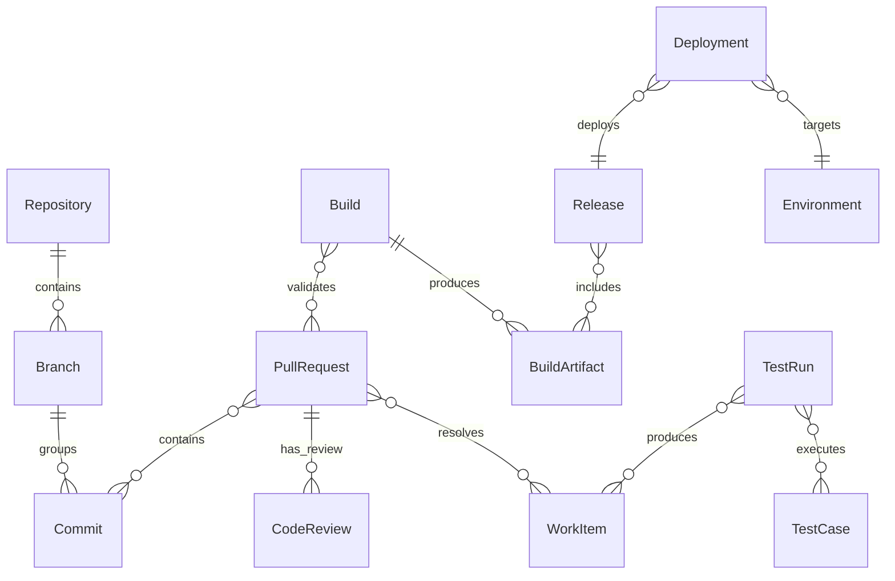

**Terms**

| Level  | Term                     | Meaning                                                                                       | Studio   |
| ------ | ------------------------ | --------------------------------------------------------------------------------------------- | -------- |
| **L2** | **Source Change**        | Source-code changes proposed and reviewed for delivery.                                       | **core** |
| L3     | ↳ **Branch**             | Line of development within a repository.                                                      | **core** |
| L3     | ↳ **Commit**             | Versioned source-code change.                                                                 | **core** |
| L3     | ↳ **Pull Request**       | Proposed code change for review and merge.                                                    | **core** |
| L3     | ↳ **Code Review**        | Review activity or record evaluating a Pull Request or code change before merge or release.   | **core** |
| **L2** | **Build & Verification** | Build and test records proving that a change can work.                                        | **core** |
| L3     | ↳ **Build**              | Build process result for a source revision: status, logs, metadata and produced artifacts.    | **core** |
| L3     | ↳ **Build Artifact**     | Output of a build process: binary, container image, package or bundle.                        | **core** |
| L3     | ↳ **Test Case**          | Test definition verifying behavior, requirement or quality condition.                         | **core** |
| L3     | ↳ **Test Run**           | Execution of Test Cases.                                                                      | **core** |
| **L2** | **Release & Deployment** | Change boundaries and deployment records.                                                     | **core** |
| L3     | ↳ **Release**            | Planned or shipped change boundary with scope, version, decision, notes and rollout intent.   | **core** |
| L3     | ↳ **Release Decision**   | Specialized Decision for approving, rejecting or deferring a Release or Deployment.           | **core** |
| L3     | ↳ **Deployment**         | Event/record of placing a Build Artifact or Release into an Environment.                      | **core** |
| **L2** | **Change Traceability**  | Records and metrics that connect delivered change to scope, evidence and outcomes.            | **core** |
| L3     | ↳ **Change Record**      | Record connecting a delivered change to its scope, evidence, decision and deployment context. | **core** |
| L3     | ↳ **Delivery Metric**    | Measures delivery flow, throughput, quality, lead time, release readiness or effectiveness.   | **core** |

**Relationships**

| Subject | Predicate | Object | How many | Notes |
| --- | --- | --- | --- | --- |
| Commit | belongs_to | Repository | `N:1` | |
| Branch | belongs_to | Repository | `N:1` | |
| Branch | groups | Commit | `1:N` | |
| Commit | authored_by | Person / AI Agent | `N:1` | Attribution per invariant 8; co-authors go on the relationship record. |
| Pull Request | contains | Commit | `N:M` | A commit may appear in more than one branch/history. |
| Pull Request | opened_by | Person / AI Agent | `N:1` | Attribution per invariant 8. |
| Pull Request | resolves | Work Item / Requirement / Remediation | `N:M` | |
| Pull Request | has_review | Code Review | `0..N` | |
| Code Review | reviews | Pull Request / Commit | `N:1` | |
| Code Review | performed_by | Person / Team / AI Agent | `N:M` | |
| Code Review | produces | Evidence / Finding / Work Item | `N:M` | |
| Build | validates | Commit / Pull Request | `N:M` | |
| Build | produces | Build Artifact | `1:N` | |
| Test Case | verifies | Requirement / Acceptance Criteria | `N:M` | |
| Test Run | executes | Test Case | `N:M` | |
| Test Run | produces | Evidence / Work Item / Finding | `N:M` | |
| Release | includes | Build Artifact / Roadmap Item / Work Item | `N:M` | |
| Release | ships | Feature / Capability Increment / Change Record | `N:M` | |
| Release | has_owner | Person / Team | `N:M` | Through Responsibility Assignment. |
| Deployment | deploys | Build Artifact / Release | `N:1` | |
| Deployment | targets | Environment | `N:1` | |
| Deployment | performed_by | Person / AI Agent | `N:1` | Deploys are increasingly agent-initiated; attribution per invariant 8. |
| Release Decision | approves_rejects_or_defers | Release / Deployment | `N:M` | |
| Change Record | links | Work Item / Requirement / Pull Request / Release / Deployment / Evidence | `N:M` | |

### 3.8 Operations

> What is running, how healthy is it, what happened in production, and how does feedback return?

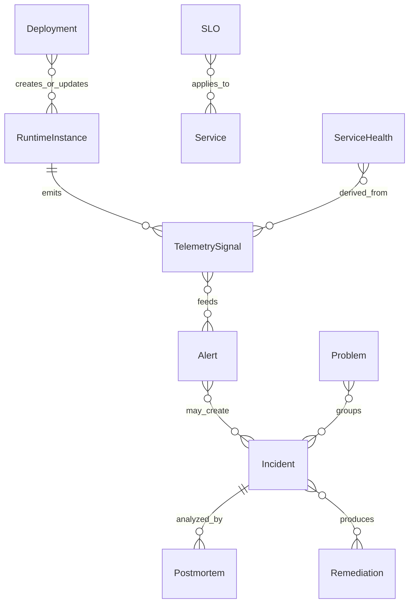

**Terms**

| Level  | Term                              | Meaning                                                                                                  | Studio       |
| ------ | --------------------------------- | -------------------------------------------------------------------------------------------------------- | ------------ |
| **L2** | **Runtime Observation**           | Runtime entities and the telemetry used to observe them.                                                 | **core**     |
| L3     | ↳ **Runtime Instance**            | Running instance of an Application, Service, job, database, queue, model endpoint or other runtime unit. | **core**     |
| L3     | ↳ **Telemetry Signal**            | Observed runtime signal: log, trace, metric, event or health check.                                      | **core**     |
| L3     | ↳ **Operational Metric**          | Measures runtime, reliability, performance, availability or operational behavior.                        | **core**     |
| L3     | ↳ **Alert**                       | Operational signal emitted by monitoring or observation.                                                 | **core**     |
| **L2** | **Incident & Problem Management** | Operational disruptions, impact analysis and follow-up.                                                  | **core**     |
| L3     | ↳ **Incident**                    | Disruption or operational event requiring response and follow-up.                                        | **core**     |
| L3     | ↳ **Postmortem**                  | Analysis of an Incident and prevention actions.                                                          | **core**     |
| L3     | ↳ **Customer Impact**             | Effect of an operational event on Customers, Customer Accounts, revenue, commitments or usage.           | **core**     |
| L3     | ↳ **Problem**                     | Underlying or recurring cause behind incidents, defects or operational instability.                      | **core**     |
| **L2** | **Reliability Management**        | Reliability objectives and service health state.                                                         | **extended** |
| L3     | ↳ **SLO**                         | Internal measurable reliability or service-level objective.                                              | **extended** |
| L3     | ↳ **Service Health**              | Current or historical view of whether a service is operating within expected thresholds.                 | **extended** |
| **L2** | **Operational Knowledge**         | Procedures used to run, diagnose and recover systems.                                                    | **extended** |
| L3     | ↳ **Runbook**                     | Operational procedure for running, diagnosing or recovering a system.                                    | **extended** |

**Relationships**

| Subject | Predicate | Object | How many | Notes |
| --- | --- | --- | --- | --- |
| Deployment | creates_or_updates | Runtime Instance | `N:M` | |
| Runtime Instance | emits | Telemetry Signal | `1:N` | |
| Telemetry Signal | feeds | Operational Metric / Alert | `N:M` | |
| Alert | may_create | Incident | `N:M` | |
| Incident | impacts | Customer / Customer Account / Product / Software System | `N:M` | |
| Incident | has_owner | Person / Team | `N:M` | Through Responsibility Assignment. |
| Incident | produces | Finding / Remediation / Work Item | `N:M` | Postmortem is the inverse `Postmortem analyzes Incident` (below), not a produced object. |
| Problem | groups | Incident / Work Item | `N:M` | |
| Problem | creates | Remediation / Work Item | `N:M` | |
| SLO | measured_by | Operational Metric | `N:M` | |
| SLO | applies_to | Service / Product / Runtime Instance | `N:M` | |
| Service Health | derived_from | Telemetry Signal / Operational Metric / SLO / Alert / Incident | `N:M` | |
| Runbook | used_for | Incident / Problem / Runtime Instance | `N:M` | |
| Postmortem | analyzes | Incident | `N:1` | |
| Postmortem | creates | Finding / Decision / Remediation | `N:M` | |
| Customer Impact | links | Incident / Service Health / Customer / Customer Account / Product / Customer Agreement | `N:M` | |

### 3.9 Governance

> What rules, controls, risks, evidence and decisions constrain and assure the organization?

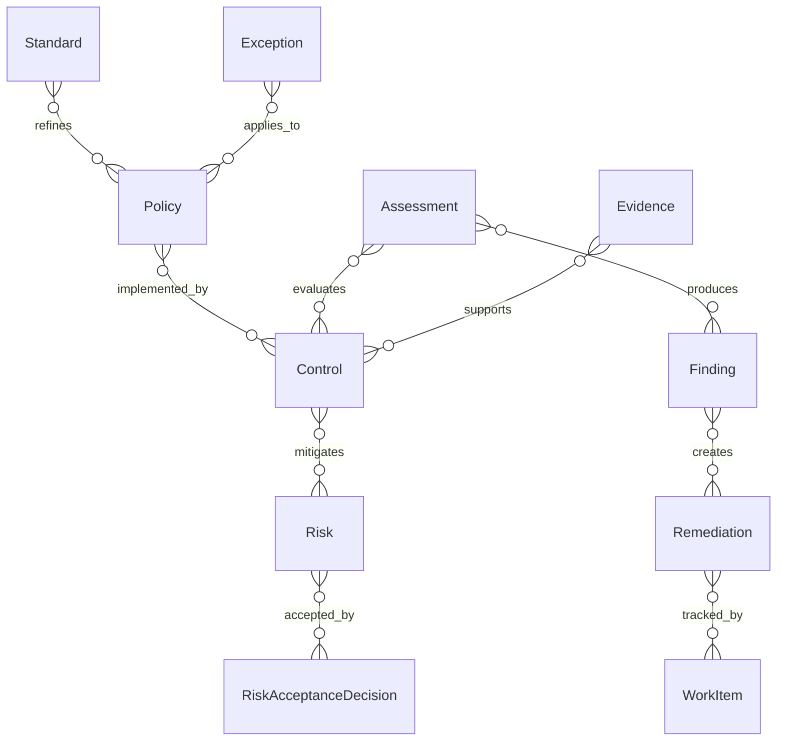

**Terms**

| Level  | Term                           | Meaning                                                                                                                    | Studio       |
| ------ | ------------------------------ | -------------------------------------------------------------------------------------------------------------------------- | ------------ |
| **L2** | **Rules & Expectations**       | Normative rules and expected practices.                                                                                    | **core**     |
| L3     | ↳ **Policy**                   | Normative organizational rule, expectation or requirement.                                                                 | **core**     |
| L3     | ↳ **Standard**                 | Required way of meeting a Policy or engineering/governance expectation.                                                    | **core**     |
| L3     | ↳ **Guideline**                | Recommended practice; not mandatory unless referenced by Policy/Standard.                                                  | **core**     |
| **L2** | **Assurance & Evidence**       | Mechanisms for verifying and proving governance state.                                                                     | **core**     |
| L3     | ↳ **Control**                  | Verifiable mechanism that implements a Policy or reduces a Risk.                                                           | **core**     |
| L3     | ↳ **Assessment**               | Evaluation of an object, process or control against Policies, Standards or Risks.                                          | **core**     |
| L3     | ↳ **Finding**                  | Observed issue, gap, non-compliance, vulnerability or problem.                                                             | **core**     |
| L3     | ↳ **Evidence**                 | Supporting or attesting artifact/record for a claim, control, decision, finding, risk or release.                          | **core**     |
| **L2** | **Risk & Exceptions**          | Risks, approved deviations and risk acceptance choices.                                                                    | **core**     |
| L3     | ↳ **Risk**                     | Possible negative event with likelihood, impact, owner and treatment status.                                               | **core**     |
| L3     | ↳ **Exception**                | Approved deviation from Policy, Standard or Control, with scope and expiry.                                                | **core**     |
| L3     | ↳ **Risk Acceptance Decision** | Specialized Decision to accept a known risk under stated conditions.                                                       | **core**     |
| **L2** | **Governance Decisions**       | Recorded choices with rationale, evidence and consequences.                                                                | **core**     |
| L3     | ↳ **Decision**                 | General recorded choice with rationale, date, owner, evidence and consequences; base record for all specialized decisions. | **core**     |
| L3     | ↳ **Architecture Decision**    | Specialized Decision about technical architecture, system design or platform direction.                                    | **core**     |
| **L2** | **Remediation & Measurement**  | Corrective actions and governance metrics.                                                                                 | **extended** |
| L3     | ↳ **Remediation**              | Planned treatment to resolve a Finding or reduce a Risk.                                                                   | **extended** |
| L3     | ↳ **Governance Metric**        | Measures risk exposure, control coverage, finding aging, exception volume or assessment status.                            | **extended** |

**Relationships**

| Subject | Predicate | Object | How many | Notes |
| --- | --- | --- | --- | --- |
| Policy | applies_to | Domain Object | `N:M` | |
| Policy | implemented_by | Control | `N:M` | |
| Standard | refines | Policy | `N:M` | |
| Standard | constrains | Software System / Process / Release / Control | `N:M` | |
| Guideline | informs | Work Item / Assessment / Decision | `N:M` | |
| Control | mitigates | Risk | `N:M` | |
| Assessment | evaluates | Control / Software System / Process / Vendor | `N:M` | |
| Assessment | produces | Finding / Evidence | `N:M` | |
| Finding | creates | Risk / Exception / Decision / Remediation | `N:M` | |
| Risk | mitigated_by | Control / Remediation / Decision | `N:M` | |
| Exception | applies_to | Policy / Standard / Control / Finding / Risk | `N:M` | |
| Architecture Decision | constrains | Software System / Repository / API / Work Item | `N:M` | |
| Risk Acceptance Decision | accepts | Risk | `N:M` | |
| Evidence | supports | Assessment / Control / Finding / Decision / Test Run / Deployment | `N:M` | |
| Remediation | resolves | Finding / Risk | `N:M` | |
| Remediation | tracked_by | Work Item / Project | `N:M` | |

### 3.10 External Dependencies

> Which external parties, supplier agreements, components, licenses, services and obligations does the organization depend on?

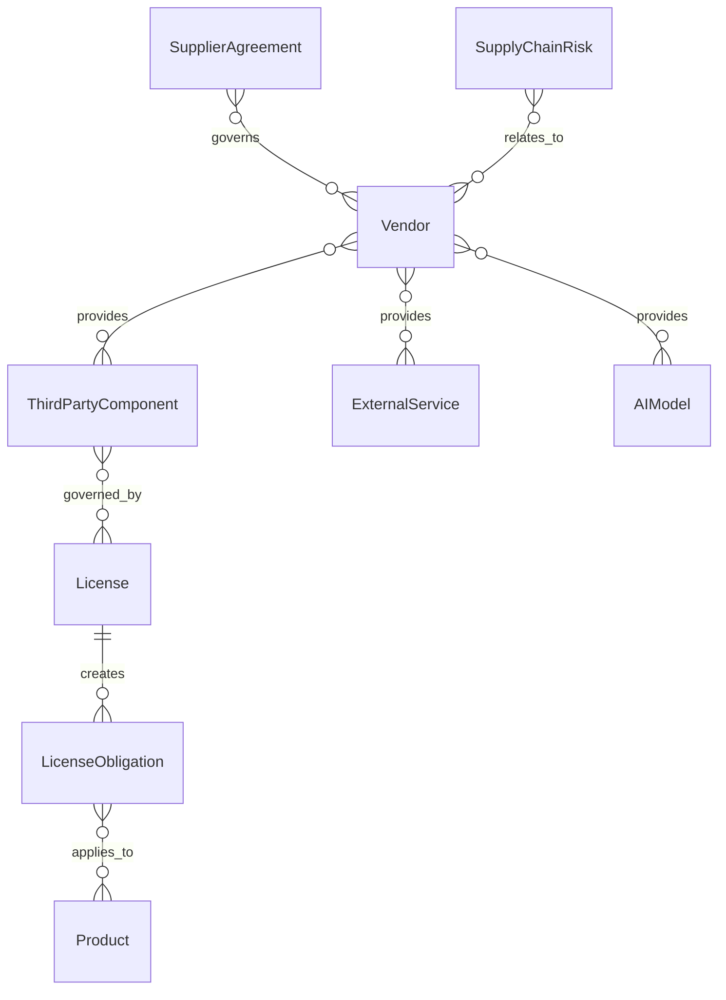

**Terms**

| Level | Term | Meaning | Studio |
| --- | --- | --- | --- |
| **L2** | **Suppliers & Agreements** | External suppliers and the agreements that govern supplier relationships. | **extended** |
| L3 | ↳ **Vendor** | Supplier outside the organization that provides tools, components, services, infrastructure or data. | |
| L3 | ↳ **Supplier Agreement** | Agreement with a vendor, supplier, partner or external service provider. | |
| **L2** | **Third-Party Assets & Services** | External components, services and technology dependencies used by the organization. | **extended** |
| L3 | ↳ **Third-Party Component** | Externally supplied component, package, service or dataset used by the organization. Externally consumed AI models are modeled as AI Model. | |
| L3 | ↳ **External Service** | Service operated by an external party and used by the organization. | |
| L3 | ↳ **Technology Dependency** | Dependency on a technology, framework, platform, runtime or standard outside direct product ownership. | |
| **L2** | **Licenses & Obligations** *(inbound)* | Legal permissions and obligations on external components or assets **the organization consumes**. The outbound license for the organization's own Product is **Product License** (§3.5). | **extended** |
| L3 | ↳ **License** | Legal permission or constraint governing use, distribution, modification or commercialization of a third-party asset or component. | |
| L3 | ↳ **License Obligation** | Requirement created by a License: attribution, notices, usage restriction, disclosure, payment or audit. | |
| **L2** | **Supply-Chain Risk & Measurement** | Risk and measurement around external components, services, vendors and licenses. | **background** |
| L3 | ↳ **Supply-Chain Risk** | Risk created by external components, vendors, services, licenses or delivery dependencies. | |
| L3 | ↳ **External Dependency Metric** | Measures vendor performance, external service reliability, license exposure, component risk or dependency cost. | |

**Relationships**

| Subject | Predicate | Object | How many | Notes |
| --- | --- | --- | --- | --- |
| Vendor | provides | Tooling System / Third-Party Component / External Service / AI Model | `N:M` | |
| Supplier Agreement | governs | Vendor / External Service / Third-Party Component / AI Model | `N:M` | |
| Supplier Agreement | creates | Supply-Chain Risk / Risk / Finding | `N:M` | |
| Third-Party Component | governed_by | License | `N:M` | Inbound licensing. |
| License | creates | License Obligation | `1:N` | |
| License Obligation | applies_to | Third-Party Component / Product / Usage | `N:M` | |
| External Service | supports | Software Estate / Delivery / Operations / Commercial | `N:M` | |
| Technology Dependency | affects | Software System / Technology Stack / Organizational Structure / Investment Direction / Risk / Architecture Decision | `N:M` | |
| Supply-Chain Risk | relates_to | Vendor / Third-Party Component / License / External Service / AI Model | `N:M` | |

## 4. Work Management Layer

> How does the organization organize work across all domains?

Work Management applies across all domains — it is where **Project** lives: a project coordinates change in any domain, so it is deliberately not part of any single domain area (§1).

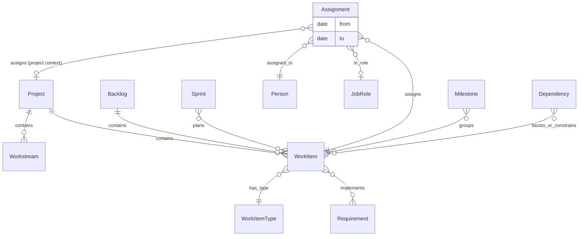

**Terms**

| Term               | Meaning                                                                                                                                                   | Studio   |
| ------------------ | --------------------------------------------------------------------------------------------------------------------------------------------------------- | -------- |
| **Project**        | Bounded execution effort: feature delivery, research, migration, complex bugfix, customer implementation or remediation.                                  | **core** |
| **Workstream**     | Coordinated stream of work inside or across Projects, often focused on a discipline, domain, system or outcome.                                           | **core** |
| **Process**        | Repeatable way of performing work or making decisions.                                                                                                    | **core** |
| **Activity**       | Bounded action or step within a process, project or workstream.                                                                                           | **core** |
| **Backlog**        | Ordered or triaged collection of work that may be considered, planned or executed.                                                                        | **core** |
| **Sprint**         | Time-boxed execution iteration into which work items are planned (Scrum; other cadences map to Process).                                                  | **core** |
| **Work Item**      | Tracked unit of delivery or follow-up work.                                                                                                               | **core** |
| **Work Item Type** | Classification of a Work Item — epic, user story, task, bug, spike, chore, incident follow-up, remediation task.                                          | **core** |
| **Assignment**     | Allocation of work to a person, team, role or function; may carry the Job Role in which the assignee acts for this work; has effective dates when needed. | **core** |
| **Milestone**      | Significant target date or achievement in a Project, Workstream or Roadmap.                                                                               | **core** |
| **Dependency**     | Relationship where one object, work item, team or external constraint affects another.                                                                    | **core** |
| **Handoff**        | Transfer of responsibility, context or work output between people, teams or functions.                                                                    | **core** |
| **Outcome**        | Result or effect the work is intended to create or has actually created.                                                                                  | **core** |

**Relationships**

| Subject | Predicate | Object | How many | Notes |
| --- | --- | --- | --- | --- |
| Project | contains | Workstream / Work Item | `0..N` | |
| Workstream | contains | Work Item | `1:N` | |
| Project | justified_by | Roadmap Item / Strategic Initiative / Incident / Risk / Finding / Customer Agreement / Business Decision | `N:M` | Every project has an explicit reason (invariant 2). |
| Project | has_owner | Person / Team | `N:M` | Through Responsibility Assignment. |
| Backlog | contains | Work Item | `0..N` | |
| Work Item | has_type | Work Item Type | `N:1` | |
| Sprint | plans | Work Item | `N:M` | A work item may carry over. |
| Work Item | implements | Requirement / Acceptance Criteria | `N:M` | |
| Process | contains | Activity / Handoff | `1:N` | |
| Activity | produces | Work Item / Outcome | `N:M` | |
| Assignment | assigns | Work Item / Activity / Project / Workstream | `N:1` | One assignment record allocates one piece of work; multiplicity arises from many records. |
| Assignment | assigned_to | Person / Team / Job Role / Function / AI Agent | `N:1` | Assignment is not ownership; has effective dates when needed. |
| Assignment | in_role | Job Role | `0..1` | A person may act in different roles on different projects; distinct from the org-wide roles implied by Position (§3.1). |
| Milestone | groups | Roadmap Item / Work Item / Release / Decision | `N:M` | |
| Dependency | blocks_or_constrains | Work Item / Project / Domain Object | `N:M` | |
| Handoff | transfers_from | Person / Team / Function | `N:1` | |
| Handoff | transfers_to | Person / Team / Function | `N:1` | |
| Outcome | describes | Project / Workstream / Activity / Roadmap Item | `N:M` | |
| Outcome | measured_against | Success Criteria | `N:M` | |
| Project | affects | Product / Software System / Data Asset / Risk | `N:M` | |

**Why Delivery and Operations are domain areas, not subareas of Work Management:** Work Management models the *coordination* of work (projects, work items, assignments). Delivery models the *records produced by the software change pipeline* (commits, pull requests, builds, releases, deployments). Operations models the *records produced by running systems* (telemetry, incidents, service health). The same real-world flow often crosses all three: an incident creates work items, the work is delivered through pull requests and deployments, and operations observes whether health recovered.

Common development tracker labels are modeled as `Work Item Type` values — controlled vocabulary, not separate root-domain entities:

| Work Item Type | Meaning |
| --- | --- |
| **Epic** | Large work item that groups related user stories, tasks or bugs around a product change, capability increment or delivery outcome. |
| **User Story** | Work item describing desired user or stakeholder value, usually tied to a feature, requirement or acceptance criteria. |
| **Task** | Concrete executable work that does not need to be framed as user-facing value. |
| **Bug** | Work item tracking a defect, regression, failed expectation or unexpected behavior. |
| **Spike** | Time-boxed investigation, research or technical exploration. |
| **Chore** | Maintenance, cleanup or operational work that supports delivery but is not directly user-facing. |

## 5. Function Overlay

Functions describe who participates. Functions never hold accountable ownership (invariant 1) — they participate in work routing (assignment, handoff). On the Studio side, functions do not become containers or objects — they appear through actor roles, assignments and views ([[studio-representation-model]] §9). In the **Studio**-column sense the overlay is **background**: we do not propose covering functions as objects.

| Function | Participates mainly in | Notes |
| --- | --- | --- |
| **Product Management** | Strategy, Market, Product, Commercial, Work Management. | Leads product direction, opportunities, roadmap and requirements. |
| **Product Marketing** | Market, Product, Commercial, Strategy. | Connects positioning, launch, competitive context and sales enablement. |
| **R&D / Engineering** | Product, Software Estate, Delivery, Operations, Governance. | Researches, designs, builds, evolves and helps operate technical systems. |
| **QA** | Product, Delivery, Software Estate, Governance. | Validates requirements, quality, release readiness and test evidence. |
| **DevOps / SRE** | Software Estate, Delivery, Operations, Governance, External Dependencies. | Builds delivery/runtime practices and reliability mechanisms. |
| **GTM / Sales** | Market, Commercial, Product, Strategy. | Converts market opportunities into customer and revenue motion. |
| **Customer Success** | Commercial, Operations, Product, Market, Work Management. | Turns customer usage, feedback and impact into retention and improvement work. |
| **Design / UX** | Product, Market, Delivery, Work Management. | Researches user needs, designs experiences and validates usability. |
| **Security / Compliance** | Governance, Software Estate, Delivery, Operations, External Dependencies. | Owns security posture, compliance programs, controls and risk treatment. |
| **People Ops** | Organizational Structure, Work Management, Governance. | Supports employment, roles, skills, onboarding, capacity and organizational change. |
| **Finance** | Strategy, Commercial, External Dependencies, Governance. | Supports budgets, investment, spend, cost allocation and economic outcomes. |
| **Legal** | Commercial, Governance, External Dependencies, Organizational Structure. | Supports agreements, IP, policy, risk, licensing and compliance obligations. |
| **Procurement** | External Dependencies, Commercial, Governance, Software Estate. | Supports vendor selection, supplier agreements, purchase process and third-party controls. |
| **Internal IT** | Organizational Structure, Software Estate, Operations, Governance, External Dependencies. | Supports internal tools, employee technology, access and operational services. |

## 6. Lifecycles And Invariants

### 6.1 Lifecycles

State lists are indicative vocabularies, not mandated workflows; organizations adapt them.

| Entity | Typical lifecycle |
| --- | --- |
| Work Item | open → ready → in progress → in review → done / cancelled |
| Roadmap Item | proposed → committed → in delivery → shipped / dropped |
| Project | proposed → active → on hold → completed / cancelled |
| Opportunity | identified → evaluated → accepted / rejected |
| Experiment | designed → running → concluded (validated / invalidated) |
| Deal | qualified → in progress → won / lost |
| Subscription | active → renewed / expanded / reduced → churned |
| Support Case | opened → in progress → waiting → resolved → closed |
| Incident | detected → acknowledged → mitigated → resolved → reviewed |
| Problem | identified → analyzed → remediated / accepted |
| Release | planned → in progress → released / cancelled |
| Risk | identified → assessed → treated / accepted → closed |
| Finding | open → triaged → remediated / risk-accepted → verified |
| Exception | requested → approved → active → expired / revoked |

### 6.2 Invariants

1. Accountable ownership is always a Person or Team (through Responsibility Assignment) — never a Job Role, a Function or an AI Agent.
2. Every Project is justified by at least one explicit reason: roadmap item, strategic initiative, incident, risk, finding, customer agreement or business decision.
3. A production Deployment references a Build Artifact or Release; where release gates apply, it requires a Release Decision.
4. A Requirement accepted for delivery has Acceptance Criteria.
5. An Exception always has a scope and an expiry or review date.
6. A Risk always has an owner, likelihood, impact and treatment status.
7. Employment, Team Membership, Position Allocation, Reporting Line, Assignment, Responsibility Assignment and Skill possession carry effective dates.
8. Work performed by an AI Agent is attributed to that agent; accountability stays with a Person or Team.
9. Metrics measure; decisions change. A metric never modifies a domain object directly — its influence flows through decisions, roadmaps and work.
10. Every specialized Decision (business, product, architecture, risk acceptance, release) is a Decision and inherits its record fields.
11. An active Product, Software System, Service, AI Agent or Budget has an accountable owner — a Person or Team, through Responsibility Assignment.

## Appendix A. 

Everything else is content-identical to v0.8.09. Glossary rows for the new terms (Skill, Product License, Mission) and notes (Vision scope, `in_role`, `participates_in`) are pending in [[software-organization-glossary]].
