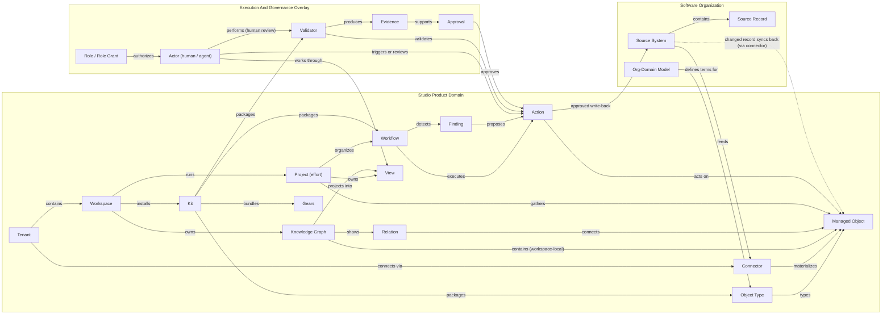
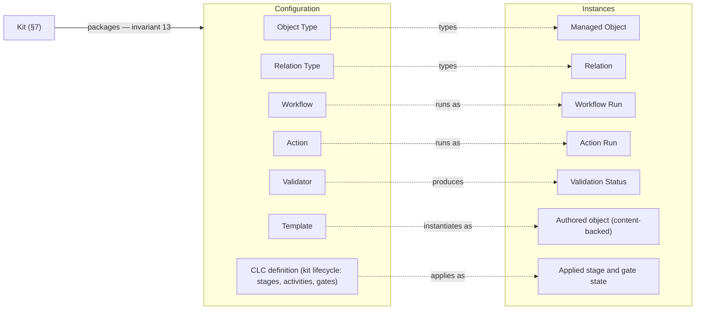
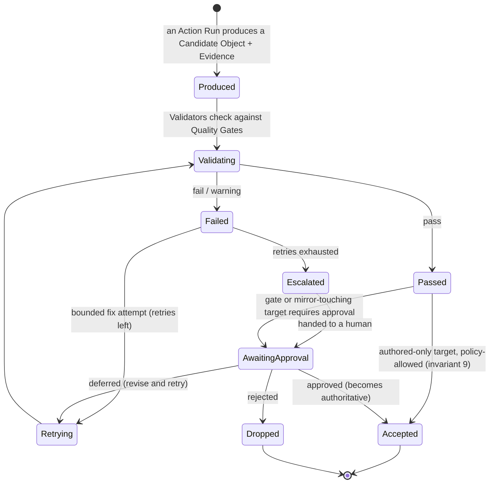

# Studio Product Domain Model

*How Studio represents a software organization — Studio's own world, how the organization's domain model flows into it, and how work moves forward on top. Includes the Organization-to-Studio Mapping.*

## 0. The Whole Model On One Page

The organization's domain model ([[software-organization-domain-model]]) describes **reality**: people, products, code, releases, incidents, policies. Studio does not replace that reality — it **represents** it, and then **moves work forward** on top of the representation.

> An **Organization** gets a **Tenant**. Connectors pull records from the organization's tools; identity mapping turns them into **managed objects**, each owned by one workspace. A **Workspace** is Studio's working context for one purpose (typically a product line): the objects it **owns**, together with the **relations** among them, form its **Knowledge Graph** — graph and identity both live at workspace level. Objects are workspace-local; the only cross-workspace operation is **copy** — no shared object across workspaces (a shared identity for non-edited things is a proposed future direction — §3.1.1). Inside a workspace, a **Project** — an effort that is itself an object in the graph — gathers the objects it touches and drives them to an outcome. **Members** work through **views**, seeing exactly what their **roles** allow. On top of the mirror, **workflows** run **actions**: Studio computes **findings** — gaps, drift, contradictions — prepares recommendations, validates candidates against **quality gates** attaching **evidence** — a validator may be a rule, a test, a model or a **person reviewing** — and, only after **approval**, writes back to the source tools. **Kits** package the domain knowledge all of this runs on — object types, templates, workflows, validators, **Gears** building blocks — and a workspace installs them. *(How you adapt a kit to your organization — rename, re-value, re-type, re-structure — is the four-rung map in §7.)*

One story, one picture: *Studio connects to the organization's systems, materializes their records as managed objects in knowledge graphs, and lets people and agents run governed projects, workflows and actions over them.*



*Reading the diagram: an arrow points the way content flows or control acts (sources feed connectors, the graph projects into views, approvals approve actions). The overview simplifies — the **Action** node stands for Action and its runs; the exact machinery is §6.1.*

**Running example, used throughout:** *Acronis runs Studio. Its tenant connects Jira, GitLab and the HRIS (human-resources system). The "Backup & Recovery" product line — with its product **Cyber Protect** — is a Workspace; inside it, the "Clean Restore" Project gathers everything that effort touches: the competitor signal, the roadmap item, the specs, the repositories and the pull requests. Each employee exists in Jira, GitLab and the HRIS — three source records; inside the "Backup & Recovery" workspace, identity mapping assembles them into one Person object — one page, one history, three provenance trails. Another workspace importing the same engineer mints its own, independent Person object (correlation: the correlation layer, §3.1.1); within a workspace, the golden thread never notices the difference.*

## 1. Frame

**This document is** the domain model of Studio (the product): the entities that exist *only because Studio exists*, their relationships and invariants, and the mapping from each organization entity to its Studio object. It **takes the organization's domain model ([[software-organization-domain-model]]) as its reference** — the entities Studio represents are drawn from there, and no organization entity is redefined here. **It is not** that organization model itself, an information architecture or screen design (downstream, with the UX team), or a storage / sync architecture.

**It sits above the Studio Kernel Model** ([[studio-kernel-model]]) as one of two co-normative layers. The kernel is normative for mechanics — identity, versioning, execution, authorization, audit — which this document adopts **by reference and never restates** (a rule only code can verify lives in the kernel; here live the principle and the scenario). This document is normative for the product domain; where the two appear to conflict, it is a defect, resolved in the decision register.

## 2. Names And Aliases

This doc uses one shared dictionary — [[studio-glossary]]. A few entities, for structural reasons, carry different names across the organization model, this product model and the kernel contract; those are reconciled in the glossary's **cross-layer alias table**.

## 3. Studio's World

**One discipline runs through the whole model: definition vs instance.** Every working thing in Studio exists twice: as a **definition** — configuration, chosen and shipped *as data* by kits and admins (invariant 13) — and as an **instance** — what actually happened. Think blueprint vs part: an Object Type says what a Requirement *is*; a Managed Object is requirement R-12. A Workflow is the pipeline's definition; a Workflow Run is yesterday's execution of it. A Template is the blank; an authored object is the filled-in document. The CLC definition (the kit's configured lifecycle) is the blueprint; the applied stage state is where work stands right now. The payoff: **adapting Studio to an organization means changing the left column — install or edit a kit — never the product itself.** Durable configuration has three owners — tenant control config, workspace control config, and **kit configuration, which is a workspace-owned graph object with immutable versions** (templates, lifecycle definitions, rule sets), authoritative only as an exact version (§6.4).



*Transitions (§6.1) are the history of the right column — the substrate delivery metrics are read from. Change the organization, change the left column's rows — not the schema.*

**How to read the `Facing` column** (used in every entity table). **Cardinality echoes:** entity rows repeat, in parentheses, the numbers readers ask first — how many workspaces, projects, roles; the normative source stays the relationship catalog (§8.1). 
- **Admin-facing** — an administrator creates and manages it; it is configuration (Object Type, Workflow, Validator). 
- **User-facing** — a member meets it in everyday work (Managed Object, Workflow Run, Finding). 
- **System-facing** — internal machinery: nobody sees the entity itself, only its effects inside other surfaces (Knowledge Graph, Transition, User Projection). 
- ***(signal)*** — a status a member sees but never edits (Sync State, Validation Status). Rule of thumb: in every *definition → execution* pair, the definition is Admin-facing and the execution is User-facing — an admin configures the Workflow, a member watches its Workflow Run. The information architecture is derived from this column: facing decides where an entity's surface lives and who sees it.

**Three layers, one tenant.** Everything in Studio lives in exactly one of three layers:

1. **Control-plane citizen** — Tenant, Member, Team, Role, Permission, Data Policy, Safety Constraint, Connector, Kit, Audit Entry. Citizens govern access and configuration; they are **not part of any knowledge graph**, and **authorization flows through citizens only — never through the graph** (invariant 15). A tenant-level change to a citizen (a role, a policy) reaches every workspace directly, with no graph involved.
2. **Graph object** — a workspace-local, kit-typed managed object: the domain data (§3.2).
3. **Citizen Stand-in** — an optional workspace-local **representation** of a citizen, created by a kit (people-management, SDLC) when a workspace needs a member or team *on* the graph (e.g. a Person object standing for a Member). Representation-only: never authoritative, never consulted for authorization.

These three layers place *where a thing lives*; the per-**field** refinement — who may write each field and which layer's contract owns it — is **§3.4** (it builds on acquisition mode, so it follows §3.2).

### 3.1 Containers and people

| Term          | Meaning                                                                                                                                                                                                                                                                                                                                                                                                                                                                                                                                      | Primary relationships                                                                                                                                                                                                                                                                                                                                                                                                                                               | Facing       |
| ------------- | -------------------------------------------------------------------------------------------------------------------------------------------------------------------------------------------------------------------------------------------------------------------------------------------------------------------------------------------------------------------------------------------------------------------------------------------------------------------------------------------------------------------------------------------- | ------------------------------------------------------------------------------------------------------------------------------------------------------------------------------------------------------------------------------------------------------------------------------------------------------------------------------------------------------------------------------------------------------------------------------------------------------------------- | ------------ |
| **Tenant**    | The instance of Studio serving one Organization (**1:1** — unchanged). *Acronis = one tenant.* Commercial packaging (subscription plan, account policies) is tenant configuration, not domain entities. A tenant may sit under a **parent tenant** in a control-plane **admin hierarchy**: a service provider's parent tenant administers N child tenants, each still 1:1 with its own organization — the hierarchy governs *management*, never data (each tenant's objects stay isolated). Kernel already supports this (`parentTenantId`). | Contains workspaces, members and connectors (any number of each; the tenant itself is one per organization); keeps the **control-plane registries** — members, teams, roles, policies, connectors, kits, audit — and the tenant-wide **type** registry (invariant 13). It holds **no object-identity registry**: object identity is workspace-local. **May administer child tenants** (`Tenant → administers → Tenant`, 1:N, control-plane only, deployment-gated). | Admin-facing |
| **Workspace** | Studio's working context, bounded by **one purpose** — typically a product line, or several products linked to each other; may span departments and teams; may be personal.                                                                                                                                                                                                                                                                                                                                                                  | Belongs to the tenant (a tenant runs **any number** of workspaces); **owns** its managed objects — every object is workspace-local, and the same real-world subject in two workspaces is two independent objects (sharing requirements: §3.1.1); owns **exactly one** Knowledge Graph; hosts any number of projects, views, workflows, automation.                                                                                                                  | User-facing  |
| **Project**   | Studio's effort container — **itself a managed object of type Project**: usually *authored* in Studio, sometimes mirrored from a tracker and **adopted**. Roughly a tracker's epic or initiative — a goal, the objects that effort touches, an outcome; Studio adds the workbench: inclusion scope, workflows, progress. *"Clean Restore" gathers the gap, the roadmap item, the repos and the PRs of one push.*                                                                                                                             | Is a managed object (type Project); belongs to **exactly one** workspace (a workspace hosts **any number** of projects); includes managed objects by reference (an object may belong to several projects at once); *advances* the managed objects it exists for (a Roadmap Item, an epic work item).                                                                                                                                                                | User-facing  |
| **Member**    | Someone using Studio — the vision's Studio **User**. Client access — CLI, IDE plugins, MCP endpoints, API tokens — is **member configuration, not domain entities** (same status as commercial packaging).                                                                                                                                                                                                                                                                                                                                   | A control-plane citizen (§3, three layers). Links to at most one Person managed object **per workspace**, and a workspace's Person links to at most one member; holds **any number** of Role Grants, each at one scope — directly or via teams. **A member works in any number of workspaces and projects at once** — participation *is* the role grant at that scope; there is no separate "project membership" record.                                            | User-facing  |
| **Team**      | A control-plane citizen (§3): a Studio-native **group of members** — a grantee of roles and a unit of organizing work. ⚠️ Not the org's Team (glossary ▸ divergent terms): an org Team arrives as a managed object; a Studio Team may be **seeded** from one, but membership is managed in Studio and never auto-synced — sources must not silently change access.                                                                                                                                                                           | Belongs to the tenant (any number of teams); has members (a member may belong to many teams); granted roles at a scope (like a member); optionally seeded from an org Team managed object; membership changes are audit-logged. *(Realization: the kernel has no group grantee — a Studio Team materializes as per-principal grants applied by a governed Worker, one audit entry per change.)*                                                                     | User-facing  |

#### 3.1.1 Working across workspaces

**Two capability layers, defined once here** *(referenced throughout the doc)*: the **per-workspace layer** — objects and identity are workspace-local, and cross-workspace answers are scalar roll-ups (counts, not shared objects); and the **cross-workspace correlation layer** — a non-authoritative way to line up "the same real thing" across workspaces via correlation IDs + correspondence records (side by side, never merged into one object). The per-workspace layer is the base model; the correlation layer is an **additional capability built above it**. Where the doc says "the correlation layer," it means this.

The governing rule is one line: **the same thing in two workspaces is safe to share only when Studio doesn't edit it.** So the base model is workspace-local objects with **copy** as the only cross-workspace move — a member sees only their own workspace, authored content (a PRD, a review) travels to another workspace only as a copy, and the only org-wide authored things (company Vision, Mission, top-level Objective) sit in a designated commons workspace. Sharing *one* identity for non-edited things (a person, a repo, a build), object-level cross-line portfolio, and hard-wall existence-concealment are our **proposed** direction (Appendix D), not shipped. The ten detailed requirements (R1–R10), and which of them need a kernel change, are in **Appendix D**.

**Studio supports service-provider / MSP topologies** (VISION §6.4 "Service providers: Core focus"): a **parent tenant administers N child tenants**, each still 1:1 with its own organization — one provider console over many client tenants, with the provider able to push its kits down the hierarchy (§7). The **tenant admin hierarchy** (§3.1 Tenant) that enables this is a *different axis* from cross-workspace sharing and must not be confused with it: it is **control-plane only** — the hierarchy governs *management*, never data — and it creates **no** shared objects, no shared identity and no cross-tenant graph. Objects and identity stay workspace-local exactly as above; the only sanctioned cross-tenant move is a parent **distributing a kit** (definition, copy-only) down the hierarchy (§7).

### 3.2 Objects and relations

| Term                | Meaning                                                                                                                                                                                                                                                                                                                                                                                                                                                                                                                                 | Primary relationships                                                                                                                            | Facing        |
| ------------------- | --------------------------------------------------------------------------------------------------------------------------------------------------------------------------------------------------------------------------------------------------------------------------------------------------------------------------------------------------------------------------------------------------------------------------------------------------------------------------------------------------------------------------------------- | ------------------------------------------------------------------------------------------------------------------------------------------------ | ------------- |
| **Knowledge Graph** | The workspace-level home of the facts: the managed objects the workspace includes plus the relations among them. One graph per workspace — and a graph is a **system model, not a UI**: members see views; a graph diagram is just one view.                                                                                                                                                                                                                                                                                            | Belongs 1:1 to a workspace; queried by views, workflows, automation.                                                                             | System-facing |
| **Managed Object**  | Studio's representation of one real entity — the three-layer model (§3) calls this a *graph object* (its domain-data layer). It **is the kernel `Object` metatype seen at the product layer**, with acquisition/provenance/sync added; the name keeps "Managed" because bare "object" is used generically throughout. *(STUDIO_VISION calls this "artifact"; kernel/ARCH say "Object" — same entity, see glossary alias table.)* **One object per workspace** — owned by the workspace that created or imported it, never shared across workspaces; projects inside the workspace include it by reference, never copy it. Everything else it carries — below this table.                                                                                                                                                                                                                                                                                                                                                               | Typed by an Object Type; assembled from source records via identity mapping (authored objects have none); included into projects within its workspace. | User-facing   |
| **Relation**        | A typed, directed link between exactly two managed objects — *"PR **resolves** Work Item"*. Carries an **origin** — **imported** (a source fact, materialized in the importing workspace; a second workspace importing the same fact gets its own relation — invariant 5) or **asserted / inferred** (added by a member or proposed by Studio; lives in one graph, invariant 4) — plus the same provenance and confidence as an object.                                                                                                                                                               | Instance of a Relation Type.                                                                                                                     | User-facing   |
| **Object Type**     | The blueprint of one kind of object: what a Requirement, a PR or a Release *is* — its expected attributes and which relations it may enter. Three rules: every domain-facing type stands for **exactly one organization-model term**; a type may **specialize** another (Metric-by-domain, Decision subtypes); **one registry per tenant, each workspace activates its subset** — the workspace's *effective ontology* (invariant 13). Types come from three suppliers — **built-in**, **kit install**, **custom** — recorded per type. Customers may extend kit types with governed external attributes without forking the type — declared by kits, activation-gated, never weakening the base schema (kernel contract). A typed attribute may be **constrained by a Reference Catalog** (§7) — an editable value set, not a fixed schema enum — when its allowed values are an operational choice. | Types managed objects; defines expected attributes and allowed relation types; registered at the tenant; activated per workspace.                | Admin-facing  |
| **Relation Type**   | Registered kind of relation (`realized_by`, `implements`, `depends_on`, `has_owner`, `supports`…). Mirrors the organization model's primary relationships. Registered tenant-wide and activated per workspace, like object types.                                                                                                                                                                                                                                                                                                              | Constrains which object types it may connect.                                                                                                    | Admin-facing  |

**What every managed object carries:**

- **Acquisition mode** — exactly one of three: **mirrored** (fully synced from sources), **linked** (a shallow external link — a CRM opportunity, an HR profile), **authored** (created and owned in Studio).
- **Content-backed** — the object carries its own versioned content: a PRD (product-requirements document), a policy, a postmortem — informally, "a document". Content and versions are part of the object, not separate entities — kernel-side, an Object with a content facet and immutable versions (§6.4). Frozen, content-addressed payloads (builds, exports, evidence material) are a **different kernel metatype** — proposed name **Immutable Blob** (pending): the content never versions (a new payload is a new blob), though the record keeps ordinary object identity and audit semantics.
- **Provenance, confidence and sync state** — every object records where it came from, how confident the identification is, and whether it still matches its sources (§4).

### 3.3 Working surfaces

| Term             | Meaning                                                                                                                                                                                                                                                                                                                                                                                                                                                                                                                                                                                                                                          | Primary relationships                                                                                                                                                                                        | Facing                                                                                |
| ---------------- | ------------------------------------------------------------------------------------------------------------------------------------------------------------------------------------------------------------------------------------------------------------------------------------------------------------------------------------------------------------------------------------------------------------------------------------------------------------------------------------------------------------------------------------------------------------------------------------------------------------------------------------------------ | ------------------------------------------------------------------------------------------------------------------------------------------------------------------------------------------------------------ | ------------------------------------------------------------------------------------- |
| **View**         | Saved way of selecting and presenting objects: list, board, table, timeline, dashboard, graph diagram. Recurring kinds: *object view* (one object + its neighborhood), *traceability view* (intent → requirement → code → test → release → feedback), *review view* (candidates, validation results, write-backs pending approval), **graph view** (a scoped diagram over the workspace's Knowledge Graph), **insight view** (the window onto workspace-level signals and delivery metrics). A project's **Graph View** and **Insight View** are exactly this — project-scoped views; the graph and the signals themselves stay workspace-level. | Belongs to a workspace, a project **or** a member (exactly one); selects by query; always renders through the viewer's projection.                                                                           | User-facing                                                                           |
| **Workflow**     | **Repeatable automation pipeline — one entity** *(the vision's "flow")*: activities, actors, validators, quality gates. The recurring patterns ship as workflows: gap analysis, traceability analysis, stale-artifact detection, PRD-to-code validation, incident-to-postmortem. Configured by admins; **published to the Workflow Library**, where a member runs it in one click; may include sub-workflows.                                                                                                                                                                                                                                    | Contains activities (§7); delivered by kits (§7) or authored; reads and changes Studio-authored objects; for mirrored objects it produces **prepared actions** (§6), because the source stays authoritative. | Admin-facing (members meet published workflows through the library, runs and history) |
| **Workflow Run** | One execution of a workflow, with its status and history.                                                                                                                                                                                                                                                                                                                                                                                                                                                                                                                                                                                        | Executes a workflow; carries action runs and AI runs; may wait on approvals.                                                                                                                                 | User-facing                                                                           |
| **Automation Rule**   | Standing config rule that reacts to events, sync results or schedules — *config, not a run*.                                                                                                                                                                                                                                                                                                                                                                                                                                                                                                                                                                                           | Watches graphs and sync events; triggers workflows or actions.                                                                                                                                               | Admin-facing                                                                          |

**The execution stack, one ladder** *(each level: definition → its run)*:

```text
Workflow             (repeatable pipeline — definition; published to the Workflow Library)
  -> Workflow Run    (execution)
       -> Activity   (configured unit of work)
            -> Action (transformation definition)   -> Action Run   (execution; states in §6.1)
                 -> AI-assisted steps bill an AI Run (model, tokens, cost — §6.3)
```

*One trace: a member runs the "Gap Analysis" workflow from the library → a run starts → an analysis activity executes an action → the action run consumes a context package and its AI run bills tokens → **findings** land on the graph and surface in insight views; anything mirror-touching waits as a prepared action run.*

### 3.4 What properties an object carries — and who controls them

One question runs across every Studio object — **write authority**: *who may set a field?*

- **editable** — a member/admin sets it directly;
- **editable-once** — set at a decision point, then immutable (an Approval, a Kit Activation);
- **system-computed** — Studio derives it, never hand-entered (sync state, a run's `executionState`, a metric);
- **read-only** — a mechanism field the product never writes (object id, version, audit).

*"Which attributes exist" is the org model's; classifying **write authority** is this document's. It is the **structural default** — a **Data Policy** (§5) may further restrict a field per tenant on top of it; principal-level permission (who, by role) is §5's job, not restated here. Which layer's **contract defines** a field — kernel vs kit vs product — is an architecture concern, **not classified here**: it's owned by the kernel contract and kit definitions (see the glossary ▸ Cross-layer alias table). The domain-relevant fact is write authority; "read-only" already tells the reader a field is sealed elsewhere.*

**Three rules settle the common cases:**

1. **Source-owned domain fields follow acquisition mode.** On a **mirrored** object, source-owned fields are **read-only** in Studio — a change flows back only as an approved write-back (§6.4); on an **authored** object they are **editable**. Studio's *own augmentation* on a mirrored object (e.g. a plan/estimate a member adds to a mirrored Work Item) follows the authored rule — editable. A **linked** object exposes only its shallow link fields.
2. **Computed means system, forever** (invariant 14). Transitions, delivery/cost metrics and **computed** findings are system-maintained — never authored.
3. **Kernel mechanism fields are always read-only** (id, version, audit, `parentTenantId`); **control-plane config** is admin-editable (§5).

The four write-authority classes and the three rules are the **normative** part. The per-object map — which property of which object lands where — is **illustrative and non-exhaustive**; it lives in **Appendix E**.

## 4. How the Organization Enters Studio

*The same engineer appears as a Jira user, a GitLab account and an HRIS row — three source records. Identity mapping declares them one Person object **in the importing workspace**. Another workspace importing the same sources mints its own, independent Person object (cross-workspace correlation: the correlation layer, §3.1.1).*

| Term | Meaning | Primary relationships | Facing |
|---|---|---|---|
| **Source System** | External system holding original records: Jira, GitLab, Confluence, HRIS, CRM, CI/CD, monitoring. Remains the **system of record** for what it exports; Studio-authored objects are Studio-authoritative. ⚠️ The same tool can also appear *in* the graph as a managed object (`Tooling System`) — plumbing and portrait, optionally linked. | Reached through connectors. | Admin-facing |
| **Connector** | Configured integration between the tenant and one source system. | Produces source records; runs sync runs; has health and lifecycle. | Admin-facing |
| **Source Record** | One original record as fetched (an issue, a repo, an employee row). | Maps to **at most one managed object per workspace** (a record imported into N workspaces yields N objects); superseded by newer fetches. | System-facing |
| **Source Link** | The pair (managed object × source record) — where provenance lives. | Carries the Sync State for that pair. | System-facing |
| **Identity Mapping** | Rule or confirmed fact that several source records are the same real entity. Studio proposes matches (e-mail, linked accounts, names); an administrator confirms uncertain ones and can split wrong merges; every merge/split is audit-logged. | Merges source records into one **workspace-local** managed object; there is no cross-workspace merge or split, and object identities themselves are never merged, split or reused. | Admin-facing |
| **Field Mapping** | Mapping between source-record fields and managed-object attributes. | Configured per connector / object type. | Admin-facing |
| **Relationship Mapping** | Mapping between source-system links and Studio relation types. | Configured per connector; produces imported relations. | Admin-facing |
| **Sync Run** | One synchronization execution: import, update, reconcile, check. | Creates/updates managed objects and imported relations; surfaces conflicts. | Admin-facing |
| **Sync State** | Synchronization status per **source link**: in sync, pending, stale, conflicted, error, paused. Answers "does this match the source?" — distinct from Validation Status (§6), which answers "does this make sense?" | Signals on objects and in admin views. | User-facing (signal) |
| **Conflict** | A detected inconsistency between Studio and one or more sources — a first-class object so resolution work can target it. Resolves through the deterministic **source-authority ladder** (§6.4) — connector default → type override → field override → approved time-bounded exception — configured by the organization's governance rules. | Concerns one managed object; resolved by rule, member or workflow. | User-facing (signal) |

**Walkthrough — connecting an existing organization:**

```text
Admin configures Connectors (Jira, GitLab, Confluence, HRIS)
  -> Sync Runs fetch Source Records
  -> Studio proposes Identity Mappings (Jira user + GitLab account + HRIS row = one Person)
  -> Managed Objects materialize in each importing Workspace as that workspace's
     own objects; a Source Link records provenance per object
  -> imported Relations materialize per workspace — both endpoints in the same graph
  -> Sync State and Conflicts surface gaps and stale links; conflicts resolve per governance rules
```

## 5. Who Sees What

Access model: **RBAC** (role-based access control). Permissions attach to roles; roles are granted to **members and teams**; nothing is ever attached to an individual object. The **base access model is RBAC**; attribute-level restriction, explicit deny and legal walls (**ABAC**) are the enterprise variant, **an enterprise capability** — the VISION §6.4 "rich RBAC/ABAC" line is a roadmap position, not a base-model promise.

| Term                               | Meaning                                                                                                                                                                                                                                                                                                                                                                                                                    | Primary relationships                                                           | Facing        |
| ---------------------------------- | -------------------------------------------------------------------------------------------------------------------------------------------------------------------------------------------------------------------------------------------------------------------------------------------------------------------------------------------------------------------------------------------------------------------------- | ------------------------------------------------------------------------------- | ------------- |
| **Role**                           | Named permission set from the tenant's role catalog. ⚠️ Not the org model's Job Role.                                                                                                                                                                                                                                                                                                                                      | Granted to members and teams via role grants — a member or team may hold **any number** of roles, one scope per grant.                                   | Admin-facing  |
| **Role Grant**                     | The fact that a member **or a team** holds a role **at a scope** — tenant, workspace or project. Tenant-scope grants govern control-plane administration (members, connectors, kits, policies) and tenant-level scalar-aggregate surfaces; object-level cross-workspace surfaces (portfolio, compliance drill-down) are **the correlation layer**.                                                                                                                                                                                                                          | Grantee (member \| team) × Role × Scope; archiving a scope suspends its grants. | Admin-facing  |
| **Permission**                     | Concrete right (read / create / change / connect / run / approve / publish / administer) over a **resource**: an object type, a scope, or a feature area.                                                                                                                                                                                                                                                                  | Bundled into roles.                                                             | Admin-facing  |
| **User Projection**                | The effective subset one member can see, computed from their role grants — **direct grants plus grants via their teams**. Objects outside it render per their type's **Data Policy visibility level** — **full / stub / concealed**; the shipped default is **stub** (existence, type and label visible; content, attributes and relation context hidden); sensitive types ship **concealed** — nothing renders, not even existence. Access **never propagates along relations** — a link from a visible Work Item to a restricted Customer Account reveals nothing; the account renders at its visibility level (a stub by default), and the relation renders only at stub level or above. | Every view renders through it.                                                  | System-facing |
| **Data Policy**                    | Rule for data sensitivity, retention, redaction, model usage **and visibility** over object types and sources. Visibility per object type: **full / stub / concealed**; shipped default = **stub**. A control-plane citizen (§3).                                                                                                                                                                                                                                                                                                                              | Constrains projections, context packages, model routing.                        | Admin-facing  |
| **Safety Constraint**              | Rule preventing unsafe automation: unauthorized write-back, sensitive-data exposure, uncontrolled model usage.                                                                                                                                                                                                                                                                                                             | Constrains actions, workflows, agents.                                          | Admin-facing  |

## 6. The Acting Layer

Studio's point is not only to mirror the organization but to **move work forward**. The product principle is a trust ramp: **read-only insight first, recommendations second, approved automation third.** The mirror and Studio-authored objects ship first; the entities below are defined now so UX can reserve the surfaces. In the model the ramp is literal: **findings** (read-only insight) → **prepared action runs** (recommendations) → **approved write-back** (automation).

### 6.1 Actions, validation, write-back

| Term                      | Meaning                                                                                                                                                                                                                                                                                                                                                                                                                                                                                                                                                                                                                                     | Primary relationships                                                                                                                                                                                                                                                                                                                          | Facing                  |
| ------------------------- | ------------------------------------------------------------------------------------------------------------------------------------------------------------------------------------------------------------------------------------------------------------------------------------------------------------------------------------------------------------------------------------------------------------------------------------------------------------------------------------------------------------------------------------------------------------------------------------------------------------------------------------------- | ---------------------------------------------------------------------------------------------------------------------------------------------------------------------------------------------------------------------------------------------------------------------------------------------------------------------------------------------- | ----------------------- |
| **Actor**                 | Who acts: a human member, an **AI agent**, an external system or a pipeline. Every action is attributed to its actor (invariant 12). Each actor carries an **autonomy level** (what it may do unattended) and a **reach** (how far effects extend: draft / graph / write-back) — the same two attributes for humans and agents. Reach **write-back** is never granted to agent autonomy. | Performs action runs; plays **any number** of roles — access roles via grants (§5), agent roles for AI agents (§6.2).                                                                                                                                                                                                                                                                                                       | System- and user-facing |
| **Finding**               | An observed issue over the graph: a gap, drift, staleness, a contradiction, a duplicate, an ownership hole, a review/scan result. Carries a **provenance** — **mirrored** (synced from a source tool's finding: SAST/DAST, code review, audit), **computed** (raised by Studio's own workflows / validators / checkpoints over the graph) or **authored** (raised by a member). A **computed** finding **auto-resolves** when its condition clears (self-healing); mirrored/authored findings carry the governance lifecycle. **Same concept as the organization model's Finding (§3.9)** — Studio mirrors those and computes its own. The substance of the trust ramp's first phase (read-only insight). *("Signal" survives only as informal UI wording for an active finding worth attention — not a separate entity.)* | Computed ones derived from the knowledge graph by workflows, validators and checkpoints; mirrored ones sync from sources; may produce prepared action runs and Opportunities; rendered in insight views (§3.3). | User-facing (signal)   |
| **Action**                | Reusable definition of a transformation: `create_design`, `decompose_feature`, `implement_code`, `run_ci`, `create_postmortem` — inputs, outputs, actor requirements, gates. Naming follows the Workflow / Workflow Run pattern: **Action** is the definition, **Action Run** the execution. An action always resolves to one exact implementation before it runs; the binding is recorded (§6.4).                                                                                                                                                                                                                                                                                                                                                | Executed as action runs; packaged by kits, composed into workflows; performs the activities of lifecycle stages (§7).                                                                                                                                                                                                                          | Admin-facing            |
| **Action Run**            | One concrete execution of an action by an actor — **one entity, with two attributes instead of separate object types**: a **state** (`prepared → approved / rejected / deferred / escalated → running → applied / failed`; a produced candidate declined at the decision point is `dropped`) and an **effect target** (the knowledge graph, or a source system = write-back). Mirror-touching runs always enter at `prepared`; runs touching only Studio-authored objects may start at `running` where policy allows (invariant 9).                                                                                                                                                                 | Executes an action; consumes managed objects (via a context package); produces candidate objects; while `prepared`, decided by exactly one approval — **approving the run authorizes the act; each candidate it produces is still decided on its own** — bulk approval happens only through an **immutable manifest** of the exact candidate/object versions with a **per-subject outcome**, each attributed to its deciding actor; the one-gesture "approve / reject / defer selected" UX **generates** the manifest; carries AI runs. | User-facing             |
| **Candidate Object**      | Proposed graph **content** — a would-be managed object, relation or content version — produced by Studio or an agent but **not yet accepted** as authoritative. Contrast: a candidate object is a proposed *thing*; a prepared action run is a proposed *act*. An inferred relation is *not* a candidate object — it is decided in place: proposed → confirmed / retired (Appendix B).                                                                                                                                                                                                                                                      | Produced by action runs; checked by validators; decided by approvals.                                                                                                                                                                                                                                                                          | User-facing             |
| **Approval**              | Recorded, governed **actor** decision (approve / reject / escalate / defer) on a prepared action run, a candidate object or a write-back, with decider and rationale. **Default decider: a human.** An AI agent may decide only when all four hold: an explicit admin **autonomy policy** · **reach ≤ graph** — never write-back · **producer ≠ approver** · full attribution + audit (invariant 12). **Human-reserved by shipped default** (PC-3): product intent, architecture tradeoffs, security exceptions, release approvals, risk acceptance, customer-impacting actions, process ownership (VISION §5.1) — a governance-kit-configurable set, plus write-back reach which is never agent. Enterprise sign-off — approval chains and all/any/quorum sets — ships with the governance kit; **delegation** is a kernel control-plane record the kit consumes; a decision never authorizes a later version of its subject.                                                                                                                                                                                                                                                                                                                                                                                                                                                                                     | Decides candidate objects and prepared action runs; audit-logged.                                                                                                                                                                                                                                                                              | User-facing             |
| **Validator**             | Check — rule, test, model or human review — that evaluates objects, candidates or action runs against gates and policies.                                                                                                                                                                                                                                                                                                                                                                                                                                                                                                                   | Produces validation results/statuses and evidence.                                                                                                                                                                                                                                                                                             | Admin-facing            |
| **Validation Status**     | Whether an object currently satisfies the rules that apply to it: pass, fail, warning, retry, escalated, blocked. Semantic health.                                                                                                                                                                                                                                                                                                                                                                                                                                                                               | Evaluated by validators against quality gates.                                                                                                                                                                                                                                                                                                 | User-facing (signal)    |
| **Quality Gate**          | Required validation checkpoint before work moves to the next state or before write-back. *"No approved spec — no build."*                                                                                                                                                                                                                                                                                                                                                                                                                                                                                                                   | Gates action runs, activities, write-backs; requires evidence.                                                                                                                                                                                                                                                                                 | Admin-facing            |
| **Evidence**              | Record supporting a validation or approval: test run, review, document version, source reference. ⚠️ vs org Governance Evidence (glossary ▸ divergent terms).                                                                                                                                                                                                                                                                                                                                                                                                                                                                                 | Attached to validations, approvals, gates; supports every quality-gate and approval decision.                                                                                                                                                                                                                                                  | User-facing             |
| **Write-back Capability** | Configured *ability* to update a given source system — per connector, per object type, under policy.                                                                                                                                                                                                                                                                                                                                                                                                                                                                                                                                        | Enables write-back action runs.                                                                                                                                                                                                                                                                                                                | Admin-facing            |
| **Audit Entry**           | Immutable record of the things that must never be silent: identity merges/splits, role grants, team membership changes, kit publications, approvals, write-backs, agent actions.                                                                                                                                                                                                                                                                                                                                                                                                                                                            | Written by the system; queryable by admins.                                                                                                                                                                                                                                                                                                    | Admin-facing            |
| **Transition**            | Immutable state-change record of one managed object, workflow run or action run: actor, from-state, to-state, timestamp, via which action or sync run. **The measurement substrate**: cycle time, acceptance rate, time-to-ready are read out of transitions, never entered. For mirrored objects, transitions derive from sync deltas — the source stays authoritative. Kernel-side, a Transition is a **projection** derived from immutable versions and audit records — not separately written truth (§6.4).                                                                                                                                                                                                                                                                    | Written by the system on every state change; feeds delivery metrics (§6.3); complements Audit Entry (administrative acts).                                                                                                                                                                                                                     | System-facing           |

**Prepared Action and Write-back are Action Run states, not object types.** **Prepared Action** = an action run in state `prepared`: a **recommendation** awaiting an approval decision (default decider: a human) — against mirrored objects this is the only kind of write until write-back is approved. **Write-back Action** = an **approved** action run whose effect target is a source system (create Jira tasks, open a pull request, update a status); it requires capability + permission + passing validation + approval + audit — all five (invariant 10). Both names remain in use as UX labels for those states.

**The bounded validation loop, one state machine** — this is where bounded automation lives: a failure loops through a bounded retry, then hands off to a human; nothing becomes authoritative on the strength of having been produced (invariant 9).



*The same chain gates acts: a prepared action run passes validators and quality gates before its approval, and a write-back additionally needs capability + permission + audit — all five (invariant 10). A bounded fix attempt is a **new run with lineage**, never a mutated old run (§6.4). The states surface in UX as Validation Status (§6.1) and the Candidate Object lifecycle (Appendix B).*

**Acceptance and authority — authored vs mirrored.** Two rules the state string alone does not carry. **(1) Produce, then approve:** a mirror-touching run *drafts first* — its generation step runs, the candidate objects and evidence attach, and only then does it sit in `prepared`; approval authorizes **applying the effect**, and `running → applied` in the state string is that application, never unreviewed generation. **(2) Acceptance ≠ authority for mirrored targets:** accepting a candidate for a **Studio-authored** target makes it authoritative immediately (Appendix B: *accepted — becomes authoritative*). For a **source-system** target, approval only *authorizes the write-back*; the source stays authoritative, and the change becomes authoritative in the mirror **after the source applies it and the confirming sync run mirrors it back** — an approved-but-failed write-back changes nothing (invariant 10, §4). Terminal vocabulary: `rejected` = the prepared **act** was declined · `dropped` = the produced **candidate** was discarded (at approval, or after escalation) · `failed` = the application errored.

### 6.2 AI collaboration

| Term                     | Meaning                                                                                                                                                    | Primary relationships                                            | Facing        |
| ------------------------ | ---------------------------------------------------------------------------------------------------------------------------------------------------------- | ---------------------------------------------------------------- | ------------- |
| **Agent Role**           | Specialized role an AI agent plays in an activity: analyst, implementer, reviewer, tester, summarizer. ⚠️ Distinct from access Role and org Job Role.      | Played by AI agents in workflows and stages.                     | Admin-facing  |
| **Context Package**      | The selected set of objects, relations, content versions, immutable blobs, rules and evidence handed to an actor for one action or review — Studio's unit of "what the model saw". | Feeds action runs; constrained by data policies and projections. | System-facing |
| **Model Routing Policy** | Rule selecting the AI model or tool per activity type, role, cost, risk or data policy — lockable by the organization.                                     | Governs AI runs; set at tenant/workspace scope.                  | Admin-facing  |

### 6.3 Usage and cost

Cost is a **first-class, computed layer**, not an afterthought: every model call is metered with a token breakdown, spend is attributable **at every altitude** (step → phase → scenario), the model itself asks **"could this run have been cheaper, and how,"** and **different steps can run different models**. Nothing here is hand-entered. The entities below answer the cost scenario directly — each row names which part of it it carries:

- *count tokens at every **step*** → **AI Run** (one per Action Run; model + token breakdown incl. cached & retry-overhead);
- *per **phase / scenario*** → **Cost Metric** (rolls AI Runs up per step, phase, and whole workflow);
- *"could it be **cheaper, and how**"* → **Cost Retrospective** → a computed **Finding → Recommendation** (§6.1);
- *different **model per step*** → **Model Routing Policy** (§6.2);
- *caps + alerts* → **Cost Budget**.

| Term | Meaning | Primary relationships | Facing |
|---|---|---|---|
| **AI Run** | One execution by a model or agent: model used, runtime, **cost**, and a **token breakdown** — prompt / completion / **cached** / **retry-overhead** / **batch-saving** — so "where did the tokens go?" is answerable (chatty re-query and cache-miss loops often eat more than the primary generated tokens). The atomic unit under every AI-spend surface. Kernel-side, a **projection over execution runs** — no independent execution identity (glossary alias table); this is what makes "AI cost per accepted change" provable. | Belongs to an action or workflow run; attributed to an actor. | Admin-facing |
| **Usage Event** | Measured Studio activity (connector syncs, workflow executions, validations, member activity) — a **computed metering projection** over existing runs, not a run or entity of its own. | Aggregates into cost metrics. | System-facing |
| **Cost Budget** | Cap on spend at a scope: tenant, workspace, project, workflow, agent or model. | Caps AI runs; alerts and blocks per policy. | Admin-facing |
| **Cost Metric** | Studio-specific measurement: **AI cost per accepted change**, PRD-to-task cycle cost, review cost saved — **rolled up per step (Action Run), per lifecycle phase/stage, and per scenario/workflow**, so cost is attributable at every altitude. | Computed over AI runs and usage events. | User-facing |
| **Cost Retrospective** | Computed after-the-fact analysis of a workflow run (or phase): plan vs actual tokens/cost, **where spend went** (cache misses, retries, chatty loops, oversized context), and **whether it could have been done cheaper and how** — e.g. a cheaper model for a step (via Model Routing Policy §6.2), caching, batching, fewer re-queries. Surfaces its conclusions as a **computed Finding → Recommendation** on the trust ramp (§6.1), not a silent metric. | Analyzes AI runs + transitions of a workflow run/phase; produces cost-optimization findings. | User-facing |
| **Delivery Metric** | Studio-computed delivery measurement, read from transitions and relations: cycle time, acceptance rate, time-to-ready, requirement-to-test coverage. Never entered by hand. ⚠️ Mirrored org Metrics stay managed objects (§9, mapping conventions). | Computed over transitions (§6.1) and relations; shown in dashboards and insight views. | User-facing |

*One trace (the cost scenario): a workflow runs → each step's Action Run bills an **AI Run** recording its token breakdown → a step that re-queried 5× and one that used an oversized model show up as **retry-overhead** and high **completion** tokens → **Cost Metric** rolls the spend up per step, per phase and for the whole scenario → a **Cost Retrospective** compares plan vs actual, names those two as the waste, and raises a **Finding → Recommendation**: "route step 5 to a cheaper model (§6.2), cache step 3." A **Cost Budget** would have alerted or blocked had the run breached its cap. Every number is computed from runs — so "count tokens at every step and say whether it could have been cheaper" is answerable end-to-end, and provable.*

### 6.4 Adopted from the kernel contract (by reference)

The kernel contract ([[studio-kernel-model]]) is normative for execution mechanics. This model adopts the following **by reference — as principles, never re-specified machinery**:

- **Exact version binding.** Every governed run pins its exact inputs — object versions, policy versions, approval evidence, connector version, an idempotency key — and write-backs return **effect receipts**. Without this, the golden thread and the cost metrics are unprovable.
- **Retry is a new run**, with lineage to its predecessor; a run is never mutated and re-run.
- **Three version axes.** Type-system major, immutable kit version and object version are three different axes — never conflated.
- **Configuration is an object.** Every durable kit configuration is a workspace-owned graph object with immutable versions; a type's applied lifecycle is selected through its lifecycle configuration binding.
- **Kit UI sandbox.** A kit may ship a specialized UI extension — sandboxed, version-pinned, restricted to authorized host APIs; durable effects go only through governed runs; browser- or extension-local state is never authority.
- **Source-authority ladder.** Authority resolves deterministically through the kernel's four-tier precedence — connector/import default down to an approved time-bounded exception, ties being configuration errors (kernel: K-CONN-02, §4.5). (the connector/import default is the first rung; §4 conflicts resolve through it.)

### 6.5 Collaboration

Studio is the **primary place** where people discuss their own work — comments and threads live here first, not only in the source tools. Where an object mirrors a source record, a comment **may** propagate to that tool (governed write-back), but Studio stays the home of the conversation. These entities ship in the **guaranteed first-party kit-set** (always present, like the trust ramp).

| Term | Meaning | Primary relationships | Facing |
|---|---|---|---|
| **Comment** | A member's note on an object, a specific version, or a review/candidate — Studio-native and first-class. May propagate to the source tool where the object is mirrored; Studio stays the primary home. | Authored by an **Actor** (attributed, invariant 12); targets a Managed Object / content version / Candidate Object / Action Run; belongs to a Discussion Thread; may **mention** members. | User-facing |
| **Discussion Thread** | An ordered set of comments on one subject; resolvable (open → resolved). | Groups comments; attached to exactly one subject. | User-facing |
| **Notification** | A delivered alert to a member or team about an event they care about — a mention, a reply, an approval request, an assignment, a signal. **Computed / dispatched, never authored.** | Targets a Member / Team; raised by comments, mentions, approvals, signals; delivery preferences are member configuration, not domain entities. | User-facing (signal) |

**Comments are not evidence and not approvals** — a comment is discussion; an **Approval** is a governed decision (§6.1); **Evidence** supports a validation. Keeping the three distinct prevents "a comment counted as sign-off."

### 6.6 The Assistant

The **Assistant** is the conversational surface where a member states an **open goal** and Studio plans and carries it out — the product face of NL-first invocation. It is **not a new entity**: it is an **AI Agent** (an Actor, §6.1) in an **orchestrator Agent Role** (§6.2), reached through a chat surface.

**It adds no new constructs — it composes existing ones.** A kit ships *pre-authored* Workflows and Actions; the Assistant assembles a *sequence on the fly* for a goal no kit anticipated. That is a difference in **how the sequence arose** (agent-composed vs kit-authored), not in **what it is** — so it needs no new object type. The Assistant **composes an ordered sequence of governed operations**, each already governed on its own:
- a **graph run** — a Workflow Run or Action Run over the workspace (§3.3, §6.1);
- a **control-plane decision** — installing a kit (a Kit Activation), creating a workspace (§7, §3).

This composition is **out-of-kernel orchestration over N independently-authorized operations** — the same pattern as parent→child kit distribution (§8.1), one plane up: no super-entity, each operation keeps its own authorization and audit. The member sees the proposed sequence as **plan-preview** and approves before anything runs; a whole conversation's runs and decisions are tied together by a **correlation key** (the correlation pattern, §3.1.1), so "what this conversation cost and changed" reads back as a projection — the chat transcript itself is a projection, never authority.

**Principle — no invisible effect (invariant 16 · PC-13):** every step the Assistant runs materializes as a governed, attributed object the member **can see and open** — a run, a Kit Activation, a Finding, a Notification, a generated Workflow on the graph — under the trust ramp (approval before any write-back) and with attribution (agent distinguishable from human, PC-11). Not merely audit-logged: perceivable and inspectable. The Assistant draws its options **from the activated catalogue** (Workflow Library, activated kits — §7): "it picks its own tools" means from what is governed, never arbitrary.

*One trace: a member types "tighten our release quality" → the Assistant proposes a sequence — *run gap analysis · draft the missing checks (Action Runs) · generate a review Workflow · surface the Findings* → the member approves it in **plan-preview** → each step runs as its existing mechanism, every effect visible and openable, attributed to the agent, write-backs gated by approval. A step that crosses into the control plane — install a kit, create a workspace — is the same shape: an independently-approved governed decision in the sequence.*

## 7. Lifecycle, Packaging And Vocabulary

| Term | Meaning | Primary relationships | Facing |
|---|---|---|---|
| **Construction Lifecycle (CLC)** | The lifecycle **framework** a domain-skeleton kit defines for its workspaces — stages, activities, gates. **Kit-defined, not platform-defined**: Studio ships no universal stage ladder, and a non-production vertical's kit names its own lifecycle — CLC is the frame, not a mandated word. The flagship **SDLC Kit** ships the default: phases **Plan / Build / Operate**, 14 stages — Intent, Vision, Discovery, Strategy, Definition, Design, Construction, Validation, Release, Operation, Support, Intelligence, Optimization, Evolution — realizing the vision's *Product Lifecycle* (§4.5–4.6). The kit keeps its market-familiar name. | Contains lifecycle phases; phases contain lifecycle stages; stages define activities with their inputs/outputs, performed via actions (§6.1). | User-facing (configured per workspace by admins) |
| **Lifecycle Phase** | One of a CLC's phases (the SDLC Kit's: **Plan / Build / Operate**), grouping lifecycle stages. | Belongs to the CLC; contains lifecycle stages. | User-facing |
| **Lifecycle Stage** | One stage of a CLC. Per **performer role** — a human's Job Role (PM, Developer) or an Agent Role, never the access Role (§5) — and stage, Studio configures **activities**, their **inputs/outputs**, quality gates and **synchronization checkpoints** — the footing for "what should I do next" UX. | Belongs to a lifecycle phase; defines activities per performer role; gated by quality gates; checked by synchronization checkpoints. | User-facing |
| **Activity** | One configured unit of work inside a lifecycle stage (per performer role) or a workflow, with declared **inputs and outputs** (object types). ⚠️ vs org Activity (glossary ▸ divergent terms). | Belongs to a lifecycle stage or a workflow; declares input/output object types; performed by actors via actions (§6.1). | User-facing |
| **Synchronization Checkpoint** | Configured point where Studio checks that handoffs, sources, work products and relations are in sync. | Runs validators; raises conflicts and signals (§6.1). | Admin-facing |
| **Workflow Library** | Catalog of workflows published to a workspace — predefined and custom. What a member browses and runs — the **secondary door by decision**: primary invocation is NL-first + plan-preview; the library is the browsable catalog and the "what can Studio do here?" fallback. | Contains published workflows; populated by kits. | User-facing |
| **Kit** | Package of reusable delivery knowledge that **defines a domain**: **object & relation type definitions** (the ontology contribution), **terminology overrides** (the domain's own labels), **reference catalogs** (default value sets), templates, workflows, actions, validators, policies, reference architectures, and **an optional sandboxed UI extension** (the safety constraint on it is a kernel mechanic — §6.4). Two origins: **shipped** (by Constructor) and **authored** in the organization. Which kits exist is catalog content; the entity shape is fixed here. | Packages object & relation types, workflows, actions, validators, templates, Gears building blocks; published to the Kit Catalog; installed into workspaces — install **registers the kit's types tenant-wide** and **activates** them (with workflows, templates, validators) in the installing workspace (invariant 13). Activation is itself a versioned, audited workspace decision pinning the exact kit version and what it enables; a new kit release or any permission widening requires a new explicit activation decision (kernel contract). | Admin-facing |
| **Kit Catalog** | The tenant's internal catalog of kits available to install — shipped kits plus kits **published by the organization's own members**. Not a marketplace: no third-party publishers, no monetization; peer/cross-tenant sharing forbidden. **The unit of sharing is the kit** — a single template or workflow is shared as a small kit. **One sanctioned cross-tenant path:** a **parent tenant may distribute a kit down its admin hierarchy** to the child tenants it administers — audited, copy-only, control-plane; still no peer, third-party or monetized sharing. | Contains studio kits; members with the `publish` permission add to it; every publication is audit-logged. | User-facing |
| **Template** | Reusable blueprint for a content-backed object: a PRD template, a postmortem template, a design-doc skeleton. | Shipped by kits; instantiated as authored objects. | User-facing |
| **Gears** | A module from **Constructor Gears** — the Constructor platform's library of reusable engines, modules and developer/operations tools. Kits and actions assemble them; if the customer adopts one, it also appears in their graph as software estate. | Used by kits and actions. | Admin-facing |
| **Domain Dictionary** | Configurable vocabulary of a tenant or workspace. **Precedence: workspace-level entries shadow tenant-level ones** (labels only, invariant 11). | Holds terminology overrides. | Admin-facing |
| **Terminology Override** | Workspace- or tenant-specific **label** for a canonical concept (*Roadmap Item → "Research Plan Item"*, *Team → "Squad"*). Changes labels, **never** canonical semantics or relation meaning (invariant 11). **Custom names are delivered through a Kit**: a kit packages the overrides its domain expects, so a customer adopts its own vocabulary by installing/authoring a kit — the canon rule "one object type = one organization-model term" (invariant 1) is never weakened; a genuinely new *type* is a kit **custom Object Type** (still a specialization resolving to an org-model term — invariant 1), not a relabel. Overrides may also be set directly per workspace/tenant for one-off labels. | Relabels object types and relation types; shipped by kits or set locally. | Admin-facing |
| **Reference Catalog** | An **editable, named set of allowed values** for a field or dimension — Work Item types, cost units, incident severities, deal stages, priority levels, environment types. **Defaults ship in the kit; a workspace adds its own values and disables ones it doesn't use** (kit defaults are never deleted, only disabled). Versioned and audited; edited by an admin (permission per §5). Changes **values only** — never the *meaning* of the field, its label, or its type. Disabling a value already in use is guarded (like deactivating a type that has instances). **Boundary:** a set whose values carry logic or invariants (acquisition mode `mirrored/linked/authored`, Finding provenance, the write-authority classes) is **fixed schema, not a catalog** — those stay in the type's GTS enum. A catalog is for values that are an *operational choice* with no rule hanging on them. | Ships with a kit; **constrains a typed attribute** of an Object Type; edited per workspace; realized kernel-side as a `configuration`-profile object (kit-shipped default roots, workspace-editable versions). | Admin-facing |
| **Glossary Term** | A term of the customer's **own product domain**, with a definition — the ontology of *what the team is building* (for Acronis: "recovery point", "immutable backup"). The workspace's terms together form its **Glossary** (the IA surface). Not an Object Type (Studio's delivery ontology) and not a Terminology Override (labels only, invariant 11). | Defined per workspace; expressed by managed objects via term mappings. | User-facing |
| **Term Mapping** | The tie between a glossary term and the managed objects expressing it — the requirement, design, code and tests that carry it. Lets Studio detect **term drift** — the term changed in the design but never reached the code — surfaced as a signal (§6.1). | Connects one glossary term to managed objects; drift raises signals. | System-facing |

**How to customize Studio — the four rungs (one map).** Adapting Studio to how you work means climbing only as far as you need; each rung is a distinct governed mechanism, none a substitute for another — this is how "no lock-in" is real (PC-12). Where each mechanism's machinery lives:

| Rung | In plain words | Example | Mechanism · where it lives |
|---|---|---|---|
| **relabel** | rename a concept | *Team → "Squad"* | **Terminology Override** (§7) — label only, never semantics (invariant 11); shipped by a kit (§8.1 `packages`) |
| **re-value** | change a field's allowed values | add Work Item type *"chore"* | **Reference Catalog** (§7) — bound to an Object Type attribute (§3.2); edited per workspace, versioned + audited (§8.1) |
| **re-type** | add a new kind of object | introduce *"OKR"* | **custom Object Type** (§3.2) — still resolves to one org-model term (invariant 1); registered tenant-wide, activated per workspace (invariant 13, §8.1) |
| **re-structure** | bring a whole domain | your own vertical kit | **Kit** (§7) — installed & activated per workspace (§8.1); optional sandboxed UI extension (§6.4); the product promise is PC-12 (Appendix C) |

Most adaptation is the bottom two rungs — no forking, governance intact.

**The kernel is inert — kits make it a product.** Studio ships as three layers: the **kernel** (the engine — no domain opinions of its own); the **guaranteed mechanism kit-set** — **`cf.governance`** (Finding, Recommendation, Approval, Validator, Quality Gate, evidence-gating) and **`cf.ai`** (AI Run projection, meters, Cost Budget) — **non-removable**, version-pinned, auto-activated on every tenant; and **at least one domain-skeleton kit** — ontology + CLC + acting wiring — **swappable**, default = **SDLC Kit**, never removable to zero. The trust ramp (PC-1) and "AI cost per accepted change" (PC-6) are product guarantees carried by the mechanism kit-set — **"kit-packaged" says where a capability lives, never whether it is promised.** (OS analogy: kernel vs distribution — "no kit" means "no userland", not "no product".)

## 8. Relationship Catalog And Invariants

### 8.1 Relationship catalog

**How to read this table** *(reference material — skim on first read)*: cardinality `A:B` says how many subjects relate to how many objects — `1:1` one-to-one, `1:N` one subject to many objects, `N:1` many subjects to one object, `N:M` many-to-many; `0..1` = optional (zero or one), `0..N` = zero or more; `A × B` = a pair. "Exactly 2, directed" = the relation always joins two objects, from → to. "Exactly one" = the subject belongs to one of the listed alternatives, never several. Backticked lowercase words in running text (`advances`, `measures`) are relation-type names from this catalog.

| Subject                                    | Predicate         | Object                                                                                        | Cardinality              | Notes                                                                                                                              |
| ------------------------------------------ | ----------------- | --------------------------------------------------------------------------------------------- | ------------------------ | ---------------------------------------------------------------------------------------------------------------------------------- |
| Tenant                              | represents        | Organization                                                                                  | `1:1`                    | Cardinality unchanged. Service-provider topology = an **admin hierarchy of tenants** (next row), not one tenant over many orgs.                                                                               |
| Tenant                              | administers       | Tenant (child)                                                                                | `1:N` optional           | **Control-plane admin hierarchy**: a parent tenant manages child tenants; deployment-gated; data stays isolated per tenant; kernel `parentTenantId`.                                                            |
| Tenant                              | contains          | Workspace / Member / Team / Connector                                                         | `1:N`                    |                                                                                                                                    |
| Workspace | owns | Managed Object | `1:N` | Objects are workspace-local — owned by the workspace that created or imported them; the tenant holds no object-identity registry. |
| Workspace                                  | owns              | Knowledge Graph                                                                               | `1:1`                    |                                                                                                                                    |
| Project                                    | represented as    | Managed Object (type Project)                                                                 | `1:1`                    | Authored in Studio, or mirrored from a tracker and adopted; the workbench (inclusion, workflows) is Studio behavior.               |
| Project                                    | belongs to        | Workspace                                                                                     | `N:1`                    |                                                                                                                                    |
| Project                                    | includes          | Managed Object                                                                                | `N:M`                    | By reference, within the workspace; an object may be in several projects. Stored as its own record — **Inclusion**: who, when, manual or rule.                                                                                |
| Project                                    | advances          | Managed Object                                                                                | `N:M`                    | Typically a Roadmap Item or an epic work item. Studio-native workbench relation, not an org-model mirror.                                                                                     |
| Project                                    | organizes         | Workflow                                                                                      | `N:M`                    | The workbench: workflows gathered for the effort (§3.1).                                                                           |
| Member | links to | Person (managed object) | `0..1 : 0..1` per workspace | **Cross-plane association, not a graph Relationship** — Member is a control-plane Principal, Person a graph object; realized as `principalRef` data / control-plane mapping per workspace (§3). |
| Member / Team                              | granted           | Role                                                                                          | `N:M`                    | Stored as **Role Grant** (grantee × role × scope).                                                                                 |
| Team                                       | has member        | Member                                                                                        | `N:M`                    | Managed in Studio; optionally seeded from an org Team object — source membership changes never change Studio membership.           |
| Role                                       | bundles           | Permission                                                                                    | `1:N`                    | Permission = right × resource.                                                                                                     |
| Managed Object                             | typed by          | Object Type                                                                                   | `N:1`                    |                                                                                                                                    |
| Tenant                              | registers         | Object Type / Relation Type                                                                   | `1:N`                    | The tenant-wide type registry; provenance per type: built-in / kit / custom.                                                       |
| Workspace                                  | activates         | Object Type / Relation Type                                                                   | `N:M`                    | The workspace's effective ontology.                                                                                                |
| Object Type                                | represents        | Organization-model term                                                                       | `N:1`                    | Several types may specialize one term.                                                                                             |
| Object Type                                | specializes       | Object Type                                                                                   | `N:1` optional           | Metric family, Decision subtypes.                                                                                                  |
| Managed Object                             | assembled from    | Source Record                                                                                 | `0..N`                   | 0 for authored objects; via Identity Mapping.                                                                                      |
| Source Record                              | produced by       | Connector                                                                                     | `N:1`                    |                                                                                                                                    |
| Connector                                  | connects to       | Source System                                                                                 | `N:1`                    | A source system may have several connectors.                                                                                       |
| Sync State                                 | tracks            | Source Link                                                                                   | `1:1`                    | Source Link = managed object × source record.                                                                                      |
| Sync Run                                   | updates           | Managed Object / imported Relation                                                            | `N:M`                    | May raise Conflicts.                                                                                                               |
| Conflict                                   | concerns          | Managed Object                                                                                | `N:1`                    | Resolved per governance rules.                                                                                                     |
| Relation                                   | instance of       | Relation Type                                                                                 | `N:1`                    |                                                                                                                                    |
| Relation                                   | connects          | Managed Object                                                                                | exactly 2, directed      |                                                                                                                                    |
| Relation (any origin) | belongs to | Knowledge Graph | `N:1` | Never spans workspaces; both endpoints in the same workspace. An import into two workspaces creates two relations with independent versions and source links. |
| View                                       | belongs to        | Workspace / Project / Member                                                                  | `N:1`, exactly one       |                                                                                                                                    |
| Workflow                                   | may include       | Workflow (sub-workflow)                                                                       | `N:M`                    | Composition of sub-workflows.                                                             |
| Workflow Library                           | contains          | Workflow                                                                                      | `1:N`                    | Published workflows — what members run.                                                                     |
| Workflow Run                               | executes          | Workflow                                                                                      | `N:1`                    |                                                                                                                                    |
| Automation Rule                            | triggers          | Workflow / Action                                                                             | `N:M`                    | On events, syncs, schedules.                                                                                                       |
| Assistant *(an AI Agent Actor)*            | composes          | ordered sequence of Workflow Run / Action Run / Kit Activation / control-plane decision       | `1:N`                    | **Out-of-kernel orchestration over N independently-authorized operations** (parallel to the kit-push C1 answer) — **no new entity**; each op keeps its own authorization + audit; control-plane steps are authored/approved decisions, not Flow steps; shown as plan-preview; write-backs gated by approval; conversation-correlated via the correlation pattern (§3.1.1).                          |
| Assistant                                  | selects from      | Workflow Library / activated Object Types                                                     | `N:M`                    | Picks tools from the governed catalogue, never arbitrary (§7).                                                                     |
| Finding (computed)                         | derived from      | Knowledge Graph                                                                               | `N:1`                    | Raised by workflows, validators and checkpoints; auto-resolves when the condition clears (invariant 14). Mirrored findings sync from sources instead. |
| Finding                                    | may produce       | Action Run (`prepared`) / Opportunity                                                         | `1:N`                    | Finding first, recommendation second — the trust ramp in the model.                                                                |
| Actor                                      | performs          | Action Run                                                                                    | `1:N`                    | Attribution is mandatory.                                                                                                          |
| Actor (AI agent)                           | plays             | Agent Role                                                                                    | `N:M`                    | Per workflow / stage. The human counterpart is the org **Job Role**, a mirrored fact (Person fills Position, Position implies Job Role); access Roles are a separate question (§5). |
| Managed Object / Workflow Run / Action Run | records           | Transition                                                                                    | `1:N`                    | Immutable; mirrored-object transitions derive from sync deltas.                                                                    |
| Transition                                 | performed by      | Actor                                                                                         | `N:1`                    | Who moved it, from what state to what, when, via which run.                                                                        |
| Action Run                                 | executes          | Action                                                                                        | `N:1`                    |                                                                                                                                    |
| Action Run                                 | consumes          | Context Package                                                                               | `N:1`                    |                                                                                                                                    |
| Action Run                                 | produces          | Candidate Object                                                                              | `0..N`                   |                                                                                                                                    |
| Action Run (`prepared`)                    | targets           | Managed Object                                                                                | `N:M`                    | The recommendation state ("Prepared Action"); decided by exactly one Approval.                                                     |
| Action Run (write-back)                    | updates           | Source System                                                                                 | `N:1`                    | Requires capability + permission + validation + approval + audit — all five (invariant 10).                                        |
| Validator                                  | checks            | Candidate Object / Action Run / Managed Object                                                | `N:M`                    | Produces validation status + evidence.                                                                                             |
| Quality Gate                               | gates             | Action Run / Activity                                                                         | `N:M`                    | Including write-back runs; requires evidence.                                                                                      |
| Evidence                                   | supports          | Validation Status / Approval / Quality Gate                                                   | `N:M`                    |                                                                                                                                    |
| Actor                                      | authors           | Comment                                                                                        | `1:N`                    | Attribution mandatory (invariant 12).                                                                                              |
| Comment                                    | targets           | Managed Object / content version / Candidate Object / Action Run                               | `N:1`                    | Studio-native; may write-back to source where mirrored (§6.5).                                                                     |
| Comment                                    | belongs to        | Discussion Thread                                                                              | `N:1`                    |                                                                                                                                    |
| Notification                               | targets           | Member / Team                                                                                  | `N:M`                    | Computed / dispatched, never authored.                                                                                            |
| Approval                                   | decides           | Action Run (`prepared` / write-back) / Candidate Object                                       | `1:1` per decision event | Audit-logged. A deferred run returns to `prepared` and may be decided again — a **new** approval record each time. Bulk = an immutable manifest of exact versions with per-subject outcomes, each attributed to its actor.                 |
| AI Run                                     | belongs to        | Action Run / Workflow Run                                                                     | `N:1`                    | Carries model + cost.                                                                                                              |
| Cost Budget                                | caps              | AI Run (at a scope)                                                                           | `1:N`                    | Tenant / workspace / project / workflow / agent / model.                                                                                      |
| Cost Retrospective                         | analyzes          | Workflow Run / Lifecycle Phase / AI Run                                                        | `N:M`                    | Plan vs actual tokens/cost; where spend went; cheaper-path.                                                                         |
| Cost Retrospective                         | produces          | Finding (cost-optimization) / Recommendation                                                  | `1:N`                    | Surfaces on the trust ramp (§6.1), not a silent metric.                                                                             |
| Delivery Metric                            | computed from     | Transition / Relation                                                                         | `N:M`                    | Read from history, never entered (invariant 14).                                                                                   |
| Metric *(domain specializations only)*     | measures          | Managed Object                                                                                | `N:M`                    | The §9 metrics convention; a generic `Metric` is never instantiated — always a domain specialization.                              |
| Kit                                 | packages          | Object Type / Relation Type / Terminology Override / **Reference Catalog** / Workflow / Action / Validator / Template / Gears / **UI Extension** *(sandboxed, §6.4)* | `1:N`                    | Terminology overrides ship labels; Reference Catalogs ship default value sets; UI extension's safety constraint is the kernel mechanic in §6.4.                                                                                                                                   |
| Kit Catalog                                | contains          | Kit                                                                                    | `1:N`                    | Shipped + published by members; one catalog per tenant.                                                                            |
| Member                                     | publishes         | Kit                                                                                    | `N:M`                    | Requires the `publish` permission; audit-logged.                                                                                   |
| Workspace                                  | installs          | Kit                                                                                    | `N:M`                    | Registers the kit's types tenant-wide; activates them + populates the Workflow Library, templates, validators here (invariant 13). |
| Tenant (parent)                            | distributes       | Kit → child Tenant                                                                     | `N:M`                    | **Down the admin hierarchy only**; audited, copy-only. Realized as **per-child-tenant distribution of an immutable kit manifest**, activated per-workspace as an ordinary `KitActivation` **within each child tenant** — orchestration over N independent activations, not a kernel cross-tenant primitive (kernel confirm C1/C2). No peer/third-party/monetized sharing.                          |
| CLC (kit-defined) | contains | Lifecycle Phase | `1:N` | Phases per kit; the SDLC Kit ships Plan / Build / Operate. |
| Lifecycle Phase                            | contains          | Lifecycle Stage                                                                               | `1:N`                    |                                                                                                                                    |
| Lifecycle Stage                            | defines           | Activity                                                                                      | `1:N`                    | Per role.                                                                                                                          |
| Activity                                   | declares          | Input / Output (object types)                                                                 | `N:M`                    | What the activity consumes and produces.                                                                                           |
| Activity                                   | performed via     | Action                                                                                        | `N:M`                    |                                                                                                                                    |
| Terminology Override                       | relabels          | Object Type / Relation Type                                                                   | `N:1`                    | Labels only.                                                                                                                       |
| Reference Catalog                          | constrains        | Object Type attribute                                                                         | `1:N`                    | Editable value set (not a fixed schema enum); values only, never semantics.                                               |
| Workspace                                  | edits             | Reference Catalog                                                                             | `N:M`                    | Adds/disables values on top of kit defaults; versioned + audited; kit defaults never deleted.                                     |
| Workspace                                  | defines           | Glossary Term                                                                                 | `1:N`                    | The customer's product-domain ontology (§7).                                                                                       |
| Term Mapping                               | ties              | Glossary Term ↔ Managed Object                                                                | `N:M`                    | Drift between expressions raises a signal.                                                                                         |

### 8.2 Invariants

*Product commitments in testable form. Kernel invariants (K-\*) are referenced (§6.4), never restated — where an invariant here names a kernel rule, the kernel contract is normative for the mechanics.*

1. Every **domain-facing** Object Type resolves to exactly one organization-model term (directly or via specialization). **Studio-native types that describe Studio's own execution, metering or system status — not an org-model entity — are *not* domain-facing and are exempt** (e.g. Action / Workflow / Sync Run, AI Run, Transition, Cost / Usage projections, Candidate Object, Conflict, Validation / Sync State, Approval, Audit Entry). The test is the criterion, not this list.
2. A managed object is **workspace-local**: it belongs to exactly one workspace and never appears in another; the same real-world subject in two workspaces is two independent objects (kernel: K-IDENT-01..07; cross-workspace correspondence = the cross-workspace correlation layer). Within its workspace, inclusion into projects is by reference and never copies.
3. A source record maps to **at most one managed object per workspace**; mirrored and linked objects preserve source references and provenance.
4. Removing an object from a workspace **retires its asserted / inferred relations there** (the both-endpoints-in-workspace rule is invariant 5; this is its unique corollary — cascade retirement).
5. Every relation — imported, asserted or inferred — lives in exactly one workspace's knowledge graph, with both endpoints in that workspace; an import into two workspaces creates two objects and two relations (kernel: K-IDENT-03).
6. Access never propagates along relations; objects outside a member's projection render per their type's Data Policy visibility level — full / stub / concealed, shipped default **stub**.
7. Every identity merge/split, role grant, team membership change, kit publication, approval, write-back and agent action produces an audit entry.
8. Organization-model entities that are **reified relationships** — relationships stored as their own records with attributes (Employment, Team Membership, Position Allocation, Reporting Line, Responsibility Assignment, Assignment, Competency possession, Dependency, Handoff) — arrive as **managed objects**, never as bare relations: their dates and attributes must survive.
9. Candidate objects and prepared action runs are **not authoritative** until accepted by an approval or an explicitly configured **autonomy policy** — agent auto-acceptance only with reach ≤ graph, producer ≠ approver, full attribution.
10. A write-back action run requires source capability, actor permission, passing validation, approval and audit — all five — executed under an exact-version input envelope with an idempotency key and confirmed by effect receipts (§6.4).
11. A terminology override changes labels, **never** canonical semantics or relationship meaning.
12. Every action run is attributed to an actor; agent-produced content is always distinguishable from human-produced content.
13. The Object/Relation Type registry is **tenant-wide**; a workspace **activates** a subset — its effective ontology. A kit install registers the kit's types at the tenant and activates them in the installing workspace; deactivating never deletes a type that has instances.
14. **Transitions and delivery metrics are computed, never authored** — read from history, never hand-entered; transitions are immutable. A **computed** Finding is likewise system-raised (not hand-authored) and **auto-resolves** when its condition clears — but, unlike a metric, it carries a lifecycle and may be acknowledged, triaged or accepted for work (mirrored/authored Findings are ordinary managed objects).
15. Authorization flows through control-plane citizens only — never through graph objects; a citizen stand-in is representation-only and is never consulted for access decisions.
16. **No invisible Assistant effect** (PC-13). Every step the Assistant runs materializes as a governed, attributed object the user **can see and open** — a Workflow/Action Run, Kit Activation, Finding, Notification or Transition — under the trust ramp; not merely audit-logged. The chat transcript is a projection and is never authoritative (§6.6).

## 9. Organization-to-Studio Mapping

First-pass mapping of the most important organization entities — every root domain plus the Work Management layer. The rest of the inventory is mapped on demand. Rows the organization model now tiers **Mentioned or Secondary** (most Commercial, External Dependencies, Strategy finance, SLO/Operational Metric) are kept here for completeness but marked *(on-demand)* — shown when needed, not managed first. Typical sources are examples, not commitments. **Division of labor with the glossary:** the glossary's divergent-terms index disambiguates shared *words*; this table maps *entities* — where a word collides, the guard lives in the glossary and rows here only point at it (⚠️). Studio-side targets are **kit-owned object types** (registered tenant-wide). **Import is per workspace:** each importing workspace mints its own objects, each with its own source links — nothing here implies a shared cross-workspace object.

| Organization entity (domain) | Studio object | Typical sources | Mirrored / authored | Where a member meets it |
|---|---|---|---|---|
| Organization (Organizational Structure) | represented by the Tenant; also a managed object if useful | admin setup, directory | — | tenant administration |
| Person (Organizational Structure) | Person | HRIS, directory, Git/tracker accounts | mirrored | people directory, ownership panels *(one Person object per importing workspace; the control-plane Member links per workspace — §3)* |
| Team (Organizational Structure) | Team — a managed object; ⚠️ may *seed* a Studio Team (§3.1), which then lives its own life | directory, Git groups, tracker teams | mirrored | team page, ownership panels |
| Competency (Organizational Structure) | Competency; `Person has_competency` | HRIS, skills matrix, inferred from Git/tracker activity | mirrored or authored | people directory, staffing & matching |
| Vision / Mission (Strategy) | Vision *(a company Vision `frames` Strategy; a product/line Vision guides one or more Products/Lines — each has ≤1, one Vision may cover several)*, Mission — content-backed | vision decks, strategy docs | authored (mirrored if doc-tool-backed) | vision & strategy view; a Product surfaces the Vision guiding it |
| Objective (Strategy) | Objective | OKR tool, strategy documents | mirrored or authored | objectives overview |
| Budget / Spend Record (Strategy) | Budget, Spend Record | finance systems | linked *(on-demand)* | investment & cost views 🔒 |
| Roadmap Item (Strategy) | Roadmap Item | roadmap tool, tracker | mirrored or authored | roadmap |
| Competitor + Market Signal (Market) | Competitor, Market Signal | competitive-intelligence tools, research notes | authored + mirrored | competitive landscape 🔒 |
| Product Line (Product) | Product Line | product catalog, docs | mirrored or authored | workspace product scope *(Studio has no Product Portfolio object; an object-level cross-line view is the cross-workspace correlation layer — the per-workspace layer gives per-workspace views + scalar aggregates)* |
| Product (Product) | Product | product catalog, wiki | mirrored or authored | product catalog |
| Product Capability / Feature (Product) | Product Capability, Feature | wiki, PRDs, tracker components | mostly authored | capability map |
| Requirement (Product) | Requirement — content-backed | PRD/spec docs, tracker | authored + mirrored | requirements / spec view |
| Spec & design artifacts (Product) | PRD, DESIGN Document, **Design (content-backed)** *(org term: Design Artifact — the Studio type drops "Artifact", reserved for the kernel's frozen metatype)*, Decomposition, Feature Spec, Impact/Coverage Report — content-backed managed objects (object = document, versioned) | wiki, Figma, PRD/spec docs, repo | authored + mirrored | spec / design view |
| UI/UX Interactive PoC App (Product) | *linked* to a Repository / deployed preview — running code, not a content-backed doc | repo, preview host | linked | prototype / PoC gallery |
| Customer Account (Commercial) | Customer Account | CRM | mirrored (often *linked*) *(on-demand)* | account overview 🔒 |
| Customer Agreement / Subscription (Commercial) | Customer Agreement, Subscription | CRM, billing | linked *(on-demand)* | commercial views 🔒 |
| Deal / Support Case (Commercial) | Deal, Support Case | CRM, support desk | mirrored *(on-demand)* | pipeline & support views 🔒 |
| Software System / Service (Software Estate) | Software System, Service | service catalog, infrastructure-as-code (IaC) definitions | mirrored | system / service catalog |
| Repository (Software Estate) | Repository | GitHub, GitLab | mirrored | repository browser |
| AI Model / AI Agent (Software Estate) | AI Model, AI Agent | model registry, agent platform | mirrored | AI estate & cost views |
| Commit / Pull Request (Delivery) | Commit, Pull Request *(high-volume)* | Git platform | mirrored | change history, traceability |
| Build / Release / Deployment (Delivery) | Build, Release, Deployment, Release Notes *(content-backed)*, SBOM; captured supply-chain / runtime states are **Snapshots** *(kernel `Snapshot` type; see glossary ▸ Cross-layer alias table)* | CI/CD, SBOM tooling | mirrored (Release Notes authored + mirrored) | delivery timeline, release readiness, dependency manifest |
| Work Item (Work Management) | Work Item | Jira, Linear, Azure DevOps | mirrored | work views, backlog |
| Project (Work Management) | **Project** — the same entity: mirrored from trackers or authored in Studio; Studio adopts it as a working project (adds scope + workflows) | tracker, project-management tool | mirrored or authored | project overview; working projects |
| Incident (Operations) | Incident | PagerDuty, IT service-management (ITSM) tools | mirrored | operations feed *(org model v0.9.10 tiers Incident & Problem Management as Managed)* |
| SLO (service-level objective) + Operational Metric (Operations) | SLO, Operational Metric | monitoring | mirrored *(on-demand)* | health dashboards |
| Policy / Control (Governance) | Policy — content-backed, Control | Confluence, governance-risk-compliance (GRC) tools | mirrored + authored | policy catalog, compliance view |
| Evidence (Governance) | Governance Evidence — a managed object; ⚠️ distinct from Studio's own Evidence (glossary; §6.1) | GRC tools, test and review records | mirrored + authored | compliance view, gate details |
| Vendor / Third-Party Component / License (External Dependencies) | Vendor, Third-Party Component, License | the SBOM object (Delivery §3.7), procurement | mirrored / linked *(on-demand)* | dependency & license exposure 🔒 |

**Mapping conventions:**

- **🔒 = role-restricted** — the view surfaces only to holders of the relevant grant (finance, commercial, security).
- **Metrics.** Every organization `* Metric` term maps to one pattern: an object type from the **Metric family — always a domain specialization** (Product Metric, Operational Metric, …), never a generic `Metric` business object (the org model deliberately retired that; the family name is a modeling pattern, not an instantiable type) — attached to what it measures by the `measures` relation (§8.1). For **mirrored** metrics the series data stays in sources and Studio holds definition, current value and provenance; **Delivery Metric and Cost Metric are Studio-computed, never mirrored** (§6.3) — the org model's own **Delivery Metric** (§3.7) is subsumed by the Studio-computed one, not mirrored as a series.
- **Decisions.** `Decision` and its specializations map to one **Decision** type with subtypes, usually content-backed (architecture decision records (ADRs), decision logs).
- **Reified relationships** (Employment, Team Membership, Position Allocation, Assignment, Competency possession, Dependency, Handoff) map to **managed objects** — invariant 8.
- **Document-backed entities** (PRD, policy, postmortem, runbook) are **content-backed managed objects**: object and document are the same node, with versions.
- **Functions** (the function overlay of the organization model) do not become containers: they appear through actor roles, assignments and views.
- **Gaps.** A detected gap is a **computed Finding** — raised by Studio over the graph, auto-resolving when the condition clears (invariant 14). Accepting it for work is a policy-allowed action that **authors a managed object** — typically an Opportunity or a Roadmap Item candidate — linked to the finding; that authored object carries the work lifecycle (what a member sees as a pinned gap). Two entities, one UX card.

## 10. Worked Example And Scenarios

Three illustrative scenarios — the golden thread cut into its three actor sessions — administrator, product manager, developer. Each ends with its output.

### 10.1 An administrator connects the organization (cold start)

```text
Start: a fresh Tenant — one Workspace ("Backup & Recovery"), one Project inside it.
  -> The admin configures Connectors: GitHub, CI, Jira — read-only first.
  -> Sync Runs fetch Source Records; managed objects materialize in the Knowledge Graph:
     Repository "backup-agent", Branches, Commits, Pull Requests, Builds, work items.
  -> Person objects are minted from one source; tool accounts attach via account mapping.
  -> The guaranteed mechanism kits (cf.governance, cf.ai) are already active —
     every tenant ships with them, non-removable.
  -> The admin installs the SDLC Kit and the Product Management Kit: their Object and
     Relation Types register at the tenant and activate in the workspace; the Workflow
     Library, templates and validators fill in.
  -> Model routing is locked; members are invited; roles granted at workspace scope.

Output: a ready workspace — a live Knowledge Graph mirroring the organization's tools,
        an active ontology, guardrails on, nothing changed in any source system.
```

### 10.2 A competitor signal becomes an approved spec

```text
Start: the PM runs the "competitor discovery" workflow from the Workflow Library.
  -> The workflow run fills the graph: Competitor objects (Veeam among them) and their
     capabilities, each with provenance and evidence.
  -> A comparison surfaces the delta; Studio computes a **Finding** — the capability gap
     ("Clean Restore"), computed provenance, auto-resolving if the gap closes.
  -> A policy-allowed action authors the Gap object (an Opportunity) from that finding; it
     lands on the recommendations rail, linked to its evidence.
  -> "Draft a spec from this gap": an Action Run authors a PRD — a content-backed
     Requirement with versions.
  -> Validators check completeness; the quality gate "no approved spec, no build"
     holds until the Approval is recorded.

Output: an approved spec, traceable to the finding and the competitor evidence —
        and the gate now lets delivery start.
```

*Every step the PM takes is a relation traversal rendered through a view; a link to a restricted object renders as a locked stub — nothing behind a lock is revealed.*

### 10.3 A developer ships it — and the loop closes through the source

```text
Start: the developer picks a story from the backlog (decomposed from the approved spec).
  -> Work happens at the source: a branch, commits — then an Action Run whose effect
     target is the source system: the bounded write-back that opens the Pull Request.
     It required capability + permission + passing validation + approval + audit — all
     five — executed under an exact-version envelope with an idempotency key and
     confirmed by the source's effect receipt (§6.4).
  -> CI runs; the failing test goes green; Validators attach Evidence; the
     release-readiness gate clears.
  -> The connector syncs the merged change back into the graph — Studio never mutated
     a mirrored fact directly; Transitions recorded every state move along the way.

Output: a working feature in staging, traceable end to end —
        finding -> gap -> spec -> story -> pull request -> tests -> release. The golden thread.
```

### 10.4 A portfolio lead looks across lines (the per-workspace boundary, honestly)

```text
Start: Acronis now runs two workspaces — "Backup & Recovery" and "Cyber Cloud".
       A security lead holds a tenant-scope grant.
  -> The lead opens the cross-line summary: scalar aggregates per workspace —
     open critical findings, write-backs pending approval, AI cost per accepted
     change — side by side. This is the per-workspace layer (PC-7).
  -> She asks "show me every workspace where engineer X can write to production."
     Per-workspace layer: each workspace answers for its own X (a local Person object);
     the summary lists the workspaces, not one unified person.
  -> Correlation layer: object-level drill-down comes from a
     dedicated aggregation workspace (re-imports the same sources into its OWN
     local Person — a new correlated object, not X's line objects), or app-level
     side-by-side reads over an opaque key. It never joins X's objects across the
     lines (K-IDENT-07). One shared object across lines stays the proposed future direction (Appendix D).

Output: a real cross-line view today (aggregates + per-workspace drill),
        with the object-level "one person everywhere" view honestly phased —
        deferred, not dropped.
```

---

## Appendix A. Key Design Decisions

### Decided — modeling rationale not captured by an invariant or entity

*Status arbiter: [[studio-decision-register]] (one row per decision). This appendix keeps **only rationale encoded nowhere else** — reasoning not already stated by an invariant (§8.2) or an entity table. Decisions fully realized by an invariant/entity (D-018–D-023, D-025, D-027–D-032, D-061, D-063–D-065, D-067–D-076) live only in the register; **D-017 is superseded by D-058 and dropped.** *(D-016 and D-024 carry their topology rule in the register but keep their **rationale** below — the "why the one sanctioned cross-tenant move" reasoning.)*

- **D-058 — identity is workspace-local; three layers.** The three layers exist for a reason the invariants (2/5/15) don't state: **control-plane citizens** carry authorization (never the graph), **graph objects** are workspace-local domain data, **Citizen Stand-ins** are kit-created, non-authoritative stand-ins for citizens when a workspace needs one *on* the graph. Same real subject in two workspaces = two independent objects (K-IDENT-01..07). Supersedes D-017.
- **D-059 — cross-workspace = correlation layer (phase 2).** Cross-line summaries are built **above** workspaces via correlation IDs + correspondence records — non-authoritative, never a recreated tenant registry (K-IDENT-07). Conformant home: a dedicated aggregation workspace (its "unified person" is a *new correlated local object*, not the same identity) and/or app-level composition over opaque keys — side-by-side, never one object across lines. The conformant *fallback* if the proposed kernel changes (App. D) is refused; the product bets on the proposed kernel changes (App. D) for object-level cross-line.
- **D-060 — kernel `Artifact` → Immutable Blob (status: proposed — pending the kernel author).** The kernel scheme is adopted as-is; its axis is **identified-entity-with-versions (`Object`) vs frozen content-addressed payload** — *not* editable-vs-immutable. Proposed change: rename the metatype `Artifact` → **Immutable Blob** to free "artifact" as team slang; editable content = an Object with a content facet, no separate type. Open until the kernel author rules.
- **D-062 — what Studio *is*: kernel + guaranteed kit-set.** Studio = an inert **kernel** + non-removable, auto-activated mechanism kits **`cf.governance`** and **`cf.ai`** + **≥1 swappable domain-skeleton kit** (default SDLC Kit). Trust ramp and "AI cost per accepted change" are product guarantees carried by the mechanism kit-set, never optional kit content. (OS analogy: "no kit" = "no userland", not "no product".)
- **D-024 ⇄ D-016 — the one sanctioned cross-tenant move.** Tenant:Org stays 1:1; a parent tenant may **administer** N child tenants (control-plane). No marketplace / monetization / peer cross-tenant sharing — **except** a parent distributing its kit *down* the hierarchy (audited, copy-only). The single exception, because a provider administering its own clients ≠ a marketplace.
- **D-066 — RBAC now, ABAC deferred (enterprise, D-041).** Phase-1 access = RBAC + type-level Data Policy visibility (D-061); attribute-level restriction / explicit deny / legal walls (ABAC) = enterprise variant, enterprise (D-041). *(VISION §6.4's "rich RBAC/ABAC" is a roadmap position, not a base-model promise — a note for the vision owner.)*

**Boundary (out of scope, D-026):** client access — CLI / IDE / MCP / API tokens — is per-member **configuration, not domain entities** (like commercial packaging). Noted so it isn't mistaken for a missing entity.*

*Open questions live in [[studio-decision-register]] (rows with status `open`) — not duplicated here.*

## Appendix B. Lifecycles

One row per entity: the states an instance passes through, from creation to retirement — the **enum contract** for storage and for every status badge, filter and queue tab in the UI. These are also the state spaces Transitions record, so delivery metrics (cycle time, time-to-ready) have defined endpoints.

| Entity | Lifecycle |
|---|---|
| Connector | configured → connected → syncing → degraded → disabled / removed |
| Source Record | fetched → parsed → mapped / unmapped → superseded |
| Identity Mapping | proposed → confirmed → merged / split → retired *(on split, each object keeps its provenance; identities are never reused)* |
| Managed Object (mirrored / linked) | discovered → resolved → active → stale → archived |
| Managed Object (authored) | created → active → archived |
| Relation (inferred) | proposed → confirmed / retired |
| Sync State | in sync → pending / stale → conflicted / error → paused |
| Conflict | detected → assigned → resolved / accepted |
| Finding | detected → acknowledged → triaged → accepted *(→ Opportunity)* / dismissed; **computed** findings **auto-resolve** when the condition clears |
| Workspace | created → active → archived *(archiving suspends its role grants)* |
| Project — workbench aspect *(one entity: as a managed object of type Project it follows the object lifecycles above; this row is the Studio workbench only)* | authored / adopted → active → archived *(the effort's own lifecycle lives in the org model)* |
| Member | invited → active → deactivated |
| Team | created (blank or seeded from an org Team) → active → archived *(archiving suspends its role grants)* |
| Kit | authored / shipped → published (in the Kit Catalog) → installed (per workspace) → archived |
| Workflow run | started → running → waiting (approval) → completed / failed |
| Automation Rule | enabled → disabled |
| Candidate Object | produced → validating *(bounded retries)* → passed / escalated → awaiting approval → accepted / dropped *(rejected)*; **or** passed → accepted directly for an authored-only, policy-allowed target (invariant 9). *Accepted becomes authoritative immediately for authored targets; for mirrored targets only after the confirming sync (§6.1).* — the §6.1 state machine |
| Action Run | *mirror-touching / write-back:* prepared → approved / rejected / deferred / escalated → running → applied / failed *(a candidate declined at the decision point is `dropped`)* · *authored-only, policy-allowed (invariant 9):* running → applied / failed |

## Appendix C. Product Commitments (→ PRD)

*What Studio guarantees at the product layer, above the kernel — normative for the product domain. These are product promises, not domain-model entities; they live here temporarily and belong in a future PRD/BRD. Each traces to VISION and/or the decision register; this list states the promises, not their wiring (gates, version binding, guaranteed kits, decision trail live in the kernel contract and the register).*

- **PC-1 Trust ramp.** Adoption grows in steps — read-only insight → recommendations → automation you approve → governed write-back to your tools — and every installation ships the full ramp.
- **PC-2 Approval floor.** Nothing Studio generates becomes authoritative just because it was produced; it becomes real only when accepted — by a human by default, and by an agent only under an explicit autonomy policy that lets it touch the graph but never write back to a source.
- **PC-3 Human-reserved decisions.** Seven decision classes are human by default and off-limits to agent autonomy — **product intent, architecture tradeoffs, security exceptions, release approvals, risk acceptance, customer-impacting actions, process ownership**. An admin can tune the set through governance policy; an agent can never widen it, and write-back to a source is never handed to an agent.
- **PC-4 No migration.** Your existing tools stay the system of record. Studio never edits a mirrored fact directly; every change that leaves Studio passes governance checks and becomes authoritative only after the source tool confirms it.
- **PC-5 Traceability.** Within a workspace, every accepted change is traceable end to end — intent → requirement → code → test → release — pinned to exact versions.
- **PC-6 Cost metric.** "AI cost per accepted change" is a built-in, first-class metric in every installation — computed by Studio, reproducible, never hand-entered.
- **PC-7 Portfolio, honestly phased.** Cross-line portfolio and compliance views are committed but phased: per-workspace summaries and roll-up numbers ship now; drilling those summaries down to the individual objects across lines is a later phase. We say which is which rather than implying it all works today.
- **PC-8 Discoverable by default.** Inside a workspace, an object a member can't fully open still shows as a stub — it exists, with a type and a label — by default; sensitive types can be hidden entirely. Access never leaks along relationships.
- **PC-9 One-gesture review.** A member approves, rejects or defers the selected items in a single action; Studio records the rigorous detail — exact versions, a per-item outcome — underneath. Rigor is the record, not the user's chore.
- **PC-10 No lifecycle lock-in.** The lifecycle is defined by kits, not hard-wired; there is no forced universal stage ladder. One base lifecycle kit is always present (the default SDLC Kit) and is freely replaceable.
- **PC-11 Attribution.** Every action is attributed to whoever — or whatever — performed it; agent-produced content is always distinguishable from human-produced content.
- **PC-12 Bring your own objects & terms.** You adapt Studio to how you work without forking or losing governance: **rename** concepts (Terminology Override), **edit the allowed values** of a field (Reference Catalog), **add your own object types**, and **bring a whole domain** as a kit — each a distinct, governed mechanism, defaults shipped and freely overridable. This is the product-level shape of the vision's "Defaults Without Lock-In" (VISION §4.7).
- **PC-13 No invisible effect.** Anything the Assistant (or any agent) does shows up as a governed object you **can see and open** — a run, a kit activation, a finding, a generated workflow on the graph — never a silent change; every write-back still passes the trust ramp and carries attribution. (Model form: invariant 16; productizes the vision's "everything visualized" + T15.)

## Appendix D. Working across workspaces — requirements (R1–R10)

*The detailed requirements summarized in §3.1.1 — what the product must let people do, deliberately without choosing how. The test that decides everything below: **"the same thing in two workspaces" is safe exactly when Studio itself does not edit it.** Things that live in a source (a person, a repository, a commit) and frozen-produced things (a build, a release) can be one shared thing; editable authored content (a PRD, a competitor review) crosses workspaces only as a copy — two editors on "the same" document would diverge.*

- **R1 Working context.** A member works in a workspace and sees only what it includes — no noise from other lines.
- **R2 Shared things exist.** One real entity can be used in several workspaces without manual duplication.
- **R3 One shared thing, not copies** *(needs a kernel change)*. When the same non-edited thing is used in two workspaces it is one shared thing — a change visible everywhere, one history, one owner.
- **R4 Cross-cutting view.** A security / operations / portfolio lead gets a summary across workspaces. Per-workspace summaries and scalar aggregates work today; drilling that summary down to the individual shared objects across lines *(needs a kernel change)*.
- **R5 Hard wall on demand.** A separate mode for genuinely isolated workspaces (regulatory, service-provider client, trade secret). Workspaces are already walled — no work crosses between them; concealing even a walled workspace's *existence* from org-wide surfaces *(needs a kernel change)*.
- **R6 One-way reversibility** *(needs a kernel change)*. Default = shared, the wall = a separate mode: a shared space can be partitioned into walls later; walls can never be merged back.
- **R7 Private by default; copy is the only cross-workspace move.** A thing created inside a workspace is visible only there, and never becomes visible in another workspace by sharing — the only way it reaches another workspace is as an independent copy (R8). Copy is the maximum: there is no shared object across workspaces.
- **R8 Two operations, by editability.** Editable authored content (a PRD, a competitor review) travels to another workspace **only as an independent copy** — its own life from then on. For non-edited things — frozen-produced (a build, a release) and source-living (a person, a repository, a commit) — the target is one shared thing rather than a copy *(needs a kernel change)*. Build-home rule either way: a build's home is the workspace whose run produced it; two workspaces building the same repo independently make two builds.
- **R9 Rights.** For authored content, each copy is owned by its workspace and edited per grants. For a shared non-edited thing, ownership stays with its home or source.
- **R10 Org-level commons, minimal.** The only truly org-wide authored things — company Vision, Mission, top-level Objective — live in one designated org-commons workspace, readable across the org by membership in that workspace. They stay ordinary workspace-local objects; org-wide Policy is control-plane, not a graph object. Nothing else is hoisted.

*Where these stand: R1, R2, R5 (walls), R7, R8 (copy), R9 and R10 hold on today's platform and are the near-term model — one workspace per tenant to start, then workspace-local objects with copy as the only cross-workspace move. The clauses tagged **(needs a kernel change)** — one shared identity for non-edited things (R3, R8), object-level cross-line drill-down (R4), existence concealment (R5), one-way reversibility (R6) — are our proposed direction for the platform, tracked as **the proposed kernel changes (App. D)** in the decision register. Until the kernel author acts on them, the product ships the rest and carries cross-workspace summaries with a correlation layer; no **(needs a kernel change)** clause is shipped behavior.*

## Appendix E. Property classification map (illustrative)

*Non-exhaustive sample — roughly one row per control-pattern; §3.4's four write-authority classes + three rules are the normative part, this just shows them landing. The table is expanded only when an object shows a **pattern not already present**, never for more of the same (else it becomes a second, drift-prone source of truth over the entity tables).*

| Object | Property | Write authority |
|---|---|---|
| **Managed Object** | id, version | read-only |
| | object type | read-only |
| | acquisition mode, provenance, confidence, sync state | system |
| | source-owned domain attributes | by acquisition mode (rule 1) |
| **Relation** | id, relation type | read-only |
| | origin, provenance, confidence | system |
| | endpoints | editable if asserted · system if imported (rule 1) |
| **Finding** | provenance, condition | system |
| | lifecycle state | editable (authored/mirrored) · system (computed) |
| **Workflow / Action Run** | `executionState`, timestamps | system |
| **Transition** | all fields | system, immutable |
| **Delivery / Cost Metric** | value | system (computed) |
| **AI Run** | run identity/state · model, tokens, cost breakdown | system |
| **Approval** | decision | editable-once |
| **Candidate Object** | content | editable while `prepared` → frozen on accept |
| **Comment** | body | editable by author only (§5) |
| **Object Type / kit config** | definition | editable (kit author) |
| | pinned version | read-only, immutable |
| **Data Policy** *(citizen)* | rules (redaction, visibility, model-use) | editable (admin, §5) |
| **Tenant / Member** *(citizens)* | config: parent, plan, policies, role grants, membership | editable (admin, §5) |
| **Audit Entry** | all fields | read-only |
| *illustrative per-type* | Work Item planned estimate/cost | editable (Studio augmentation, rule 1) |
| | Spend Record actual / Capacity Utilization | system (computed) |

*Which layer's contract **defines/seals** a field is not classified here (it is an architecture concern): `read-only` mechanism fields — id, version, audit, run `executionState`, `parentTenantId`, pinned type version — are owned by the kernel contract ([[studio-kernel-model]]); domain fields are defined by their **kit** (GTS type). The glossary ▸ Cross-layer alias table maps each concept to its kernel term.*

## Out Of Scope Of This Document

- Menu structure, navigation, screens — downstream, with UX.
- Kit and workflow **catalogs** (which workflows/gates/templates ship) — the entity shapes are fixed in §6–§7.
- Connector implementations and sync protocols.
- Model routing and cost-cap **values** — configuration; the entities are §6.2–§6.3.
- Full mapping of the organization model's Level 3 term inventory — on demand.
