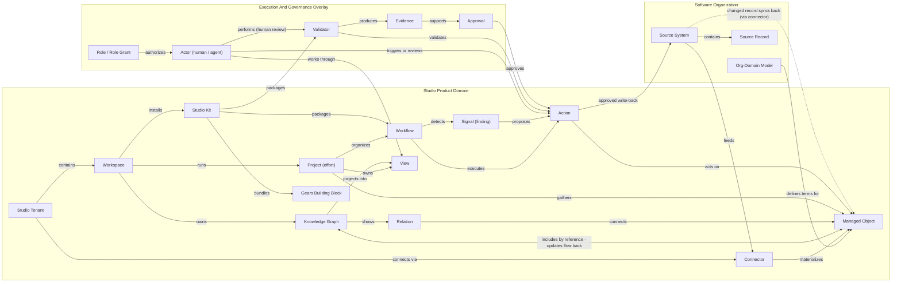
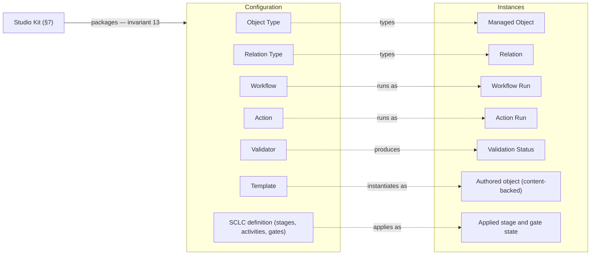
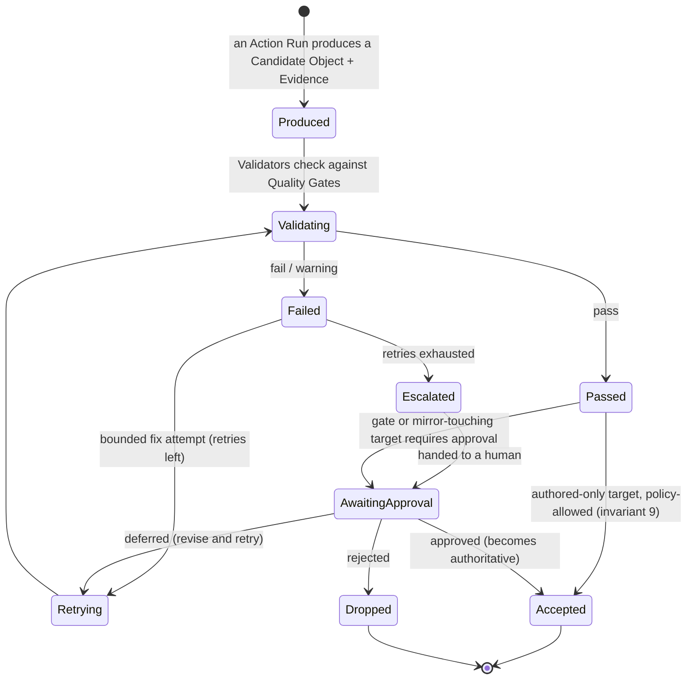

# Studio Domain Model

*How Studio represents a software organization — Studio's own world, how the organization's domain model flows into it, and how work moves forward on top. Includes the Organization-to-Studio Mapping.*

*This file (`studio-representation-model.md`) is the canonical Studio domain model.*

## 0. The Whole Model On One Page

The organization's domain model ([[software-organization-domain-model]]) describes **reality**: people, products, code, releases, incidents, policies. Studio does not replace that reality — it **represents** it, and then **moves work forward** on top of the representation.

> An **Organization** gets a **Studio Tenant**. Connectors pull records from the organization's tools; identity mapping turns them into **managed objects** — one identity per real entity across the whole tenant. A **Workspace** is Studio's working context for one purpose (typically a product line): the objects it includes, together with the **relations** among them, form its **Knowledge Graph** — the graph lives at workspace level, while every identity in it stays tenant-wide. The same object included in several workspaces stays one identity, never a copy. Inside a workspace, a **Project** — an effort that is itself an object in the graph — gathers the objects it touches and drives them to an outcome. **Members** work through **views**, seeing exactly what their **roles** allow. On top of the mirror, **workflows** run **actions**: Studio computes **signals** — gaps, drift, contradictions — prepares recommendations, validates candidates against **quality gates** attaching **evidence** — a validator may be a rule, a test, a model or a **person reviewing** — and, only after **approval**, writes back to the source tools. **Kits** package the domain knowledge all of this runs on — object types, templates, workflows, validators, **Gears** building blocks — and a workspace installs them.

One story, one picture: *Studio connects to the organization's systems, materializes their records as managed objects in knowledge graphs, and lets people and agents run governed projects, workflows and actions over them.*



*The feedback loop closes through the sources: an approved write-back changes the source system, and the connector syncs that change back into the graph — Studio never mutates mirrored facts directly.*

*The two-headed edge reads both ways: a graph **includes** managed objects by reference — and because it is a reference, a **changed object updates every graph that includes it** the moment it changes (a sync delta from the source, an authored edit); nothing is ever copied (invariant 2).*

*Arrow convention (all diagrams): an arrow points the way content flows or control acts — sources feed connectors, the graph projects into views, evidence supports approvals, approvals approve actions. Every edge reads as a sentence, subject → verb → object; where the catalog's canonical predicate runs the other way (View "belongs to" Project), the diagram draws the inverse verb (Project "owns" View) — same fact, one arrow.*

*One simplification: this overview folds instances into their definitions — the **Action** node stands for Action and its runs. Precisely, actors trigger, validators check and approvals decide **action runs** and the **candidate objects** they produce, and it is an approved *run* that writes back; the exact machinery is §6.1.*

**Running example, used throughout:** *Acronis runs Studio. Its tenant connects Jira, GitLab and the HRIS (human-resources system). The "Backup & Recovery" product line — with its product **Cyber Protect** — is a Workspace; inside it, the "Clean Restore" Project gathers everything that effort touches: the competitor signal, the roadmap item, the specs, the repositories and the pull requests. Each employee exists in Jira, GitLab and the HRIS — in Studio that is one Person object, shared by every workspace that includes it.*

## 1. Frame

**This document is** the domain model of Studio (the product): the entities that exist *only because Studio exists*, the catalog of their relationships and invariants, and the mapping that says which organization entity becomes which Studio object.

**This document is not** the organization's domain model (that is [[software-organization-domain-model]] — no organization entity is redefined here), not an information architecture or screen design (downstream, with the UX team), and not a storage or sync architecture.

## 2. Names And Aliases

Read this first — it prevents every "which Project do you mean" conversation.

### 2.1 Vision / narrative terms → canonical model terms

The product vision (`STUDIO_VISION`) uses narrative names; the model uses neutral ones. Both are legitimate — narrative in decks and docs, canonical in the model and the product schema.

| Vision / narrative term                                                                    | Canonical term here                                                                                                                            |
| ------------------------------------------------------------------------------------------ | ---------------------------------------------------------------------------------------------------------------------------------------------- |
| Shadow Object                                                                              | **Managed Object**                                                                                                                             |
| Shadow SDLC Graph / Shadow Graph *(SDLC = software development lifecycle)*                 | **Knowledge Graph** — one per workspace                                                                                                        |
| Studio User / User                                                                         | **Member** — the org model reserves *User* for people using the organization's product                                                         |
| Object / Link                                    | **Managed Object** / **Relation**                                                                                                              |
| Flow / Run                                                              | **Workflow** / **Workflow Run**                                                                                                                |
| Flow / Flow Library *(vision: "predefined flows", "Studio Flow Library"; everyday speech)* | **Workflow** / **Workflow Library** — *flow* stays the loose synonym for a workflow a member runs              |
| Concept                                            | **Glossary Term** (§7) |
| Recommendation                                                          | **Action Run in state `prepared`** ("Prepared Action") — produced from a **Signal** (§6.1)                                                     |
| Organization — used for the tenant                                      | **Studio Tenant**; Organization remains the org-model entity Studio represents                                                                 |

### 2.2 Collision guards against the organization model

Throughout the document, ⚠️ marks a term that collides with an organization-model term — the guard is in this table. Both meanings are always legitimate; never merge them.

| Term | In the organization model | In Studio |
|---|---|---|
| **Tenant** | — *(the customer's own SaaS tenants belong to the product's domain)* | Studio Tenant — one organization's Studio instance (§3.1). |
| **Workspace** | — *(a Slack or Jira workspace = the org's **Tool Workspace**, Software Estate)* | Working context for **one purpose**; what it holds — §3.1. |
| **Project** | Bounded execution effort (Work Management). | **The same entity, unified**: a managed object of type Project + Studio's workbench (§3.1). |
| **Role** | Job Role — PM, Developer, SRE; a managed object. | Named permission set (§5). |
| **Person / User / Member** | Person — a human in the org (an object; login not required). User — someone using the org's *product*. | Member — someone using *Studio* (§3.1). |
| **Team** | Stable org group; arrives as a managed object. | Studio Team — a Studio-native access group; may be *seeded* from an org Team, never auto-synced (§3.1, §5). |
| **Artifact** | Build Artifact — output of a build (Delivery). | Not an entity: a content-backed managed object (§3.2). |
| **Process / Workflow / Activity** | Process — the org's way of working; Activity — a step in it. | Workflow — executable process inside Studio (§3.3); Activity — configured unit of work (§7). |
| **Dependency / Relation** | Dependency — real coupling between work, teams, systems. | A plain link arrives as a **Relation**; a reified Dependency record arrives as a **managed object** (invariant 8). |
| **Tooling System / Source System** | Tooling System — software the org uses; an object in the graph. | Source System — the same tool as plumbing behind a connector; two representations, optionally linked (§4). |
| **AI Agent** | Actor in the org's **AI Estate**; arrives as a managed object. | An **Actor** kind (§6.1); the same real agent may be both — object in the graph, actor on it. |
| **Evidence** | Governance Evidence — a managed object. | Studio Evidence — supports validations and approvals (§6.1). |
| **Signal** | Market Signal and Telemetry Signal — domain objects. | Studio Signal — computed, never authored (§6.1). Three "signals", three entities. |
| **Metric** | The org Metric family — mirrored; series stay in sources (§9). | Cost Metric and Delivery Metric — **computed, never entered** (§6.3). |
| **Insight** | Interpreted learning from evidence — arrives as a managed object. | Not an entity: the insight *surface* = signals in insight views (§3.3, §6.1); **Constructor Insight** = a separate product — a source system behind a connector. |
| **Graph** | — | Knowledge Graph — **one workspace, one graph**; a system model, not a UI (§3.2). |

## 3. Studio's World

**One discipline runs through the whole model: definition vs instance.** Every working thing in Studio exists twice: as a **definition** — configuration, chosen and shipped *as data* by kits and admins (invariant 13) — and as an **instance** — what actually happened. Think blueprint vs part: an Object Type says what a Requirement *is*; a Managed Object is requirement R-12. A Workflow is the pipeline's definition; a Workflow Run is yesterday's execution of it. A Template is the blank; an authored object is the filled-in document. The SCLC definition is the configured lifecycle; the applied stage state is where work stands right now. The payoff: **adapting Studio to an organization means changing the left column — install or edit a kit — never the product itself.**



*Transitions (§6.1) are the history of the right column — the substrate delivery metrics are read from. Change the organization, change the left column's rows — not the schema.*

**How to read the `Facing` column** (used in every entity table). **Cardinality echoes:** entity rows repeat, in parentheses, the numbers readers ask first — how many workspaces, projects, roles; the normative source stays the relationship catalog (§8.1). 
- **Admin-facing** — an administrator creates and manages it; it is configuration (Object Type, Workflow, Validator). 
- **User-facing** — a member meets it in everyday work (Managed Object, Workflow Run, Signal). 
- **System-facing** — internal machinery: nobody sees the entity itself, only its effects inside other surfaces (Knowledge Graph, Transition, User Projection). 
- ***(signal)*** — a status a member sees but never edits (Sync State, Validation Status). Rule of thumb: in every *definition → execution* pair, the definition is Admin-facing and the execution is User-facing — an admin configures the Workflow, a member watches its Workflow Run. The information architecture is derived from this column: facing decides where an entity's surface lives and who sees it.

### 3.1 Containers and people

| Term              | Meaning                                                                                                                                                                                                                                                                                                                                                                                                                                                    | Primary relationships                                                                                                                                                                                                                                                                                | Facing       |
| ----------------- | ---------------------------------------------------------------------------------------------------------------------------------------------------------------------------------------------------------------------------------------------------------------------------------------------------------------------------------------------------------------------------------------------------------------------------------------------------------- | ---------------------------------------------------------------------------------------------------------------------------------------------------------------------------------------------------------------------------------------------------------------------------------------------------- | ------------ |
| **Studio Tenant** | The instance of Studio serving one Organization (1:1). *Acronis = one tenant.* Commercial packaging (subscription plan, account policies) is tenant configuration, not domain entities.                                                                                                                                                                                                                                                                    | Contains workspaces, members and connectors (any number of each; the tenant itself is one per organization); keeps the **tenant-wide identity registry** — one identity per real entity, shared by all workspaces.                                                                                   | Admin-facing |
| **Workspace**     | Studio's working context, bounded by **one purpose** — typically a product line, or several products linked to each other; may span departments and teams; may be personal.                                                                                                                                                                                                                                                                                | Belongs to the tenant (a tenant runs **any number** of workspaces); **includes** managed objects by reference (the same object may be included in many workspaces); owns **exactly one** Knowledge Graph; hosts any number of projects, views, workflows, automation.                                | User-facing  |
| **Project**       | Studio's effort container — **itself a managed object of type Project**: usually *authored* in Studio, sometimes mirrored from a tracker and **adopted**. Roughly a tracker's epic or initiative — a goal, the objects that effort touches, an outcome; Studio adds the workbench: inclusion scope, workflows, progress. *"Clean Restore" gathers the gap, the roadmap item, the repos and the PRs of one push.* | Is a managed object (type Project); belongs to **exactly one** workspace (a workspace hosts **any number** of projects); includes managed objects by reference (an object may belong to several projects at once); *advances* the managed objects it exists for (a Roadmap Item, an epic work item). | User-facing  |
| **Member**        | Someone using Studio — the vision's Studio **User**. Client access — CLI, IDE plugins, MCP endpoints, API tokens — is **member configuration, not domain entities** (same status as commercial packaging).                                                                                                                                                                                                                                                 | Links to at most one Person managed object, and a Person links to at most one member; holds **any number** of Role Grants, each at one scope — directly or via teams. **A member works in any number of workspaces and projects at once** — participation *is* the role grant at that scope; there is no separate "project membership" record. | User-facing  |
| **Team**          | A Studio-native **group of members** — a grantee of roles and a unit of organizing work. ⚠️ Not the org's Team (§2.2): an org Team arrives as a managed object; a Studio Team may be **seeded** from one, but membership is managed in Studio and never auto-synced — sources must not silently change access.                                                                                                                                             | Belongs to the tenant (any number of teams); has members (a member may belong to many teams); granted roles at a scope (like a member); optionally seeded from an org Team managed object; membership changes are audit-logged.                                                                      | User-facing  |

### 3.2 Objects and relations

| Term                | Meaning                                                                                                                                                                                                                                                                                                                                                                                                                                                                                                                                 | Primary relationships                                                                                                                            | Facing        |
| ------------------- | --------------------------------------------------------------------------------------------------------------------------------------------------------------------------------------------------------------------------------------------------------------------------------------------------------------------------------------------------------------------------------------------------------------------------------------------------------------------------------------------------------------------------------------- | ------------------------------------------------------------------------------------------------------------------------------------------------ | ------------- |
| **Knowledge Graph** | The workspace-level home of the facts: the managed objects the workspace includes plus the relations among them. One graph per workspace — and a graph is a **system model, not a UI**: members see views; a graph diagram is just one view.                                                                                                                                                                                                                                                                                            | Belongs 1:1 to a workspace; queried by views, workflows, automation.                                                                             | System-facing |
| **Managed Object**  | Studio's representation of one real entity. **One object per tenant** — workspaces include it by reference, never copy it. Everything else it carries — below this table.                                                                                                                                                                                                                                                                                                                                                               | Typed by an Object Type; assembled from source records via identity mapping (authored objects have none); included into workspaces and projects. | User-facing   |
| **Relation**        | A typed, directed link between exactly two managed objects — *"PR **resolves** Work Item"*. Carries an **origin** — **imported** (a source fact; appears in every graph holding both endpoints, invariant 5) or **asserted / inferred** (added by a member or proposed by Studio; lives in one graph, invariant 4) — plus the same provenance and confidence as an object.                                                                                                                                                               | Instance of a Relation Type.                                                                                                                     | User-facing   |
| **Object Type**     | The blueprint of one kind of object: what a Requirement, a PR or a Release *is* — its expected attributes and which relations it may enter. Three rules: every domain-facing type stands for **exactly one organization-model term**; a type may **specialize** another (Metric-by-domain, Decision subtypes); **one registry per tenant, each workspace activates its subset** — the workspace's *effective ontology* (invariant 13). Types come from three suppliers — **built-in**, **kit install**, **custom** — recorded per type. | Types managed objects; defines expected attributes and allowed relation types; registered at the tenant; activated per workspace.                | Admin-facing  |
| **Relation Type**   | Registered kind of relation (`realized_by`, `implements`, `depends_on`, `has_owner`, `supports`…). Mirrors the organization model's primary relationships. Registered tenant-wide and activated per workspace, like object types.                                                                                                                                                                                                                                                                                                              | Constrains which object types it may connect.                                                                                                    | Admin-facing  |

**What every managed object carries:**

- **Acquisition mode** — exactly one of three: **mirrored** (fully synced from sources), **linked** (a shallow external link — a CRM opportunity, an HR profile), **authored** (created and owned in Studio).
- **Content-backed** — the object carries its own versioned content: a PRD (product-requirements document), a policy, a postmortem — informally, "a document". Content and versions are part of the object, not separate entities; this deliberately replaces a separate "Artifact" entity (§2.2).
- **Provenance, confidence and sync state** — every object records where it came from, how confident the identification is, and whether it still matches its sources (§4).

### 3.3 Working surfaces

| Term             | Meaning                                                                                                                                                                                                                                                                                                                             | Primary relationships                                                                                                                                                    | Facing                                                              |
| ---------------- | ----------------------------------------------------------------------------------------------------------------------------------------------------------------------------------------------------------------------------------------------------------------------------------------------------------------------------------- | ------------------------------------------------------------------------------------------------------------------------------------------------------------------------ | ------------------------------------------------------------------- |
| **View**         | Saved way of selecting and presenting objects: list, board, table, timeline, dashboard, graph diagram. Recurring kinds: *object view* (one object + its neighborhood), *traceability view* (intent → requirement → code → test → release → feedback), *review view* (candidates, validation results, write-backs pending approval), **graph view** (a scoped diagram over the workspace's Knowledge Graph), **insight view** (the window onto workspace-level signals and delivery metrics). A project's **Graph View** and **Insight View** are exactly this — project-scoped views; the graph and the signals themselves stay workspace-level. | Belongs to a workspace, a project **or** a member (exactly one); selects by query; always renders through the viewer's projection.                                       | User-facing                                                         |
| **Workflow** | **Repeatable automation pipeline — one entity** *(the vision's "flow")*: activities, actors, validators, quality gates. The recurring patterns ship as workflows: gap analysis, traceability analysis, stale-artifact detection, PRD-to-code validation, incident-to-postmortem. Configured by admins; **published to the Workflow Library**, where a member runs it in one click; may include sub-workflows. | Contains activities (§7); delivered by kits (§7) or authored; reads and changes Studio-authored objects; for mirrored objects it produces **prepared actions** (§6), because the source stays authoritative. | Admin-facing (members meet published workflows through the library, runs and history) |
| **Workflow Run** | One execution of a workflow, with its status and history.                                                                                                                                                                                                                                                                           | Executes a workflow; carries action runs and AI runs; may wait on approvals.                                                                                             | User-facing                                                         |
| **Automation**   | Rule that reacts to events, sync results or schedules.                                                                                                                                                                                                                                                                              | Watches graphs and sync events; triggers workflows or actions.                                                                                                    | Admin-facing                                                        |

**The execution stack, one ladder** *(each level: definition → its run)*:

```text
Workflow             (repeatable pipeline — definition; published to the Workflow Library)
  -> Workflow Run    (execution)
       -> Activity   (configured unit of work)
            -> Action (transformation definition)   -> Action Run   (execution; states in §6.1)
                 -> AI-assisted steps bill an AI Run (model, tokens, cost — §6.3)
```

*One trace: a member runs the "Gap Analysis" workflow from the library → a run starts → an analysis activity executes an action → the action run consumes a context package and its AI run bills tokens → findings land as **signals**; anything mirror-touching waits as a prepared action run.*

## 4. How the Organization Enters Studio

*The same engineer appears as a Jira user, a GitLab account and an HRIS row — three source records. Identity mapping declares them one Person object. Every workspace that includes that person shows the same, current object.*

| Term | Meaning | Primary relationships | Facing |
|---|---|---|---|
| **Source System** | External system holding original records: Jira, GitLab, Confluence, HRIS, CRM, CI/CD, monitoring. Remains the **system of record** for what it exports; Studio-authored objects are Studio-authoritative. ⚠️ The same tool can also appear *in* the graph as a managed object (`Tooling System`) — plumbing and portrait, optionally linked. | Reached through connectors. | Admin-facing |
| **Connector** | Configured integration between the tenant and one source system. | Produces source records; runs sync runs; has health and lifecycle. | Admin-facing |
| **Source Record** | One original record as fetched (an issue, a repo, an employee row). | Maps to **at most one** managed object; superseded by newer fetches. | System-facing |
| **Source Link** | The pair (managed object × source record) — where provenance lives. | Carries the Sync State for that pair. | System-facing |
| **Identity Mapping** | Rule or confirmed fact that several source records are the same real entity. Studio proposes matches (e-mail, linked accounts, names); an administrator confirms uncertain ones and can split wrong merges; every merge/split is audit-logged. | Merges source records into one managed object. | Admin-facing |
| **Field Mapping** | Mapping between source-record fields and managed-object attributes. | Configured per connector / object type. | Admin-facing |
| **Relationship Mapping** | Mapping between source-system links and Studio relation types. | Configured per connector; produces imported relations. | Admin-facing |
| **Sync Run** | One synchronization execution: import, update, reconcile, check. | Creates/updates managed objects and imported relations; surfaces conflicts. | Admin-facing |
| **Sync State** | Synchronization status per **source link**: in sync, pending, stale, conflicted, error, paused. Answers "does this match the source?" — distinct from Validation Status (§6), which answers "does this make sense?" | Signals on objects and in admin views. | User-facing (signal) |
| **Conflict** | A detected inconsistency between Studio and one or more sources — a first-class object so resolution work can target it. Resolves **according to the organization's governance rules** (per type or per field). | Concerns one managed object; resolved by rule, member or workflow. | User-facing (signal) |

**Walkthrough — connecting an existing organization:**

```text
Admin configures Connectors (Jira, GitLab, Confluence, HRIS)
  -> Sync Runs fetch Source Records
  -> Studio proposes Identity Mappings (Jira user + GitLab account + HRIS row = one Person)
  -> Managed Objects are included into the right Workspaces by reference
  -> imported Relations materialize in each knowledge graph holding both endpoints
  -> Sync State and Conflicts surface gaps and stale links; conflicts resolve per governance rules
```

## 5. Who Sees What

Access model: **RBAC** (role-based access control). Permissions attach to roles; roles are granted to **members and teams**; nothing is ever attached to an individual object.

| Term                               | Meaning                                                                                                                                                                                                                                                                                                                                                                                                                    | Primary relationships                                                           | Facing        |
| ---------------------------------- | -------------------------------------------------------------------------------------------------------------------------------------------------------------------------------------------------------------------------------------------------------------------------------------------------------------------------------------------------------------------------------------------------------------------------- | ------------------------------------------------------------------------------- | ------------- |
| **Role**                           | Named permission set from the tenant's role catalog. ⚠️ Not the org model's Job Role.                                                                                                                                                                                                                                                                                                                                      | Granted to members and teams via role grants — a member or team may hold **any number** of roles, one scope per grant.                                   | Admin-facing  |
| **Role Grant**                     | The fact that a member **or a team** holds a role **at a scope** — tenant, workspace or project. Tenant-scope grants enable tenant-wide surfaces (portfolio, compliance) across knowledge graphs.                                                                                                                                                                                                                          | Grantee (member \| team) × Role × Scope; archiving a scope suspends its grants. | Admin-facing  |
| **Permission**                     | Concrete right (read / create / change / connect / run / approve / publish / administer) over a **resource**: an object type, a scope, or a feature area.                                                                                                                                                                                                                                                                  | Bundled into roles.                                                             | Admin-facing  |
| **User Projection**                | The effective subset one member can see, computed from their role grants — **direct grants plus grants via their teams**. Objects outside it render as **locked stubs**: existence and type visible, details not. Access **never propagates along relations** — a link from a visible Work Item to a restricted Customer Account reveals nothing; the account renders as a locked stub, the relation itself stays visible. | Every view renders through it.                                                  | System-facing |
| **Data Policy**                    | Rule for data sensitivity, retention, redaction or model usage over object types and sources.                                                                                                                                                                                                                                                                                                                              | Constrains projections, context packages, model routing.                        | Admin-facing  |
| **Safety Constraint**              | Rule preventing unsafe automation: unauthorized write-back, sensitive-data exposure, uncontrolled model usage.                                                                                                                                                                                                                                                                                                             | Constrains actions, workflows, agents.                                          | Admin-facing  |

## 6. The Acting Layer

Studio's point is not only to mirror the organization but to **move work forward**. The product principle is a trust ramp: **read-only insight first, recommendations second, approved automation third.** The mirror and Studio-authored objects ship first; the entities below are defined now so UX can reserve the surfaces. In the model the ramp is literal: **signals** (read-only insight) → **prepared action runs** (recommendations) → **approved write-back** (automation).

### 6.1 Actions, validation, write-back

| Term                      | Meaning                                                                                                                                                                                                                                                                                                                                                                                                                                                                                                                                                                                                                                     | Primary relationships                                                                                                                                                                                                                                                                                                                          | Facing                  |
| ------------------------- | ------------------------------------------------------------------------------------------------------------------------------------------------------------------------------------------------------------------------------------------------------------------------------------------------------------------------------------------------------------------------------------------------------------------------------------------------------------------------------------------------------------------------------------------------------------------------------------------------------------------------------------------- | ---------------------------------------------------------------------------------------------------------------------------------------------------------------------------------------------------------------------------------------------------------------------------------------------------------------------------------------------- | ----------------------- |
| **Actor**                 | Who acts: a human member, an **AI agent**, an external system or a pipeline. Every action is attributed to its actor (invariant 12). Each actor carries an **autonomy level** (what it may do unattended) and a **reach** (how far effects extend: draft / graph / write-back) — the same two attributes for humans and agents. | Performs action runs; plays **any number** of roles — access roles via grants (§5), agent roles for AI agents (§6.2).                                                                                                                                                                                                                                                                                                       | System- and user-facing |
| **Signal**                | Computed finding over the graph: a gap, a drift, staleness, a contradiction, a duplicate, an ownership hole. **Computed, never authored** — members acknowledge or dismiss a signal, never edit one; recomputed as the graph changes. The substance of the trust ramp's first phase (read-only insight).                                                                                                                                                                                                                                                                                                                                    | Derived from the knowledge graph by workflows, validators and checkpoints; may produce prepared action runs; rendered in insight views (§3.3).                                                                                                                                                                                                 | User-facing (signal)    |
| **Action**                | Reusable definition of a transformation: `create_design`, `decompose_feature`, `implement_code`, `run_ci`, `create_postmortem` — inputs, outputs, actor requirements, gates. Naming follows the Workflow / Workflow Run pattern: **Action** is the definition, **Action Run** the execution.                                                                                                                                                                                                                                                                                                                                                | Executed as action runs; packaged by kits, composed into workflows; performs the activities of lifecycle stages (§7).                                                                                                                                                                                                                          | Admin-facing            |
| **Action Run**            | One concrete execution of an action by an actor — **one entity, with two attributes instead of separate object types**: a **state** (`prepared → approved / rejected / deferred / escalated → running → applied / failed / dropped`) and an **effect target** (the knowledge graph, or a source system = write-back). Mirror-touching runs always enter at `prepared`; runs touching only Studio-authored objects may start at `running` where policy allows (invariant 9).                                                                                                                                                                 | Executes an action; consumes managed objects (via a context package); produces candidate objects; while `prepared`, decided by exactly one approval — **approving the run authorizes the act; each candidate it produces is still decided on its own** (batch approval is a UX convenience recorded as individual approvals); carries AI runs. | User-facing             |
| **Candidate Object**      | Proposed graph **content** — a would-be managed object, relation or content version — produced by Studio or an agent but **not yet accepted** as authoritative. Contrast: a candidate object is a proposed *thing*; a prepared action run is a proposed *act*. An inferred relation is *not* a candidate object — it is decided in place: proposed → confirmed / retired (Appendix B).                                                                                                                                                                                                                                                      | Produced by action runs; checked by validators; decided by approvals.                                                                                                                                                                                                                                                                          | User-facing             |
| **Approval**              | Recorded human decision (approve / reject / escalate / defer) on a prepared action run, a candidate object or a write-back, with decider and rationale.                                                                                                                                                                                                                                                                                                                                                                                                                                                                                     | Decides candidate objects and prepared action runs; audit-logged.                                                                                                                                                                                                                                                                              | User-facing             |
| **Validator**             | Check — rule, test, model or human review — that evaluates objects, candidates or action runs against gates and policies.                                                                                                                                                                                                                                                                                                                                                                                                                                                                                                                   | Produces validation results/statuses and evidence.                                                                                                                                                                                                                                                                                             | Admin-facing            |
| **Validation Status**     | Whether an object currently satisfies the rules that apply to it: pass, fail, warning, retry, escalated, blocked. Semantic health.                                                                                                                                                                                                                                                                                                                                                                                                                                                                               | Evaluated by validators against quality gates.                                                                                                                                                                                                                                                                                                 | User-facing (signal)    |
| **Quality Gate**          | Required validation checkpoint before work moves to the next state or before write-back. *"No approved spec — no build."*                                                                                                                                                                                                                                                                                                                                                                                                                                                                                                                   | Gates action runs, activities, write-backs; requires evidence.                                                                                                                                                                                                                                                                                 | Admin-facing            |
| **Evidence**              | Record supporting a validation or approval: test run, review, document version, source reference. ⚠️ vs org Governance Evidence (§2.2).                                                                                                                                                                                                                                                                                                                                                                                                                                                                                 | Attached to validations, approvals, gates; supports every quality-gate and approval decision.                                                                                                                                                                                                                                                  | User-facing             |
| **Write-back Capability** | Configured *ability* to update a given source system — per connector, per object type, under policy.                                                                                                                                                                                                                                                                                                                                                                                                                                                                                                                                        | Enables write-back action runs.                                                                                                                                                                                                                                                                                                                | Admin-facing            |
| **Audit Entry**           | Immutable record of the things that must never be silent: identity merges/splits, role grants, team membership changes, kit publications, approvals, write-backs, agent actions.                                                                                                                                                                                                                                                                                                                                                                                                                                                            | Written by the system; queryable by admins.                                                                                                                                                                                                                                                                                                    | Admin-facing            |
| **Transition**            | Immutable state-change record of one managed object, workflow run or action run: actor, from-state, to-state, timestamp, via which action or sync run. **The measurement substrate**: cycle time, acceptance rate, time-to-ready are read out of transitions, never entered. For mirrored objects, transitions derive from sync deltas — the source stays authoritative.                                                                                                                                                                                                                                                                    | Written by the system on every state change; feeds delivery metrics (§6.3); complements Audit Entry (administrative acts).                                                                                                                                                                                                                     | System-facing           |

**Prepared Action and Write-back are Action Run states, not object types.** **Prepared Action** = an action run in state `prepared`: a **recommendation** awaiting a human decision — against mirrored objects this is the only kind of write until write-back is approved. **Write-back Action** = an **approved** action run whose effect target is a source system (create Jira tasks, open a pull request, update a status); it requires capability + permission + passing validation + approval + audit — all five (invariant 10). Both names remain in use as UX labels for those states.

**The bounded validation loop, one state machine** — this is where bounded automation lives: a failure loops through a bounded retry, then hands off to a human; nothing becomes authoritative on the strength of having been produced (invariant 9).



*The same chain gates acts: a prepared action run passes validators and quality gates before its approval, and a write-back additionally needs capability + permission + audit — all five (invariant 10). The states surface in UX as Validation Status (§6.1) and the Candidate Object lifecycle (Appendix B).*

**Acceptance and authority — authored vs mirrored.** Two rules the state string alone does not carry. **(1) Produce, then approve:** a mirror-touching run *drafts first* — its generation step runs, the candidate objects and evidence attach, and only then does it sit in `prepared`; approval authorizes **applying the effect**, and `running → applied` in the state string is that application, never unreviewed generation. **(2) Acceptance ≠ authority for mirrored targets:** accepting a candidate for a **Studio-authored** target makes it authoritative immediately (Appendix B: *accepted — becomes authoritative*). For a **source-system** target, approval only *authorizes the write-back*; the source stays authoritative, and the change becomes authoritative in the mirror **after the source applies it and the confirming sync run mirrors it back** — an approved-but-failed write-back changes nothing (invariant 10, §4). Terminal vocabulary: `rejected` = the prepared **act** was declined · `dropped` = the produced **candidate** was discarded (at approval, or after escalation) · `failed` = the application errored.

### 6.2 AI collaboration

| Term                     | Meaning                                                                                                                                                    | Primary relationships                                            | Facing        |
| ------------------------ | ---------------------------------------------------------------------------------------------------------------------------------------------------------- | ---------------------------------------------------------------- | ------------- |
| **Agent Role**           | Specialized role an AI agent plays in an activity: analyst, implementer, reviewer, tester, summarizer. ⚠️ Distinct from access Role and org Job Role.      | Played by AI agents in workflows and stages.                     | Admin-facing  |
| **Context Package**      | The selected set of objects, relations, artifacts, rules and evidence handed to an actor for one action or review — Studio's unit of "what the model saw". | Feeds action runs; constrained by data policies and projections. | System-facing |
| **Model Routing Policy** | Rule selecting the AI model or tool per activity type, role, cost, risk or data policy — lockable by the organization.                                     | Governs AI runs; set at tenant/workspace scope.                  | Admin-facing  |

### 6.3 Usage and cost

| Term | Meaning | Primary relationships | Facing |
|---|---|---|---|
| **AI Run** | One execution by a model or agent: model used, tokens, runtime, **cost**. The atomic unit under every AI-spend surface. | Belongs to an action or workflow run; attributed to an actor. | Admin-facing |
| **Usage Event** | Measured Studio activity: connector syncs, workflow executions, validations, member activity. | Aggregates into cost metrics. | System-facing |
| **Cost Budget** | Cap on spend at a scope: tenant, workspace, project, workflow, agent or model. | Caps AI runs; alerts and blocks per policy. | Admin-facing |
| **Cost Metric** | Studio-specific measurement: **AI cost per accepted change**, PRD-to-task cycle cost, review cost saved. | Computed over AI runs and usage events. | User-facing |
| **Delivery Metric** | Studio-computed delivery measurement, read from transitions and relations: cycle time, acceptance rate, time-to-ready, requirement-to-test coverage. Never entered by hand. ⚠️ Mirrored org Metrics stay managed objects (§9, mapping conventions). | Computed over transitions (§6.1) and relations; shown in dashboards and insight views. | User-facing |

## 7. Lifecycle, Packaging And Vocabulary

| Term | Meaning | Primary relationships | Facing |
|---|---|---|---|
| **Software Construction Lifecycle (SCLC)** | Studio's configurable lifecycle model — realizes the vision's §8 *Product Lifecycle*: phases **Plan / Build / Operate**, 14 stages — Intent, Vision, Discovery, Strategy, Definition, Design, Construction, Validation, Release, Operation, Support, Intelligence, Optimization, Evolution — applied per workspace. | Contains lifecycle phases; phases contain lifecycle stages; stages define activities with their inputs/outputs, performed via actions (§6.1). | User-facing (configured per workspace by admins) |
| **Lifecycle Phase** | One of the SCLC's three phases — **Plan / Build / Operate** — grouping lifecycle stages. | Belongs to the SCLC; contains lifecycle stages. | User-facing |
| **Lifecycle Stage** | One stage of the SCLC. Per **performer role** — a human's Job Role (PM, Developer) or an Agent Role, never the access Role (§5) — and stage, Studio configures **activities**, their **inputs/outputs**, quality gates and **synchronization checkpoints** — the footing for "what should I do next" UX. | Belongs to a lifecycle phase; defines activities per performer role; gated by quality gates; checked by synchronization checkpoints. | User-facing |
| **Activity** | One configured unit of work inside a lifecycle stage (per performer role) or a workflow, with declared **inputs and outputs** (object types). ⚠️ vs org Activity (§2.2). | Belongs to a lifecycle stage or a workflow; declares input/output object types; performed by actors via actions (§6.1). | User-facing |
| **Synchronization Checkpoint** | Configured point where Studio checks that handoffs, sources, artifacts and relations are in sync. | Runs validators; raises conflicts and signals (§6.1). | Admin-facing |
| **Workflow Library** | Catalog of workflows published to a workspace — predefined and custom; the vision's **Flow Library**. What a member browses and runs — the **secondary door by decision**: primary invocation is NL-first + plan-preview (register D-009); the library is the browsable catalog and the "what can Studio do here?" fallback. | Contains published workflows; populated by kits. | User-facing |
| **Studio Kit** | Package of reusable delivery knowledge that **defines a domain**: **object & relation type definitions** (the ontology contribution), templates, workflows, actions, validators, policies, reference architectures. Two origins: **shipped** (by Constructor) and **authored** in the organization. Which kits exist is catalog content; the entity shape is fixed here. | Packages object & relation types, workflows, actions, validators, templates, Gears building blocks; published to the Kit Catalog; installed into workspaces — install **registers the kit's types tenant-wide** and **activates** them (with workflows, templates, validators) in the installing workspace (invariant 13). | Admin-facing |
| **Kit Catalog** | The tenant's internal catalog of kits available to install — shipped kits plus kits **published by the organization's own members**. Not a marketplace: no third-party publishers, no monetization; sharing stays inside the tenant. **The unit of sharing is the kit** — a single template or workflow is shared as a small kit. | Contains studio kits; members with the `publish` permission add to it; every publication is audit-logged. | User-facing |
| **Template** | Reusable blueprint for a content-backed object: a PRD template, a postmortem template, a design-doc skeleton. | Shipped by kits; instantiated as authored objects. | User-facing |
| **Gears Building Block** | A module from **Constructor Gears** — the Constructor platform's library of reusable engines, modules and developer/operations tools. Kits and actions assemble them; if the customer adopts one, it also appears in their graph as software estate. | Used by kits and actions. | Admin-facing |
| **Domain Dictionary** | Configurable vocabulary of a tenant or workspace. **Precedence: workspace-level entries shadow tenant-level ones** (labels only, invariant 11). | Holds terminology overrides. | Admin-facing |
| **Terminology Override** | Workspace- or tenant-specific **label** for a canonical concept (*Roadmap Item → "Research Plan Item"*). Changes labels, **never** canonical semantics or relation meaning (invariant 11). | Relabels object types and relation types. | Admin-facing |
| **Glossary Term** | A term of the customer's **own product domain**, with a definition — the ontology of *what the team is building* (for Acronis: "recovery point", "immutable backup"). The workspace's terms together form its **Glossary** (the IA surface). Not an Object Type (Studio's delivery ontology) and not a Terminology Override (labels only, invariant 11). | Defined per workspace; expressed by managed objects via term mappings. | User-facing |
| **Term Mapping** | The tie between a glossary term and the managed objects expressing it — the requirement, design, code and tests that carry it. Lets Studio detect **term drift** — the term changed in the design but never reached the code — surfaced as a signal (§6.1). | Connects one glossary term to managed objects; drift raises signals. | System-facing |
| **Domain Profile** | Package of mappings, terminology, validators, workflows and templates for a target domain or operating model. | Bundles dictionary + kit content. | Admin-facing |

## 8. Relationship Catalog And Invariants

### 8.1 Relationship catalog

**How to read this table** *(reference material — skim on first read)*: cardinality `A:B` says how many subjects relate to how many objects — `1:1` one-to-one, `1:N` one subject to many objects, `N:1` many subjects to one object, `N:M` many-to-many; `0..1` = optional (zero or one), `0..N` = zero or more; `A × B` = a pair. "Exactly 2, directed" = the relation always joins two objects, from → to. "Exactly one" = the subject belongs to one of the listed alternatives, never several. Backticked lowercase words in running text (`advances`, `measures`) are relation-type names from this catalog.

| Subject                                    | Predicate         | Object                                                                                        | Cardinality              | Notes                                                                                                                              |
| ------------------------------------------ | ----------------- | --------------------------------------------------------------------------------------------- | ------------------------ | ---------------------------------------------------------------------------------------------------------------------------------- |
| Studio Tenant                              | represents        | Organization                                                                                  | `1:1`                    | Multi-org (service-provider) topology — later phase.                                                                               |
| Studio Tenant                              | contains          | Workspace / Member / Team / Connector                                                         | `1:N`                    |                                                                                                                                    |
| Studio Tenant                              | holds identity of | Managed Object                                                                                | `1:N`                    | The tenant-wide identity registry.                                                                                                 |
| Workspace                                  | owns              | Knowledge Graph                                                                               | `1:1`                    |                                                                                                                                    |
| Workspace                                  | includes          | Managed Object                                                                                | `N:M`                    | Stored as its own record — **Inclusion**: who, when, manual or rule.                                                               |
| Project                                    | represented as    | Managed Object (type Project)                                                                 | `1:1`                    | Authored in Studio, or mirrored from a tracker and adopted; the workbench (inclusion, workflows) is Studio behavior.               |
| Project                                    | belongs to        | Workspace                                                                                     | `N:1`                    |                                                                                                                                    |
| Project                                    | includes          | Managed Object                                                                                | `N:M`                    | By reference; an object may be in several projects.                                                                                |
| Project                                    | advances          | Managed Object                                                                                | `N:M`                    | Typically a Roadmap Item or an epic work item. Studio-native workbench relation, not an org-model mirror.                                                                                     |
| Project                                    | organizes         | Workflow                                                                                      | `N:M`                    | The workbench: workflows gathered for the effort (§3.1).                                                                           |
| Member                                     | links to          | Person (managed object)                                                                       | `0..1 : 0..1`            |                                                                                                                                    |
| Member / Team                              | granted           | Role                                                                                          | `N:M`                    | Stored as **Role Grant** (grantee × role × scope).                                                                                 |
| Team                                       | has member        | Member                                                                                        | `N:M`                    | Managed in Studio; optionally seeded from an org Team object — source membership changes never change Studio membership.           |
| Role                                       | bundles           | Permission                                                                                    | `1:N`                    | Permission = right × resource.                                                                                                     |
| Managed Object                             | typed by          | Object Type                                                                                   | `N:1`                    |                                                                                                                                    |
| Studio Tenant                              | registers         | Object Type / Relation Type                                                                   | `1:N`                    | The tenant-wide type registry; provenance per type: built-in / kit / custom.                                                       |
| Workspace                                  | activates         | Object Type / Relation Type                                                                   | `N:M`                    | The workspace's effective ontology.                                                                                                |
| Object Type                                | represents        | Organization-model term                                                                       | `N:1`                    | Several types may specialize one term.                                                                                             |
| Object Type                                | specializes       | Object Type                                                                                   | `N:1` optional           | Metric family, Decision subtypes.                                                                                                  |
| Managed Object                             | assembled from    | Source Record                                                                                 | `0..N`                   | 0 for authored objects; via Identity Mapping.                                                                                      |
| Source Record                              | produced by       | Connector                                                                                     | `N:1`                    |                                                                                                                                    |
| Connector                                  | connects to       | Source System                                                                                 | `N:1`                    | A source system may have several connectors.                                                                                       |
| Sync State                                 | tracks            | Source Link                                                                                   | `1:1`                    | Source Link = managed object × source record.                                                                                      |
| Sync Run                                   | updates           | Managed Object / imported Relation                                                            | `N:M`                    | May raise Conflicts.                                                                                                               |
| Conflict                                   | concerns          | Managed Object                                                                                | `N:1`                    | Resolved per governance rules.                                                                                                     |
| Relation                                   | instance of       | Relation Type                                                                                 | `N:1`                    |                                                                                                                                    |
| Relation                                   | connects          | Managed Object                                                                                | exactly 2, directed      |                                                                                                                                    |
| Imported Relation                          | materialized in   | Knowledge Graph                                                                               | `N:M`                    | In every graph where both endpoints are included; kept identical by sync.                                                          |
| Asserted / Inferred Relation               | belongs to        | Knowledge Graph                                                                               | `N:1`                    | Never spans workspaces.                                                                                                            |
| View                                       | belongs to        | Workspace / Project / Member                                                                  | `N:1`, exactly one       |                                                                                                                                    |
| Workflow                                   | may include       | Workflow (sub-workflow)                                                                       | `N:M`                    | Composition of sub-workflows.                                                             |
| Workflow Library                           | contains          | Workflow                                                                                      | `1:N`                    | Published workflows — what members run.                                                                     |
| Workflow Run                               | executes          | Workflow                                                                                      | `N:1`                    |                                                                                                                                    |
| Automation                                 | triggers          | Workflow / Action                                                                             | `N:M`                    | On events, syncs, schedules.                                                                                                       |
| Signal                                     | derived from      | Knowledge Graph                                                                               | `N:1`                    | Computed by workflows, validators and checkpoints; never authored (invariant 14).                                                  |
| Signal                                     | may produce       | Action Run (`prepared`)                                                                       | `1:N`                    | Finding first, recommendation second — the trust ramp in the model.                                                                |
| Actor                                      | performs          | Action Run                                                                                    | `1:N`                    | Attribution is mandatory.                                                                                                          |
| Actor (AI agent)                           | plays             | Agent Role                                                                                    | `N:M`                    | Per workflow / stage. The human counterpart is the org **Job Role**, a mirrored fact (Person fills Position, Position implies Job Role); access Roles are a separate question (§5). |
| Managed Object / Workflow Run / Action Run | records           | Transition                                                                                    | `1:N`                    | Immutable; mirrored-object transitions derive from sync deltas.                                                                    |
| Transition                                 | performed by      | Actor                                                                                         | `N:1`                    | Who moved it, from what state to what, when, via which run.                                                                        |
| Action Run                                 | executes          | Action                                                                                        | `N:1`                    |                                                                                                                                    |
| Action Run                                 | consumes          | Context Package                                                                               | `N:1`                    |                                                                                                                                    |
| Action Run                                 | produces          | Candidate Object                                                                              | `0..N`                   |                                                                                                                                    |
| Action Run (`prepared`)                    | targets           | Managed Object                                                                                | `N:M`                    | The recommendation state ("Prepared Action"); decided by exactly one Approval.                                                     |
| Action Run (write-back)                    | updates           | Source System                                                                                 | `N:1`                    | Requires capability + permission + validation + approval + audit — all five (invariant 10).                                        |
| Validator                                  | checks            | Candidate Object / Action Run / Managed Object                                                | `N:M`                    | Produces validation status + evidence.                                                                                             |
| Quality Gate                               | gates             | Action Run / Activity                                                                         | `N:M`                    | Including write-back runs; requires evidence.                                                                                      |
| Evidence                                   | supports          | Validation Status / Approval / Quality Gate                                                   | `N:M`                    |                                                                                                                                    |
| Approval                                   | decides           | Action Run (`prepared` / write-back) / Candidate Object                                       | `1:1` per decision event | Audit-logged. A deferred run returns to `prepared` and may be decided again — a **new** approval record each time.                 |
| AI Run                                     | belongs to        | Action Run / Workflow Run                                                                     | `N:1`                    | Carries model + cost.                                                                                                              |
| Cost Budget                                | caps              | AI Run (at a scope)                                                                           | `1:N`                    | Tenant / workspace / project / agent / model.                                                                                      |
| Delivery Metric                            | computed from     | Transition / Relation                                                                         | `N:M`                    | Read from history, never entered (invariant 14).                                                                                   |
| Metric *(domain specializations only)*     | measures          | Managed Object                                                                                | `N:M`                    | The §9 metrics convention; a generic `Metric` is never instantiated — always a domain specialization.                              |
| Studio Kit                                 | packages          | Object Type / Relation Type / Workflow / Action / Validator / Template / Gears Building Block | `1:N`                    |                                                                                                                                    |
| Kit Catalog                                | contains          | Studio Kit                                                                                    | `1:N`                    | Shipped + published by members; one catalog per tenant.                                                                            |
| Member                                     | publishes         | Studio Kit                                                                                    | `N:M`                    | Requires the `publish` permission; audit-logged.                                                                                   |
| Workspace                                  | installs          | Studio Kit                                                                                    | `N:M`                    | Registers the kit's types tenant-wide; activates them + populates the Workflow Library, templates, validators here (invariant 13). |
| SCLC                                       | contains          | Lifecycle Phase                                                                               | `1:N`                    | Plan / Build / Operate.                                                                                                            |
| Lifecycle Phase                            | contains          | Lifecycle Stage                                                                               | `1:N`                    |                                                                                                                                    |
| Lifecycle Stage                            | defines           | Activity                                                                                      | `1:N`                    | Per role.                                                                                                                          |
| Activity                                   | declares          | Input / Output (object types)                                                                 | `N:M`                    | What the activity consumes and produces.                                                                                           |
| Activity                                   | performed via     | Action                                                                                        | `N:M`                    |                                                                                                                                    |
| Terminology Override                       | relabels          | Object Type / Relation Type                                                                   | `N:1`                    | Labels only.                                                                                                                       |
| Workspace                                  | defines           | Glossary Term                                                                                 | `1:N`                    | The customer's product-domain ontology (§7).                                                                                       |
| Term Mapping                               | ties              | Glossary Term ↔ Managed Object                                                                | `N:M`                    | Drift between expressions raises a signal.                                                                                         |

### 8.2 Invariants

1. Every domain-facing Object Type resolves to exactly one organization-model term (directly or via specialization).
2. A managed object has **one identity per tenant**; inclusion is by reference and never copies.
3. A source record maps to **at most one** managed object; mirrored and linked objects preserve source references and provenance.
4. An asserted or inferred relation's both endpoints must be included in its workspace; removing an object from a workspace retires its asserted relations there.
5. An imported relation is one logical fact, materialized in every knowledge graph where both its endpoints are included, and nowhere else; sync keeps every appearance identical.
6. Access never propagates along relations; objects outside a member's projection render as locked stubs.
7. Every identity merge/split, role grant, team membership change, kit publication, approval, write-back and agent action produces an audit entry.
8. Organization-model entities that are **reified relationships** — relationships stored as their own records with attributes (Employment, Team Membership, Position Allocation, Reporting Line, Responsibility Assignment, Assignment, Competency possession, Dependency, Handoff) — arrive as **managed objects**, never as bare relations: their dates and attributes must survive.
9. Candidate objects and prepared action runs are **not authoritative** until accepted by an approval (or an explicitly configured policy).
10. A write-back action run requires source capability, actor permission, passing validation, approval and audit — all five.
11. A terminology override changes labels, **never** canonical semantics or relationship meaning.
12. Every action run is attributed to an actor; agent-produced content is always distinguishable from human-produced content.
13. The Object/Relation Type registry is **tenant-wide**; a workspace **activates** a subset — its effective ontology. A kit install registers the kit's types at the tenant and activates them in the installing workspace; deactivating never deletes a type that has instances.
14. Signals, transitions and delivery metrics are **computed, never authored**: a member may acknowledge or dismiss a signal, never edit one; transitions are immutable.

## 9. Organization-to-Studio Mapping

First-pass mapping of the most important organization entities — every root domain plus the Work Management layer. The rest of the inventory is mapped on demand. Rows the organization model now tiers **Mentioned** (Operations, most Commercial, External Dependencies, Strategy finance) are kept here for completeness but marked *(on-demand)* — shown when needed, not managed first. Typical sources are examples, not commitments. **Division of labor with §2.2:** that table disambiguates shared *words*; this one maps *entities* — where a word collides, the guard lives in §2.2 and rows here only point at it.

| Organization entity (domain) | Studio object | Typical sources | Mirrored / authored | Where a member meets it |
|---|---|---|---|---|
| Organization (Organizational Structure) | represented by the Studio Tenant; also a managed object if useful | admin setup, directory | — | tenant administration |
| Person (Organizational Structure) | Person | HRIS, directory, Git/tracker accounts | mirrored | people directory, ownership panels |
| Team (Organizational Structure) | Team — a managed object; ⚠️ may *seed* a Studio Team (§3.1), which then lives its own life | directory, Git groups, tracker teams | mirrored | team page, ownership panels |
| Competency (Organizational Structure) | Competency; `Person has_competency` | HRIS, skills matrix, inferred from Git/tracker activity | mirrored or authored | people directory, staffing & matching |
| Vision / Mission (Strategy) | Vision *(a company Vision `frames` Strategy; a product/line Vision guides one or more Products/Lines — each has ≤1, one Vision may cover several)*, Mission — content-backed | vision decks, strategy docs | authored (mirrored if doc-tool-backed) | vision & strategy view; a Product surfaces the Vision guiding it |
| Objective (Strategy) | Objective | OKR tool, strategy documents | mirrored or authored | objectives overview |
| Budget / Spend Record (Strategy) | Budget, Spend Record | finance systems | linked *(on-demand)* | investment & cost views 🔒 |
| Roadmap Item (Strategy) | Roadmap Item | roadmap tool, tracker | mirrored or authored | roadmap |
| Competitor + Market Signal (Market) | Competitor, Market Signal | competitive-intelligence tools, research notes | authored + mirrored | competitive landscape 🔒 |
| Product Line (Product) | Product Line | product catalog, docs | mirrored or authored | workspace product scope *(Studio has no Product Portfolio object; a cross-line view is Organization-scoped)* |
| Product (Product) | Product | product catalog, wiki | mirrored or authored | product catalog |
| Product Capability / Feature (Product) | Product Capability, Feature | wiki, PRDs, tracker components | mostly authored | capability map |
| Requirement (Product) | Requirement — content-backed | PRD/spec docs, tracker | authored + mirrored | requirements / spec view |
| Spec & design artifacts (Product) | PRD, DESIGN Document, Design Artifact, Decomposition, Feature Spec, Impact/Coverage Report — content-backed managed objects (object = document, versioned) | wiki, Figma, PRD/spec docs, repo | authored + mirrored | spec / design view |
| UI/UX Interactive PoC App (Product) | *linked* to a Repository / deployed preview — running code, not a content-backed doc | repo, preview host | linked | prototype / PoC gallery |
| Customer Account (Commercial) | Customer Account | CRM | mirrored (often *linked*) *(on-demand)* | account overview 🔒 |
| Customer Agreement / Subscription (Commercial) | Customer Agreement, Subscription | CRM, billing | linked *(on-demand)* | commercial views 🔒 |
| Deal / Support Case (Commercial) | Deal, Support Case | CRM, support desk | mirrored *(on-demand)* | pipeline & support views 🔒 |
| Software System / Service (Software Estate) | Software System, Service | service catalog, infrastructure-as-code (IaC) definitions | mirrored | system / service catalog |
| Repository (Software Estate) | Repository | GitHub, GitLab | mirrored | repository browser |
| AI Model / AI Agent (Software Estate) | AI Model, AI Agent | model registry, agent platform | mirrored | AI estate & cost views |
| Commit / Pull Request (Delivery) | Commit, Pull Request *(high-volume)* | Git platform | mirrored | change history, traceability |
| Build / Release / Deployment (Delivery) | Build, Release, Deployment, Release Notes *(content-backed)*, SBOM | CI/CD, SBOM tooling | mirrored (Release Notes authored + mirrored) | delivery timeline, release readiness, dependency manifest |
| Work Item (Work Management) | Work Item | Jira, Linear, Azure DevOps | mirrored | work views, backlog |
| Project (Work Management) | **Project** — the same entity: mirrored from trackers or authored in Studio; Studio adopts it as a working project (adds scope + workflows) | tracker, project-management tool | mirrored or authored | project overview; working projects |
| Incident (Operations) | Incident | PagerDuty, IT service-management (ITSM) tools | mirrored *(on-demand)* | operations feed |
| SLO (service-level objective) + Operational Metric (Operations) | SLO, Operational Metric | monitoring | mirrored *(on-demand)* | health dashboards |
| Policy / Control (Governance) | Policy — content-backed, Control | Confluence, governance-risk-compliance (GRC) tools | mirrored + authored | policy catalog, compliance view |
| Evidence (Governance) | Governance Evidence — a managed object; ⚠️ distinct from Studio's own Evidence (§2.2, §6.1) | GRC tools, test and review records | mirrored + authored | compliance view, gate details |
| Vendor / Third-Party Component / License (External Dependencies) | Vendor, Third-Party Component, License | the SBOM object (Delivery §3.7), procurement | mirrored / linked *(on-demand)* | dependency & license exposure 🔒 |

**Mapping conventions:**

- **🔒 = role-restricted** — the view surfaces only to holders of the relevant grant (finance, commercial, security).
- **Metrics.** Every organization `* Metric` term maps to one pattern: an object type from the **Metric family — always a domain specialization** (Product Metric, Operational Metric, …), never a generic `Metric` business object (the org model deliberately retired that; the family name is a modeling pattern, not an instantiable type) — attached to what it measures by the `measures` relation (§8.1). For **mirrored** metrics the series data stays in sources and Studio holds definition, current value and provenance; **Delivery Metric and Cost Metric are Studio-computed, never mirrored** (§6.3, §2.2).
- **Decisions.** `Decision` and its specializations map to one **Decision** type with subtypes, usually content-backed (architecture decision records (ADRs), decision logs).
- **Reified relationships** (Employment, Team Membership, Position Allocation, Assignment, Competency possession, Dependency, Handoff) map to **managed objects** — invariant 8.
- **Document-backed entities** (PRD, policy, postmortem, runbook) are **content-backed managed objects**: object and document are the same node, with versions.
- **Functions** (the function overlay of the organization model) do not become containers: they appear through actor roles, assignments and views.
- **Gaps.** A detected gap is a **Signal** — computed, never authored (invariant 14). Accepting it for work is a policy-allowed action that **authors a managed object** — typically an Opportunity or a Roadmap Item candidate — linked to its signal; that authored object carries the work lifecycle (the MVP's "pinned Gap"). Two entities, one UX card.

## 10. Worked Example And Scenarios

Three scenarios, taken straight from the MVP ([[studio-mvp-scope]]): the golden thread cut into its three actor sessions — administrator, product manager, developer. Each ends with its output.

### 10.1 An administrator connects the organization (cold start)

```text
Start: a fresh Studio Tenant — one Workspace ("Backup & Recovery"), one Project inside it.
  -> The admin configures Connectors: GitHub, CI, Jira — read-only first.
  -> Sync Runs fetch Source Records; managed objects materialize in the Knowledge Graph:
     Repository "backup-agent", Branches, Commits, Pull Requests, Builds, work items.
  -> Person objects are minted from one source; tool accounts attach via account mapping.
  -> The admin installs the SDLC Kit and the Product Management Kit: their Object and
     Relation Types register at the tenant and activate in the workspace; the Workflow
     Library, templates and validators fill in.
  -> Model routing is locked; members are invited; roles granted at workspace scope.

Output: a ready workspace — a live Knowledge Graph mirroring the organization's tools,
        an active ontology, guardrails on, nothing changed in any source system.
```

### 10.2 A competitor signal becomes an approved spec

```text
Start: the PM runs the "competitor discovery" workflow from the Workflow Library.
  -> The workflow run fills the graph: Competitor objects (Veeam among them) and their
     capabilities, each with provenance and evidence.
  -> A comparison surfaces the delta; Studio computes a Signal — the capability gap
     ("Clean Restore"), never authored by hand.
  -> A policy-allowed action authors the Gap object from that signal; it lands on the
     recommendations rail, linked to its evidence.
  -> "Draft a spec from this gap": an Action Run authors a PRD — a content-backed
     Requirement with versions.
  -> Validators check completeness; the quality gate "no approved spec, no build"
     holds until the Approval is recorded.

Output: an approved spec, traceable to the signal and the competitor evidence —
        and the gate now lets delivery start.
```

*Every step the PM takes is a relation traversal rendered through a view; a link to a restricted object renders as a locked stub — nothing behind a lock is revealed.*

### 10.3 A developer ships it — and the loop closes through the source

```text
Start: the developer picks a story from the backlog (decomposed from the approved spec).
  -> Work happens at the source: a branch, commits — then an Action Run whose effect
     target is the source system: the bounded write-back that opens the Pull Request.
     It required capability + permission + passing validation + approval + audit — all five.
  -> CI runs; the failing test goes green; Validators attach Evidence; the
     release-readiness gate clears.
  -> The connector syncs the merged change back into the graph — Studio never mutated
     a mirrored fact directly; Transitions recorded every state move along the way.

Output: a working feature in staging, traceable end to end —
        signal -> gap -> spec -> story -> pull request -> tests -> release. The golden thread.
```

---

## Appendix A. Key Design Decisions And Open Questions

*Status arbiter: [[studio-decision-register]] — one row per decision (ID, date, owner, status). This appendix keeps the **rationale prose**; when the two disagree on status, the register wins.*

### Decided

**D-016. One tenant per organization.** A Studio Tenant serves exactly one organization. Multi-organization topologies (service providers running Studio for many client orgs) are a known later-phase extension.

**D-017. Facts live in knowledge graphs; identity is tenant-wide.** Objects and relations live in Knowledge Graphs. Every real entity has **one identity per tenant**, so the same object included in several workspaces is one entity — attributes, sources and sync state stay shared, never copied — and imported relations materialize identically in every graph holding both endpoints. This keeps shared entities (people, policies, objectives) and end-to-end traceability (signal → requirement → code → release → metric) expressible without divergence. Asserted and inferred relations belong to one knowledge graph; nothing is asserted across workspaces. Tenant-scope roles enable portfolio and compliance surfaces across knowledge graphs.

**D-018. Workspaces are purpose-bound; Projects are efforts.** A workspace = one purpose, typically a product line (may span linked products, departments, teams; may be personal). A Project is the effort container — roughly an epic or initiative — and **is itself a managed object of type Project**: authored in Studio, or mirrored from a tracker and adopted. Studio adds the workbench: inclusion scope, workflows, advancement of roadmap items. One word, one entity (unified 2026-07-12; earlier drafts kept a separate Studio-native container).

**D-019. Source systems stay authoritative; identity is admin-confirmed.** Sources remain the system of record for what they export; Studio-authored objects are Studio-authoritative; write-back is a later, permissioned capability. Studio proposes identity matches; an administrator confirms or splits them; conflicts between sources resolve according to the organization's governance rules; everything is audit-logged.

**D-020. Access is RBAC with locked stubs.** Permissions attach to roles; roles are granted to members at a scope (tenant / workspace / project). Hidden objects render as locked stubs — existence and type visible, details not. Access never propagates along relations.

**D-021. Artifact is a facet, not an entity; acquisition modes are three.** A document (PRD, policy, postmortem) is a **content-backed managed object** — object and content are one node, with versions; a separate Artifact entity was deliberately rejected. Independently, every object has exactly one **acquisition mode** — *mirrored*, *linked* or *authored* — distinguishing how it entered Studio. (Both properties: §3.2.)

**D-022. Prepared Action and Write-back are Action Run states.** One instance-level entity — Action Run, with `state` and `effect target` attributes — replaces the earlier separate Prepared Action and Write-back Action object types (review feedback, 2026-07-12). The names remain as UX labels for those states; the trust ramp (insight → recommendation → approved automation) is unchanged.

**D-023. Studio Teams are access groups, decoupled from org Teams (2026-07-12).** A Studio Team is a Studio-native group of members and a grantee of role grants. It may be seeded from a mirrored org Team object, but membership is managed in Studio and never auto-synced — otherwise a group change in HRIS or GitLab would silently change Studio access, breaking the rule that every grant is a deliberate, audit-logged administrative act.

**D-024. No marketplace; an internal Kit Catalog instead (2026-07-12, reaffirms the 2026-07-10 "no marketplace" call).** Kits come from two sources: shipped by Constructor and authored + published by the organization's own members (permissioned, audit-logged). No third-party publishers, no monetization, no cross-tenant sharing. The unit of sharing is the kit — a lone template or workflow is published as a small kit.

**D-025. The ontology is tenant-registered, workspace-activated; kits define domains (2026-07-12).** The Object/Relation Type registry is tenant-wide — forced by "one identity per tenant" + "one type per object": the same shared object in two workspaces cannot carry two types. A workspace activates a subset (its *effective ontology*). A Studio Kit **carries type definitions** — "a kit defines the domain, the graph's ontology and artifact requirements" (Max) — so a kit install registers its types at the tenant and activates them in the installing workspace; per-type provenance (built-in / kit / custom) is kept. Domain Dictionary precedence: workspace entries shadow tenant entries — labels only (invariant 11). (Registry/activation: invariant 13.)

**D-026. Client access is configuration, not entities (2026-07-12).** CLI auth, IDE plugins, MCP endpoints and API tokens are per-member configuration (surfaced in personal settings), with tenant policy (allowed clients, token lifetime) in account policies — the same "configuration, not domain entities" status as commercial packaging. Revisit only if tokens must become policy-governed, audit-logged entities.

**D-027. The graph and the insight surface live at workspace level; projects get views (decided 2026-07-12).** One Knowledge Graph per workspace; signals and delivery metrics are computed at workspace level too. A Project owns neither — it carries project-scoped **Graph View** and **Insight View** over the workspace's graph and signals (§3.3). This supersedes the IA map's *Project ▸ Project Graph* node. Separately, **Constructor Insight** (the connector/analytics/benchmarking product) sits outside Studio as a source system behind a connector (§2.2).

**D-028. Absorbed from the parallel draft (2026-07-12).** Four adoptions from *STUDIO Domain Model 2* after a three-expert comparison: **Signal** (computed finding, distinct from the prepared action run it may produce), **Transition** (the measurement substrate for delivery metrics), **Glossary Term / Term Mapping** (the customer's product-domain semantic layer; absorbed as "Concept", renamed 2026-07-13), and Actor **autonomy level / reach**. The draft's narrative is kept as companion reading (§1); its vocabulary maps in §2.1. Its two strongest diagrams — the bounded validation loop and the type/instance split — are redrawn in canonical vocabulary (§3, §6.1), corrected where they contradicted the model (acceptance always via approval or explicit policy, invariant 9).

**D-029. Flow and Workflow merged into one entity — Workflow (decided 2026-07-12).** Earlier drafts split the member-facing packaged pattern (*Flow*) from the executable definition (*Workflow*). Both external reviews flagged the split as a packaging distinction, not a domain one: Flow was the only entity without its own run, and "member runs / admin configures" is a publication property, not two entities. Canonical now: **Workflow** (definition) / **Workflow Run** (execution) / **Workflow Library** (the published catalog — the vision's Flow Library). *Flow* remains the loose vision synonym (§2.1); composition is sub-workflows (§8.1).

**D-030…D-032. MVP locks adopted into canon (2026-07-13).** First kit = **SDLC Kit + Product Management Kit**; write-back scope v1 = **one demo repository** (open PR + ticket/comment, human-gated, no auto-merge/deploy); first workflows = competitor-discovery, create_gap, draft_spec_from_gap, decompose_epic, implement_code, run_ci, deploy. Adopted as decided from studio-mvp-scope (locked 2026-07-10; register D-030…D-032). *(Naming: the lifecycle is the **SCLC** (§7); the flagship kit keeps the market-familiar name **SDLC Kit** deliberately — same lifecycle, an industry-recognizable label.)*

*(D16 "First UX views" was earlier marked decided 2026-07-13; per the status-arbiter rule above it is **open**, tracked as register **D-040** — moved to Open questions O5 below.)*

### Open questions

| #  | Not yet decided                | Question                                                                                                                                                      | Proposed resolution                                                                                                                                                                                                                                                             |
| -- | ------------------------------ | ------------------------------------------------------------------------------------------------------------------------------------------------------------- | -------------------------------------------------------------------------------------------------------------------------------------------------------------------------------------------------------------------------------------------------------------------------------- |
| O1 | Source authority per type ✅ *(MVP defaults decided 2026-07-13 → register D-038; enterprise matrix open)* | The rule exists (governance-configured); the enterprise per-type / field-level assignments are not yet made.              | **Decided for the MVP (D-038):** Repository / Branch / Commit / PR → Git host · Build / Test → CI · Work Item → Studio-authored or seeded (tracker discovery read-only) · Person → single-source via `construct` (D-033; HRIS authority later) · Product / Requirement / PRD / Gap → Studio-authored. Single source per type ⇒ **no conflict engine in MVP**. The full per-type / field-level matrix (Person.name ← HRIS etc.) stays **open** and must be decided before a tenant runs two connectors supplying the same type. |
| O2 | First cost metrics ✅ *(decided 2026-07-13 → register D-039)* | AI cost per accepted change, PRD-to-task cost, review time saved — which first?                                                                               | **AI cost per accepted change** first — both inputs (AI Run cost, Approval outcome) are already recorded in the MVP loop, and it is a trust metric (cost per *accepted* result, not per generation). Time-saved metrics wait for a transition-history baseline.                     |
| O3 | Projection across scopes ✅ *(pilot profile decided 2026-07-13 → register D-041; enterprise variant open)* | How a member's effective projection combines grants held at several scopes (tenant + workspace + project).                                                    | **Decided for the pilot (D-041):** additive union of all grants (direct + via teams), scopes inherit downward, **no deny semantics** — isolation is achieved by not granting, never by blocking. The enterprise variant (attribute-level restriction, explicit deny, legal walls, contractors, regulated data) stays **open**.                                            |
| O4 | Custom type → kit re-parenting | Can a custom type later be adopted into a member-published kit (provenance re-parented custom → kit)? What happens to existing instances and the audit trail? | **Adopt, never copy**: the type id is stable, existing instances untouched; provenance keeps its history (custom → kit, when, by whom), the act is audit-logged, and editorship passes to the kit only with explicit admin confirmation. Forbidding adoption would force a duplicate type — breaking "one type per object". Needed no earlier than member kit publishing. |
| O5 | First view kinds for UX (register D-040) | Which view kinds ship first — list / board / traceability / review / the pinned "Graph" saved view / the insight view? | Candidate set named by the IA workspace tree: Objects **browser** (list/table) · **object detail** · **Insights** "Delivery dashboard" (insight view) · the **Work queue** (review view). The pinned **"Graph"** saved view is **contested** — the MVP drops the canvas (register D-007, D-054) — and the **traceability view is second-wave** (needs a populated graph). Status **open** per D-040; the register arbitrates. |

## Appendix B. Lifecycles

One row per entity: the states an instance passes through, from creation to retirement — the **enum contract** for storage and for every status badge, filter and queue tab in the UI. These are also the state spaces Transitions record, so delivery metrics (cycle time, time-to-ready) have defined endpoints.

| Entity | Lifecycle |
|---|---|
| Connector | configured → connected → syncing → degraded → disabled / removed |
| Source Record | fetched → parsed → mapped / unmapped → superseded |
| Identity Mapping | proposed → confirmed → merged / split → retired *(on split, each object keeps its provenance; identities are never reused)* |
| Managed Object (mirrored / linked) | discovered → resolved → active → stale → archived |
| Managed Object (authored) | created → active → archived |
| Relation (inferred) | proposed → confirmed / retired |
| Sync State | in sync → pending / stale → conflicted / error → paused |
| Conflict | detected → assigned → resolved / accepted |
| Signal | detected → open → acknowledged → resolved / dismissed *(recomputed as the graph changes)* |
| Workspace | created → active → archived *(archiving suspends its role grants)* |
| Project — workbench aspect *(one entity: as a managed object of type Project it follows the object lifecycles above; this row is the Studio workbench only)* | authored / adopted → active → archived *(the effort's own lifecycle lives in the org model)* |
| Member | invited → active → deactivated |
| Team | created (blank or seeded from an org Team) → active → archived *(archiving suspends its role grants)* |
| Studio Kit | authored / shipped → published (in the Kit Catalog) → installed (per workspace) → archived |
| Workflow run | started → running → waiting (approval) → completed / failed |
| Automation | enabled → disabled |
| Candidate Object | produced → validating *(bounded retries)* → passed / escalated → awaiting approval → accepted (becomes authoritative) / dropped *(rejected)* — the §6.1 state machine |
| Action Run | *mirror-touching / write-back:* prepared → approved / rejected / deferred / escalated → running → applied / failed / dropped · *authored-only, policy-allowed (invariant 9):* running → applied / failed |

## Out Of Scope Of This Document

- Menu structure, navigation, screens — downstream, with UX.
- Kit and workflow **catalogs** (which workflows/gates/templates ship) — the entity shapes are fixed in §6–§7.
- Connector implementations and sync protocols.
- Model routing and cost-cap **values** — configuration; the entities are §6.2–§6.3.
- Full mapping of the organization model's Level 3 term inventory — on demand.
